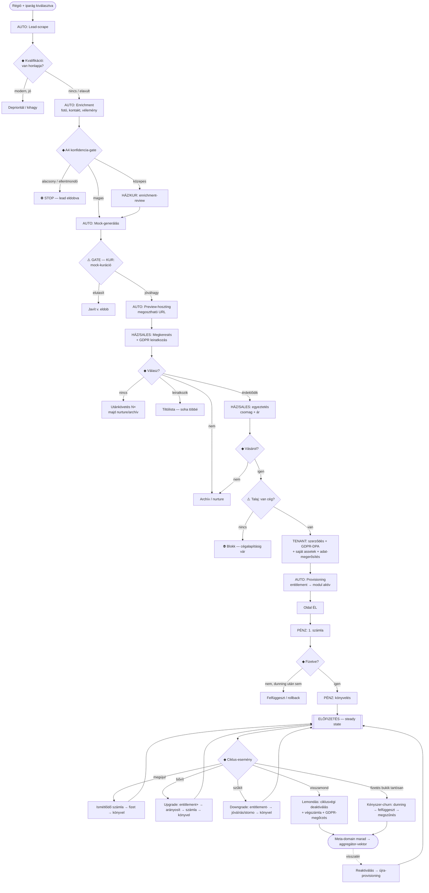

# PROCESS — Teljes ügyviteli folyamat (end-to-end, döntési elágazásokkal)

Státusz: **DRAFT v1 — reagálásra.** Cél: a lead-felfedezéstől addig, hogy egy számla
ki van fizetve ÉS le van könyvelve — a teljes életciklus, döntési ágakkal (visszamondás,
bővítés, leminősítés, bukott fizetés, reaktiválás). Ez NEM végleges; ez a közös gondolkodás
alapja. Utolsó frissítés: 2026-07-06.

> Kapcsolódó: `ROADMAP.md` (fázisok), `BACKLOG.md` (A4 provenance), `DOMAIN/` (ontológia).
> Ez a fájl a **működési** folyamatot rögzíti (ki mit csinál, mikor, milyen döntésnél),
> nem az architektúrát.

---

## Jelmagyarázat

**Aktor (A1-besorolás — minden lépés kap egyet):**
- `[AUTO]` — automatizált (agent/rendszer). Cél-állapot: minél több ide kerüljön.
- `[TENANT]` — a tulaj (ügyfél) csinálja (self-service).
- `[HÁZ]` — a mi oldalunk emberi munkája. Alszerep: `KUR`=kurátor, `PÉNZ`=pénzügy, `SALES`=értékesítés, `SUP`=support.
- `◆ DÖNTÉS` — elágazási pont (feltétel → ág).
- `⚠️ GATE` — kötelező ellenőrzési kapu (nem lehet átugrani).

> **A2-elv:** ahol most `[HÁZ]` van, oda kötelező jegyzet: *„később hogyan lesz `[AUTO]`?"*.
> Pilot-léptéken egyetlen ember (a tulaj) LEHET egyszerre KUR+PÉNZ+SALES+SUP — a szerep-szeparáció skálán számít.

---

## 0. Makró-gerinc (egy sorban)

```
FELFEDEZÉS → MOCK+KURÁCIÓ → MEGKERESÉS → KONVERZIÓ → ÉLESÍTÉS → ELŐFIZETÉS(steady) → ÉLETCIKLUS-VÁLTOZÁS → MEGSZŰNÉS
        └──────────────────────── PÉNZÜGY/KÖNYVELÉS mint kereszt-metsző szál (C-től végig) ────────────────────────┘
        └──────────────────────── JOGI/GDPR mint kereszt-metsző szál (A-tól végig) ──────────────────────────────┘
```

⚠️ **Talaj-feltétel (a tölcsér ALATT):** monetizált lépés (számla, beszedés) csak jogi entitással
(cég/egyéni váll.) lehetséges. Amíg nincs, a folyamat a **KONVERZIÓ-ig (nem pénzes rész)** futtatható;
a pénzes sáv (számla→beszedés→könyvelés) a cégalapításra van gatezelve. Lásd: `## X. Talaj-sáv`.

---

## Folyamatábra (Mermaid — GitHubon renderel)



---

## Fázisok részletesen (döntési ágakkal)

### A. FELFEDEZÉS (kapcsolatfelvétel ELŐTT) — pénz és cég nélkül futtatható

1. `[AUTO]` **Scrape** — régió × iparág → nyers leadek (Places/OSM/websearch).
2. `[AUTO]` ◆ **Kvalifikáció** — digitális lábnyom + honlap-státusz:
   - **modern, jó honlap** → deprioritál/kihagy (kicsi a hozzáadott érték).
   - **nincs / elavult honlap** → cél-lead (⭐ a „nincs semmije" a legértékesebb szegmens).
3. `[AUTO]` **Enrichment** — fotó, kontakt, website, vélemény/rating + **per-item provenance**.
4. `[AUTO]` ⚠️ **A4 konfidencia-gate** (párosítás-biztonság):
   - **magas** → auto-pass.
   - **közepes** → `[HÁZ/KUR]` enrichment-review.
   - **alacsony / ellentmondó jel** → ⛔ **STOP**, lead eldobva (jobb semmi, mint rossz ház adata).
5. `[AUTO]` **Mock-generálás** — template + egyedi „mag" + vízió-copy.
6. `[HÁZ/KUR]` ⚠️ **GATE — mock-kuráció (nulladik pont)**:
   - **jóváhagy** → hosztolható.
   - **elutasít** → javításra vissza vagy eldob.
   - *A1-jegyzet:* később a betanult konfidencia-modell auto-passolja a magas-bizalmú mockokat; a KUR csak a kivételt nézi.
7. `[AUTO]` **Preview-hoszting** — a mock kap egy megosztható URL-t (ez az első külső artefaktum).

> **Eddig cég sem, pénz sem kell.** Ez a jelenlegi „csonka walking skeleton" hiányzó vége (3.–7. lépés).

### B. MEGKERESÉS & AKVIZÍCIÓ

1. `[HÁZ/SALES]` (később `[AUTO]`) **Kiküldés** — perszonalizált, több-csatorna, GDPR-leiratkozással.
2. `[AUTO]` **Követés** — kézbesítve / megnyitva / kattintva / válasz / leiratkozás / bounce.
3. ◆ **Válasz?**
   - **nincs válasz** → utánkövetés N× → utána nurture/archív.
   - **leiratkozik** → tiltólista, soha többé (jogi kötelezettség).
   - **nemleges** → archív/nurture.
   - **érdeklődik** → értékesítési egyeztetés.
4. `[HÁZ/SALES]` **Egyeztetés** — élő preview megmutatása, csomag + ár.
5. ◆ **Vásárol?**
   - **nem** → nurture/archív.
   - **igen** → ⚠️ **Talaj-ellenőrzés: van cég?** Ha nincs → ⛔ blokk (cégalapításig). Ha van → onboarding.

### C. KONVERZIÓ / ONBOARDING (1. fizetős kapu) — CÉG KELL

1. `[TENANT]` **Csomag-választás** — tier + modulok (à la carte).
2. `[TENANT]` ⚠️ **Szerződés + GDPR adatfeldolgozói megállapodás (DPA)** — most jön létre a jogi viszony.
3. `[TENANT]` **Saját assetek** — jogtiszta képek/szövegek (vagy jogosultság-nyilatkozat a meglévőkre).
4. `[TENANT]` ⚠️ **Adat-megerősítés (A4/7. réteg)** — a tulaj megerősíti, hogy az adatok róla szólnak és helyesek.
5. ◆ **Domain:** van saját → DNS-rákötés · nincs → aldomain/regisztráció.
6. `[AUTO]` **Provisioning** — control plane → data plane: entitlement aktiválja a modulokat, oldal élesedik.
7. `[PÉNZ]` **1. számla** → ◆ **Fizetve?**
   - **igen** → könyvelés → steady state.
   - **nem (dunning után sem)** → felfüggeszt / rollback.

### D. ELŐFIZETÉS — STEADY STATE

1. `[TENANT]` **Self-service admin** — képek/szövegek szerkesztése (support-minimalizálás).
2. `[PÉNZ]` **Ismétlődő számlázás** (havi/éves) — minden ciklus: számla → fizetés →
   - **fizet** → könyvelés → tovább.
   - **bukik** → dunning (retry N + értesítés) → recovered→tovább / nem→felfüggeszt→türelmi idő→megszűnés.
3. `[HÁZ/SUP]` **Support** — kivétel-alapú, minimális.

### E. ÉLETCIKLUS-VÁLTOZÁSOK (az általad kérdezett ágak)

- **E1 — BŐVÍTÉS (upgrade):** modul+/magasabb tier → entitlement-váltás → időarányosítás (proration) → kiegészítő számla → könyvelés.
- **E2 — SZŰKÍTÉS (downgrade):** modul− → jóváírás/storno vagy következő-ciklus-korrekció → könyvelés.
- **E3 — VISSZAMONDÁS (cancel):** ◆ azonnali vagy ciklusvégi →
  jövőbeli számlázás leáll → ciklusvégén oldal-deaktiválás → **meta-domain jelenlét MARAD** (aggregátor-vektor) →
  GDPR adat-megőrzési szabály (meddig tartjuk) → végszámla/elszámolás → könyvelés → win-back nurture.
- **E4 — KÉNYSZER-CHURN (tartós fizetés-bukás):** mint E3, de dunning indítja.
- **E5 — REAKTIVÁLÁS (visszatérő ügyfél):** újra-provisioning a megőrzött adatból.

### F. PÉNZÜGY / KÖNYVELÉS (kereszt-metsző szál, C–E végig)

- **Számla-kibocsátás** — NAV Online Számla-kompatibilis (magyar jog). *Cégfüggő — talaj-sáv.*
- **Fizetés-egyeztetés (reconciliation)** — banki utalás vagy kártya beazonosítása.
- **Könyvelés** — a befolyt tétel lekönyvelése; ÁFA; bevétel-elszámolás (éves előre-fizetés vs. havi).
- **Storno / jóváíró számla** — downgrade/lemondás/visszatérítés esetén.
- **Dunning / követeléskezelés** — bukott fizetéseknél.
- **Riport** — havi/éves zárás, unit economics visszamérése (`DOMAIN/01-CALC-MODELS.md`).

---

## X. Talaj-sáv (a cégalapítás, mint a pénzes rész előfeltétele)

Nem szoftver, de a folyamat MUSZÁJ-eleme. Nyitott döntések (a tulajé):
- **Entitás-forma** — Kft. / egyéni vállalkozó / KATA? (adózás, felelősség, számlázási kötelezettség).
- **Számlázó-eszköz** — Számlázz.hu / Billingo / egyéb (NAV Online Számla integráció).
- **Könyvelés** — külső könyvelő vs. önkönyvelés; milyen adatot kell átadni.
- **Fizetés-elfogadás** — banki utalás (0 integráció) vs. kártyás (Stripe/SimplePay/Barion).
- **Jogi dokumentumok** — ÁSZF, adatkezelési tájékoztató, DPA, leiratkozás-mechanika (GDPR/Grt.).

⚠️ Amíg ez nincs, a folyamat az **A–B fázisig + a nem-pénzes preview-ig** futtatható valósan.

---

## Kereszt-metsző szálak (minden fázisra érvényes)

1. **JOGI/GDPR (A-tól végig):** demó-fázisban portál/vendég-fotó CSAK preview-ra; szerződés után
   kizárólag a tulaj saját/engedélyezett assetjei. Provenance minden adaton. Leiratkozás tisztelete.
   Churn-nél adat-megőrzési szabály.
2. **A1 (automatizálás):** minden `[HÁZ]`/`[TENANT]` lépésnél a „hogyan lesz `[AUTO]`?" jegyzet.
3. **A2 (kivétel-alapú ember):** a fő emberi kapuk — mock-kuráció (A/6), pénzügyi felügyelet (F),
   support (D/3). A betanulással az emberi lefedettség csökken.

---

## Nyitott kérdések / eldöntendő (a térkép hiátusai)

1. **Ár-modell:** havi vs. éves vs. egyösszegű élesítési díj + havi? (Hatással a bevétel-elszámolásra, churn-re.)
2. **Trial / mock→éles átmenet:** van-e ingyenes próbaidő, vagy a preview maga a „trial"?
3. **Domain-tulajdon:** ki birtokolja a domaint (mi vs. tulaj)? Churn-nél kié marad?
4. **Adat-megőrzés churn után:** meddig tartjuk a tulaj adatait (reaktiválás vs. GDPR-törlés)?
5. **Meta-domain/aggregátor:** a deaktivált oldal helyén mi jelenik meg (saját portál-vektor)?
6. **Kuráció SLA:** mennyi idő alatt kell egy mockot jóváhagyni/kiküldeni (frissesség)?
7. **Belső felület:** pilotban 1 egyszerű admin-nézet (lead-pipeline + státusz + preview-link + kuráció) —
   mikor és milyen minimállal? (A több-szerepes RBAC a Fázis 6.)
```

---

## ⭐ KANONIKUS LEAD-ÉLETCIKLUS (tulaj megerősítve, 2026-07-08)

A tulaj által közvetlenül megadott, mérvadó állapotlista. A konzol lead-pipeline
státuszai ENNEK az implementációi (nem fabrikált — lásd `memory/feedback_working_mode…` 6. pont).

| # | Állapot | Tartalom | Megjegyzés |
|---|---------|----------|-----------|
| 0 | **Scraping-folyamat** | scrape-scope definiálása + futtatás | ⚠️ **saját UI kell** a scope-hoz: ország / megye / régió / város / **térképes kijelölés** stb. |
| 1 | **Lead beazonosítás + kvalifikáció** | dedup + honlap-státusz + A4-konfidencia | PROCESS.md §A 1–3 |
| 2 | **Mock-create + kurátori jóváhagyás** | generálás → kuráció-gate | PROCESS.md §A 4 · `mock_artifact`/`curator_decision` |
| 3 | **Megkeresés** | outreach, követhető link, utánkövetés/leiratkozás | PROCESS.md §B |
| 4 | **Konverzió** | igen/nem → (igen) talaj-ellenőrzés: van cég? | PROCESS.md §C |
| 5 | **Előfizetés** | fizetés/előfizetés beállítása | ⚠️ sorrend: 5 ELŐFIZETÉS **majd** 6 ÉLESÍTÉS (fizet → aktivál) — a PROCESS.md korábbi §C/D a fordítottját sugallja; **a tulaj listája a mérvadó** |
| 6 | **Élesítés** | provisioning → oldal élesedik (control→data plane) | PROCESS.md §C 5–7 |
| 7 | **Módosítás / változás** | upgrade/downgrade/reaktiválás | PROCESS.md §E |
| 8 | **Megszűnés** | churn (önkéntes/kényszer) → meta-domain marad | PROCESS.md §E vége |

**Pilot-hatókör (PILOT.md):** csak a **0–4** (a order-intentig); az 5–8 a cégalapításra gatezelt → később.

**Implementációs következmény:** a `lead` táblának ma `qualification` mezője van, de **nincs életciklus-státusz mező** — ezt (0–8) migrációval kell felvenni, hogy a pipeline követhető legyen. A 0. állapot (scraping-scope UI) külön darab (`scraper_definition`-szerkesztő + gazdagabb geo-scope, nem csak bbox).

### Átmenet-szabályok — tulaj megerősítve (2026-07-09)

⚠️ **Éles és pilot szét van választva** (a viselkedés állapotonként eltér).

**1→2 (qualified → mock_curation) — a kulcs-átmenet:**
- **ÉLES (jövőkép):** score ≥ küszöb → `[AUTO]` mockra; score < küszöb → `[HÁZ/KUR]` manuálisan hozzáadható.
- **PILOT (rövid táv, tanuláshoz):** **mindig manuális triage.** A user/kurátor **belemegy a lead
  adat-sheetjébe**, megnézi az elérhető adatokat, és max. **felülbírálja a pontozást**, VAGY **mock-generálásra
  küldi** a leadet. Ez **külön feladatkör** (triage/review queue).

**Többi pilot-átmenet (PROCESS.md §A–C-ből, `[AUTO]`/`[HÁZ]` tagelve):**
- **2→3** mock_curation → outreach: `[HÁZ/KUR]` kurátor **jóváhagyja** (`curator_decision=approve`); elutasít → javításra vissza / eldob.
- **3→4** outreach → konverzió: `[AUTO]` kiküldés + `[HÁZ]` értékesítés érdeklődésre; nincs válasz → utánkövetés N× → nurture/archív; leiratkozik → tiltólista; nemleges → archív.
- **4→5** konverzió → előfizetés: `[HÁZ/PÉNZ]` igen + ◆ talaj-ellenőrzés (van cég?).

**Terminál állapot — ÚJ (megerősítve):** külön **`disqualified` (eldobva/diszkvalifikált)** terminál, MÁS mint a
8. `terminated` (fizető ügyfél churnje). Ide tartozik: A4-STOP, halott lead, leiratkozott, tartós nemleges.

**Változók (utánkövetés-kadencia N stb.):** NEM bedrótozva → **supervisory admin-felület szegmensek fölött**,
ahol adminként állíthatók (több ilyen változó is; lásd BACKLOG). Idea: leiratkozás + nemleges válasznál
**kötelező kérdőív** kitöltése.
