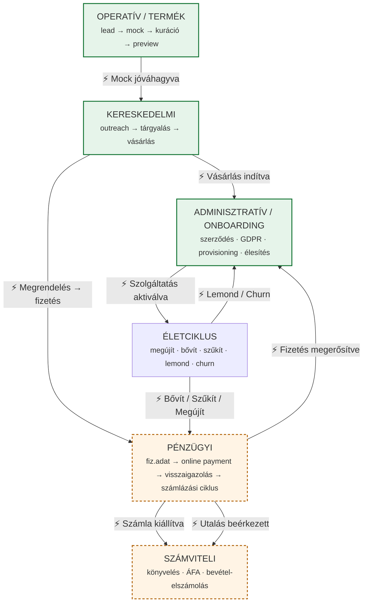

```mermaid
%%{init: {'theme':'default','themeVariables':{'fontSize':'20px'}, 'flowchart':{'rankSpacing':70,'nodeSpacing':55}}}%%
flowchart TB
    OP["OPERATÍV / TERMÉK<br/><small>lead → mock → kuráció → preview</small>"]
    KER["KERESKEDELMI<br/><small>outreach → tárgyalás → vásárlás</small>"]
    ADM["ADMINISZTRATÍV / ONBOARDING<br/><small>szerződés · GDPR · provisioning · élesítés</small>"]
    FIN["PÉNZÜGYI<br/><small>fiz.adat → online payment → visszaigazolás → számlázási ciklus</small>"]
    ACC["SZÁMVITELI<br/><small>könyvelés · ÁFA · bevétel-elszámolás</small>"]
    LIF["ÉLETCIKLUS<br/><small>megújít · bővít · szűkít · lemond · churn</small>"]

    OP -->|"⚡ Mock jóváhagyva"| KER
    KER -->|"⚡ Vásárlás indítva"| ADM
    KER -->|"⚡ Megrendelés → fizetés"| FIN
    FIN -->|"⚡ Fizetés megerősítve"| ADM
    FIN -->|"⚡ Számla kiállítva"| ACC
    FIN -->|"⚡ Utalás beérkezett"| ACC
    ADM -->|"⚡ Szolgáltatás aktiválva"| LIF
    LIF -->|"⚡ Bővít / Szűkít / Megújít"| FIN
    LIF -->|"⚡ Lemond / Churn"| ADM

    classDef now fill:#e6f4ea,stroke:#137333,stroke-width:2px;
    classDef later fill:#fff4e5,stroke:#b06000,stroke-width:2px,stroke-dasharray:5 4;
    class OP,KER,ADM now;
    class FIN,ACC later;
```
