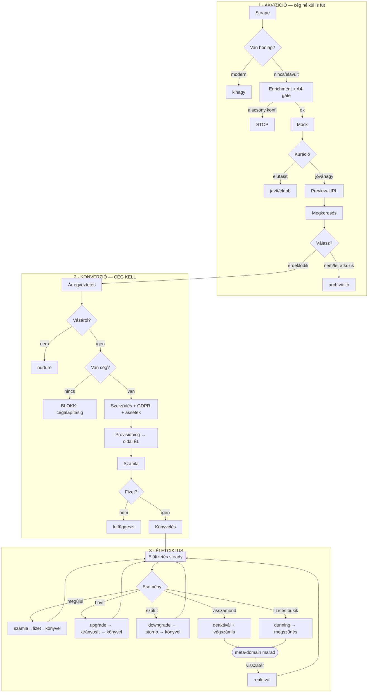

```mermaid
%%{init: {'theme':'default','themeVariables':{'fontSize':'22px'}, 'flowchart':{'nodeSpacing':40,'rankSpacing':45}}}%%
flowchart TB
    subgraph A["1 · AKVIZÍCIÓ  — cég nélkül is fut"]
        direction TB
        A1[Scrape] --> A2{Van honlap?}
        A2 -->|modern| AX[kihagy]
        A2 -->|nincs/elavult| A3[Enrichment + A4-gate]
        A3 -->|alacsony konf.| ASTOP[STOP]
        A3 -->|ok| A4[Mock]
        A4 --> A5{Kuráció}
        A5 -->|elutasít| AX2[javít/eldob]
        A5 -->|jóváhagy| A6[Preview-URL] --> A7[Megkeresés]
        A7 --> A8{Válasz?}
        A8 -->|nem/leiratkozik| AX3[archív/tiltó]
    end
    A8 -->|érdeklődik| B1

    subgraph B["2 · KONVERZIÓ  — CÉG KELL"]
        direction TB
        B1[Ár egyeztetés] --> B2{Vásárol?}
        B2 -->|nem| BX[nurture]
        B2 -->|igen| B3{Van cég?}
        B3 -->|nincs| BBLK[BLOKK: cégalapításig]
        B3 -->|van| B4[Szerződés + GDPR + assetek]
        B4 --> B5[Provisioning → oldal ÉL]
        B5 --> B6[Számla]
        B6 --> B7{Fizet?}
        B7 -->|nem| BSUS[felfüggeszt]
        B7 -->|igen| B8[Könyvelés]
    end
    B8 --> C0

    subgraph C["3 · ÉLETCIKLUS"]
        direction TB
        C0[[Előfizetés steady]] --> C1{Esemény}
        C1 -->|megújul| C2[számla→fizet→könyvel] --> C0
        C1 -->|bővít| C3[upgrade → arányosít → könyvel] --> C0
        C1 -->|szűkít| C4[downgrade → storno → könyvel] --> C0
        C1 -->|visszamond| C5[deaktivál + végszámla]
        C1 -->|fizetés bukik| C6[dunning → megszűnés]
        C5 --> C7([meta-domain marad])
        C6 --> C7
        C7 -.->|visszatér| C8[reaktivál] --> C0
    end
```
