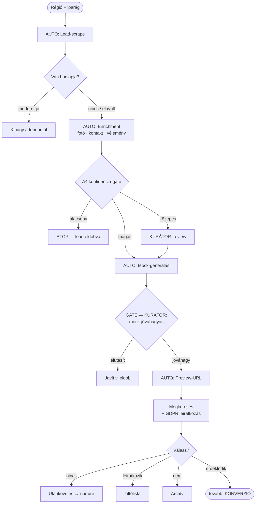

```mermaid
flowchart TD
    Start([Régió + iparág]) --> Scrape[AUTO: Lead-scrape]
    Scrape --> Qual{Van honlapja?}
    Qual -->|modern, jó| Skip[Kihagy / deprioritál]
    Qual -->|nincs / elavult| Enrich[AUTO: Enrichment<br/>fotó · kontakt · vélemény]
    Enrich --> A4{A4 konfidencia-gate}
    A4 -->|alacsony| Stop1[STOP — lead eldobva]
    A4 -->|közepes| CurEnr[KURÁTOR: review]
    A4 -->|magas| Gen[AUTO: Mock-generálás]
    CurEnr --> Gen
    Gen --> CurGate{GATE — KURÁTOR:<br/>mock-jóváhagyás}
    CurGate -->|elutasít| Fix[Javít v. eldob]
    CurGate -->|jóváhagy| Host[AUTO: Preview-URL]
    Host --> Out[Megkeresés<br/>+ GDPR leiratkozás]
    Out --> Resp{Válasz?}
    Resp -->|nincs| Follow[Utánkövetés → nurture]
    Resp -->|leiratkozik| Suppress[Tiltólista]
    Resp -->|nem| Archive[Archív]
    Resp -->|érdeklődik| Next([tovább: KONVERZIÓ])
```
