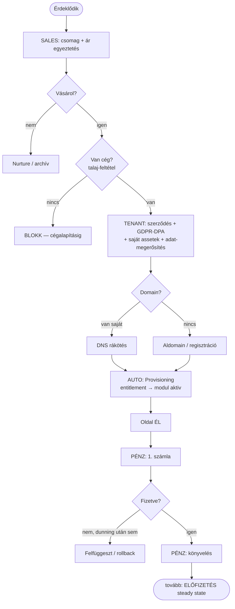

```mermaid
flowchart TD
    Start([Érdeklődik]) --> Sales[SALES: csomag + ár egyeztetés]
    Sales --> Buy{Vásárol?}
    Buy -->|nem| Arch[Nurture / archív]
    Buy -->|igen| Ground{Van cég?<br/>talaj-feltétel}
    Ground -->|nincs| Block[BLOKK — cégalapításig]
    Ground -->|van| Onboard[TENANT: szerződés + GDPR-DPA<br/>+ saját assetek + adat-megerősítés]
    Onboard --> Domain{Domain?}
    Domain -->|van saját| DNS[DNS rákötés]
    Domain -->|nincs| Reg[Aldomain / regisztráció]
    DNS --> Prov[AUTO: Provisioning<br/>entitlement → modul aktiv]
    Reg --> Prov
    Prov --> Live[Oldal ÉL]
    Live --> Inv[PÉNZ: 1. számla]
    Inv --> Pay{Fizetve?}
    Pay -->|nem, dunning után sem| Susp[Felfüggeszt / rollback]
    Pay -->|igen| Book[PÉNZ: könyvelés]
    Book --> Steady([tovább: ELŐFIZETÉS steady state])
```
