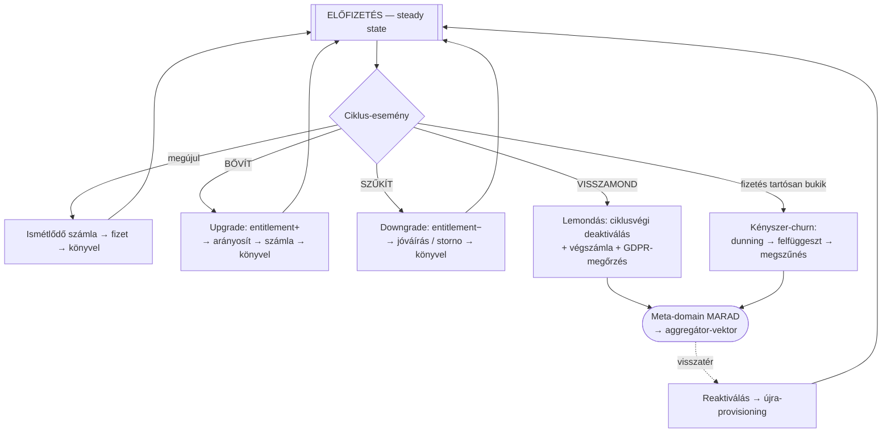

```mermaid
flowchart TD
    Steady[[ELŐFIZETÉS — steady state]] --> Cycle{Ciklus-esemény}
    Cycle -->|megújul| Recur[Ismétlődő számla → fizet → könyvel]
    Recur --> Steady
    Cycle -->|BŐVÍT| Up[Upgrade: entitlement+<br/>→ arányosít → számla → könyvel]
    Up --> Steady
    Cycle -->|SZŰKÍT| Down[Downgrade: entitlement−<br/>→ jóváírás / storno → könyvel]
    Down --> Steady
    Cycle -->|VISSZAMOND| Cancel[Lemondás: ciklusvégi deaktiválás<br/>+ végszámla + GDPR-megőrzés]
    Cycle -->|fizetés tartósan bukik| Inv[Kényszer-churn:<br/>dunning → felfüggeszt → megszűnés]
    Cancel --> End([Meta-domain MARAD<br/>→ aggregátor-vektor])
    Inv --> End
    End -.->|visszatér| React[Reaktiválás → újra-provisioning]
    React --> Steady
```
