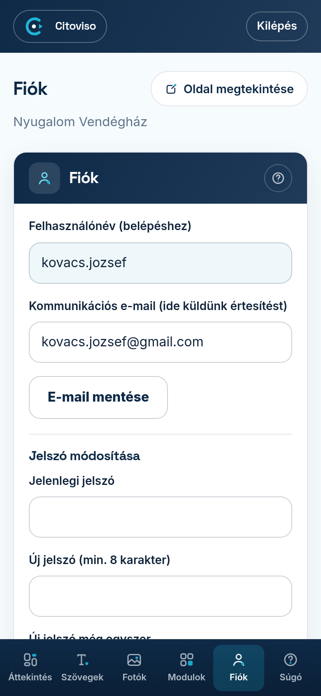

A **Fiók** fülön kezeli a belépési adatait és azt, hogy hová küldjünk értesítést.

## Felhasználónév

A **„Felhasználónév (belépéshez)”** mező csak tájékoztató: ezzel a névvel lép be a
kezelőfelületre. Ez nem módosítható — ha gondja van vele, írjon nekünk.

## Kommunikációs e-mail

A **„Kommunikációs e-mail (ide küldünk értesítést)”** mezőben azt az e-mail-címet adja meg,
amelyet naponta olvas — ide érkeznek a fontos értesítések, például egy új foglalási kérés.
A módosítást az **„E-mail mentése”** gombbal rögzíti.

## Jelszó módosítása

A **„Jelszó módosítása”** részben cserélheti le a jelszavát:

1. Írja be a **„Jelenlegi jelszó”** mezőbe a mostani jelszavát — ez igazolja, hogy tényleg Ön az.
2. Az **„Új jelszó (min. 8 karakter)”** mezőbe írja be az újat. Jó jelszó az, amit Ön megjegyez,
   de más nem talál ki — például három, egymáshoz nem kapcsolódó szó egybeírva.
3. Ismételje meg az **„Új jelszó még egyszer”** mezőben — ez véd az elgépeléstől.
4. Koppintson a **„Jelszó módosítása”** gombra. A következő belépéskor már az új jelszót használja.

## Kilépés

A **„Kilépés”** linkkel jelentkezhet ki. Közös vagy idegen eszközön (pl. a recepció gépén) a munka
végén mindig lépjen ki — a saját telefonján maradhat belépve.
