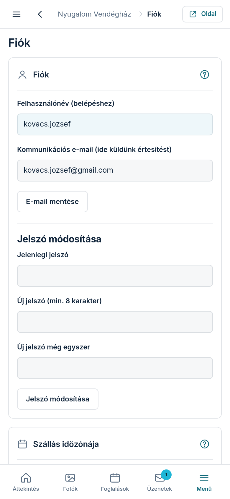

A **Fiók** fülön kezeli a belépési adatait, azt, hogy hová küldjünk értesítést, a szállása
időzónáját, és — a lap alján — a honlapján közzétett jogi adatait (impresszum, adatkezelési tájékoztató).

## Felhasználónév

A **„Felhasználónév (belépéshez)”** mező csak tájékoztató: ezzel a névvel lép be a
kezelőfelületre. Ez nem módosítható — ha gondja van vele, írjon nekünk.

## Első belépés: a jelszó beállítása

Jelszót e-mailben nem küldünk. A megrendelés után két helyen állíthatja be a sajátját:

1. **Rögtön a sikeres fizetés lapján.** Az „Állítsa be most a jelszavát” részben írja be kétszer az új
   jelszót, és koppintson a „Beállítom és belépek” gombra. Ez a lehetőség csak a fizetés utáni két órában él.
2. **A „Belépési adatai” levélből.** A levélben a felhasználóneve és egy **„Jelszó beállítása”** gomb áll.
   A gomb 7 napig érvényes, és egyszer használható. A megnyíló lapon írja be kétszer az új jelszót (legalább
   8 karakter), majd koppintson a **„Beállítom és belépek”** gombra.

A beállítás után a rendszer azonnal beléptet. Biztonsági okból a korábban megnyitott belépések megszűnnek,
más eszközön tehát újra be kell lépnie.

## Elfelejtett jelszó

1. A belépő lapon koppintson az **„Elfelejtett jelszó?”** linkre.
2. Írja be a **„Felhasználónév vagy e-mail”** mezőbe a felhasználónevét, vagy azt az e-mail címet, amelyet a
   **„Kommunikációs e-mail (ide küldünk értesítést)”** mezőben adott meg (a levelet is oda küldjük),
   majd koppintson a **„Küldjék a linket”** gombra.
3. A lap mindig ugyanazt írja: **„Ha van ilyen fiók, elküldtük”**. Ez szándékos, így senki nem tudja kipróbálni,
   kinek van fiókja nálunk. Ha a cím egy fiókhoz tartozik, néhány percen belül megjön a levél egy **„Jelszó
   beállítása”** gombbal (7 napig érvényes, egyszer használható).
4. Ha a link lejárt vagy már felhasználták, a lap ezt írja: **„Ez a link már nem érvényes”**. Az **„Új linket
   kérek”** gombbal kérhet újat.

Ha nem Ön kérte a linket, nincs teendője: a jelenlegi jelszava változatlan marad.

## Kommunikációs e-mail

A **„Kommunikációs e-mail (ide küldünk értesítést)”** mezőben azt az e-mail-címet adja meg,
amelyet naponta olvas — ide érkeznek a fontos értesítések, például egy új foglalási kérés.
A módosítást az **„E-mail mentése”** gombbal rögzíti.

## Jelszó módosítása

A **„Jelszó módosítása”** részben cserélheti le a jelszavát:

1. Írja be a **„Jelenlegi jelszó”** mezőbe a mostani jelszavát — ez igazolja, hogy tényleg Ön az.
2. Az **„Új jelszó (min. 8 karakter)”** mezőbe írja be az újat. Jó jelszó az, amit Ön megjegyez,
   de más nem talál ki — például három, egymáshoz nem kapcsolódó szó egybeírva.
3. Ismételje meg az **„Új jelszó még egyszer”** mezőben — ez véd az elgépeléstől.
4. Koppintson a **„Jelszó módosítása”** gombra. A következő belépéskor már az új jelszót használja.
   Ezen az eszközön belépve marad, a többi eszközön viszont a csere után újra be kell lépnie.

## Szállás időzónája

A **„Szállás időzónája”** kártyán azt látja, melyik időzóna órája szerint számolunk a szállásánál:
mikor „ma” egy foglalás, mikor jár le egy ár vagy egy kérés, és milyen időpontot lát a vendég.
Alapból a szállás országa adja (Magyarországon Budapest), így a legtöbb szállásnál nincs vele teendő.
Csak akkor változtassa, ha a szállás máshol van — például a Kanári-szigeteken vagy Portugáliában.

1. A **„Keresés”** mezőbe írja be a legközelebbi nagyváros vagy a sziget nevét (pl. „Lisszabon”,
   „Kanári”, „Bécs”). A lista szűkül; ha nincs találat, ezt írja: „Nincs ilyen időzóna. Próbáld a
   legközelebbi nagyvárossal (pl. „Lisszabon”).”
2. Válassza ki az **„Időzóna”** listából a megfelelőt. Alatta azonnal látja, mennyi most ott az idő,
   és melyik nap számít ott „ma”-nak („Most itt: …”).
3. Ha a választás eltér a szállás országának alapértékétől, egy figyelmeztetés kéri, hogy
   ellenőrizze. A **„Vissza az ország alapértékére”** gomb az ország alapzónáját (pl. Budapest)
   választja ki újra.
4. Koppintson az **„Időzóna mentése”** gombra. A gomb csak akkor nyomható meg, ha valóban mást
   választott, mint ami eddig be volt állítva.

A mentés után a foglalási naptár, a lejáró árak, a foglalási kérések és a vendégnek küldött
ajánlatok határideje ennek a zónának az órája szerint számol. A tőlünk kapott számlák és a
szerződések dátuma nem változik: azok a magyar naptár szerint szólnak.

## Jogi adatok

A fül alsó részén, a **„Jogi adatok”** kártyán adja meg azt, ami a honlapja Impresszum és
Adatkezelési tájékoztató oldalán megjelenik (cégnév, székhely, adószám, nyilvántartási szám).
Ezt külön útmutató írja le részletesen — ott arról is szó van, mi történik, ha egy kötelező
adat hiányzik.

## Kilépés

Telefonon az alsó sáv **„Menü”** gombjával megnyíló fiók alján találja a **„Kilépés”** sort; gépen
a bal oldali menü alján, a neve mellett a kilépés-ikon teszi ugyanezt. Közös vagy idegen eszközön
(pl. a recepció gépén) a munka végén mindig lépjen ki — a saját telefonján maradhat belépve.
