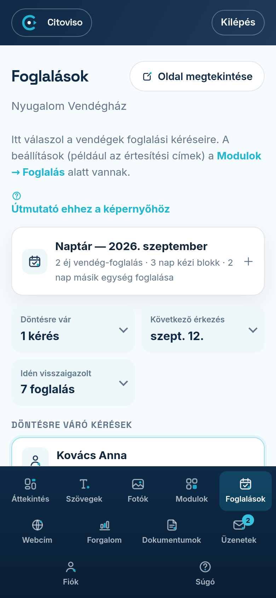

A **„Foglalások”** fülön válaszol a vendégek foglalási kéréseire, és itt látja a naptárát is.
Ha új kérés érkezik, a fül neve mellett kis szám (jelvény) mutatja — a fül megnyitásával eltűnik.

## Foglalási kérés érkezett — mit tegyek?

A **„Döntésre váró kérések”** részben időrendben látja a kéréseket: a vendég nevét, az időpontot,
a létszámot, az üzenetét és azt is, mennyi idő van hátra a válaszra. Két lehetőség közül választ:

- **„Visszaigazolom”** — megnyílik egy mező, ahová üzenetet írhat a vendégnek (nem kötelező, pl.
  „Érkezéskor csengessenek a zöld kapunál.”). A **„Megerősítem a visszaigazolást”** gombbal a
  napok foglalttá válnak, a vendég pedig e-mailt kap az üzenetével és egy naptár-melléklettel,
  amivel egy koppintással a telefonja naptárába teheti az utat.
- **„Elutasítom”** — ide is írhat indoklást (a vendég ezt olvassa majd), a napok szabadok maradnak.

Ugyanezt a döntést a kérésről kapott e-mailből is elintézheti egy koppintással, belépés nélkül.
Ha a megadott időn belül nem válaszol, a kérés lejár, és a vendég udvarias értesítést kap.

## Ha többen kérik ugyanazt az időszakot

Ha egy kérés napjai fedik egy másik kérését, a kérésen piros jelzés figyelmeztet. A
**„Visszaigazolom”** gombra ilyenkor egy választó ablak nyílik: a naptáron színnel látja, ki
melyik éjszakákat kéri, és kiválaszthatja, kinek adja az időszakot. A **„Visszaigazolom — a
többit elutasítom”** gomb megerősítés után a választott vendégnek visszaigazolást küld, a
többi fedésben lévő kérést pedig automatikusan elutasítja — azok a vendégek is e-mailt kapnak.

## A naptár

Felül a **„Naptár”** sáv csukva egy sorban összegzi a hónapot; rákoppintva kinyílik.

- **Szabad napra** koppintva azt kézzel blokkolja (a vendégek foglaltnak látják); újra koppintva felold.
- **Zöld (vendég-foglalás) napra** koppintva megnyílik a foglalás: látja a vendég adatait, és a
  **„Foglalás lemondása”** gombbal le is mondhatja — a napok felszabadulnak, a vendég e-mailt kap.
- **Csíkos nap:** azt a napot a szállás egy **másik egysége** tartja (például az egész
  szállásra érkezett foglalás a szobákat is lefoglalja). Ez a nap **nem koppintható** — sem
  feloldani, sem megnyitni nem lehet itt. A napot az az egység szabadítja fel, amelyik tartja.

## Az összegző csempék

A három csempe (**„Döntésre vár”**, **„Következő érkezés”**, **„Idén visszaigazolt”**) koppintásra
kinyílik: a várakozó kérések listája a kéréshez ugrik, az érkezés-lista a naptárban nyitja meg a
foglalást.

## Korábbi kérések és lemondás

A **„Korábbi kérések”** listában minden eldöntött kérés látszik a döntéssel együtt. Visszaigazolt
foglalást a **„Lemondom”** linkkel mondhat le (indoklást is írhat — a vendég e-mailben kapja meg).
A vendég maga is lemondhat a visszaigazoló levelében lévő linkkel — ilyenkor Ön kap e-mailt, és a
napok automatikusan felszabadulnak.

## Hová érkeznek az értesítések?

A kérésekről szóló e-maileket a Modulok → Foglalás beállításban megadott címre küldjük — több
címet is megadhat vesszővel elválasztva (pl. recepció és tulajdonos). Ha nincs megadva cím, a
fiókja e-mail címére mennek.

## Csíkos napok a naptárban

A csíkos nap azt jelenti, hogy a szállás **másik egysége** tartja azt az éjszakát: vagy az egész
szállást foglalták le, vagy — ha épp az egész szállás naptárát nézi — az egyik szobája foglalt.
Ezek a napok itt nem koppinthatók; a Modulok → Online foglalás naptárában a napra koppintva látja,
melyik egység és ki tartja.
