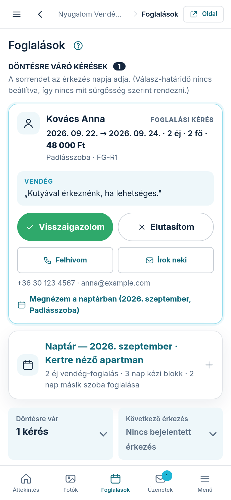
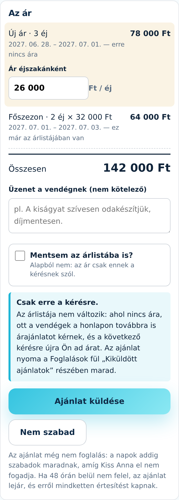

A **„Foglalások”** fülön válaszol a vendégek foglalási kéréseire, és itt látja a naptárát is.
Ha kérés vár a döntésére, a fül neve mellett kis szám (jelvény) mutatja, hány kérés vár. A szám
addig marad, amíg nem döntött — a fül megnyitásától nem tűnik el.

Az **„Áttekintés”** lap tetején is megjelenik egy sáv, amely kiírja, hány kérés vár az Ön
döntésére, és a legsürgősebb mennyi idő múlva jár le. A **„Teendők”** között minden várakozó
kérés külön sort kap: a **„Döntök”** gomb egyenesen arra a kérésre visz, árajánlat-kérésnél pedig
az **„Ajánlatot küldök”** gomb az ajánlat-lapra.

## Foglalási kérés érkezett — mit tegyek?

A **„Döntésre váró kérések”** rész áll a fül tetején — telefonon a naptár is csak alatta
következik, hogy a döntés gombjai görgetés nélkül a képernyőn legyenek. A kéréseket a
**válasz-határidő** szerint látja: aki hamarabb lejár, az van felül — akkor is, ha később
érkezne. (A lista fölött ez a mondat ki is van írva.) Minden kérésnél ott a vendég neve, az
időpont, a létszám, a szoba, az üzenete, és egy jelvény arról, mennyi ideje maradt:
**„Ma lejár”**, **„Holnap lejár”** vagy **„Van még idő”** — a sürgőseket a kártya bal szélén
piros sáv is jelzi.

Ha előbb beszélne a vendéggel, a **„Felhívom”** gombbal egy koppintással hívhatja (a telefon
tárcsázója nyílik), az **„Írok neki”** gombbal e-mailt írhat. A kártya alján lévő link a naptárat
arra a hónapra és szobára nyitja, amelyikre a vendég kér — így látja, mi van körülötte.

Két lehetőség közül választ:

- **„Visszaigazolom”** — a kártyán belül, teljes szélességben megnyílik a megerősítés. A kérdés
  megnevezi a vendéget, alatta az időpont, a szoba és az összeg, és hogy mi fog történni. Üzenetet
  is írhat a vendégnek (nem kötelező, pl. „Érkezéskor csengessenek a zöld kapunál.”): koppintson az
  **„+ Üzenetet írok a vendégnek”** feliratra. Az **„Igen, visszaigazolom”** gombbal a napok
  foglalttá válnak, a vendég pedig e-mailt kap az üzenetével és egy naptár-melléklettel, amivel
  egy koppintással a telefonja naptárába teheti az utat. A **„Mégsem”** gombbal semmi nem történik,
  a kérés marad, ahol volt.
- **„Elutasítom”** — ugyanígy rákérdez. Indoklást is írhat (**„+ Megírom, miért (nem kötelező)”**
  — a vendég ezt olvassa majd); az **„Igen, elutasítom”** gombbal küldi el, a napok szabadok
  maradnak. Itt is van **„Mégsem”**.

Amíg a megerősítés nyitva van, az ellentétes döntés gombja nem látszik — így nem koppinthat
véletlenül rá.

Ugyanezt a döntést a kérésről kapott e-mailből is elintézheti, belépés nélkül. Az **„Üzenetek”**
fülön a megnyitott levél tetején a **„Foglalások megnyitása”** gomb egyenesen erre a kérésre
visz; alatta a **„Gyors döntés innen is:”** gombok előbb rákérdeznek (a vendég nevével), és ott
is van **„Mégsem”**. A levélben a vendég telefonszáma is koppintható.
Ha a megadott időn belül nem válaszol, a kérés lejár, és a vendég udvarias értesítést kap.

## Árajánlat-kérés érkezett — a vendég nem látott árat

Ha a vendég olyan szobát vagy időszakot választ, amelyre az árlistájában nincs ár, az oldal nem
foglalást ígér neki, hanem árajánlatot kér. Az ilyen kérésen ezt olvassa: **„A vendég nem látott
árat — árajánlatot kért. Adja meg az árat, és a rendszer elküldi neki.”** Itt nincs
„Visszaigazolom” gomb, mert az ár nélkül véglegesítené a foglalást. Két lehetősége van: ha nem
tudja fogadni, az **„Elutasítom”** gomb ugyanúgy működik, mint máskor. Ha fogadná, küldjön
ajánlatot:

1. Koppintson az **„Ajánlatot küldök”** gombra (ugyanez a gomb a kérésről kapott e-mailben is ott
   van, belépés nélkül). Megnyílik az ajánlat-lap.
2. A lap felsorolja a kért éjszakákat. Amire már van ára (például a főszezonra), az a meglévő
   áron fixen áll. Csak a hiányzó éjszakákhoz kell árat írnia az **„Ár éjszakánként”** mezőbe —
   az összeg azonnal kiszámolódik alatta.
3. Írhat üzenetet a vendégnek (például „A kiságyat szívesen odakészítjük.”).
4. Az ár alapból **csak erre a kérésre** szól: az árlistája nem változik, és ahol nincs ára, ott
   a vendégek a honlapon továbbra is árajánlatot kérnek. Ha az árat az árlistába is fel akarja
   venni, pipálja be a **„Mentsem az árlistába is?”** négyzetet, és válasszon:
   - **„Csak a kért napokra”** — az ár csak ezekre az éjszakákra kerül az árlistába; ezekre a
     napokra a honlapon ajánlatkérés nélkül is foglalható lesz, más napokra továbbra is
     árajánlatot kérnek. A tartózkodás utolsó éjszakája után az ár lekerül az árlistáról.
   - **„Alapárként”** — dátum nélkül, a következő módosításig: minden olyan éjszakára érvényes,
     amelyre nincs szezonár. Ettől a szoba (vagy az egész szállás) a honlapon **foglalhatóvá
     válik** — a vendégek onnantól ajánlatkérés nélkül küldhetnek foglalási kérést, amit Ön igazol
     vissza.

   A választás alatti keretes mondat mindig kimondja, mi lesz a választásának a következménye.
5. Koppintson az **„Ajánlat küldése”** gombra. Ha mégsem tudja fogadni, ugyanitt a
   **„Nem szabad”** gombbal elutasíthatja.

Küldés után a lap zöld dobozban megerősíti, mennyi ment ki, és azt is, hogy az ár bekerült-e az
árlistába; a **„Foglalások megnyitása”** gomb ide, a „Kiküldött ajánlatok” listához hozza vissza.

A vendég e-mailben kapja meg az ajánlatot, és egy gombbal elfogadhatja. **Az ajánlat még nem
foglalás:** a napok addig szabadok maradnak, amíg a vendég el nem fogadja. Ha közben más
foglalja le őket, és a vendég utána fogadná el az ajánlatot, a lap megmondja neki, hogy a napok
elkeltek, Ön pedig értesítést kap. Ha a Modulok → Online foglalás
beállításaiban az **„Ennyi idő után magától lejár a kérés”** mezőben megadott idő letelik, az
ajánlat lejár — erről Ön és a vendég is értesítést kap. (Ha ott 0 áll, az ajánlat nem jár le.)
Ha a vendég nem kéri az ajánlatot, e-mailben szólunk, és a napok szabadok maradnak.

A válaszra váró ajánlatok az **„Ajánlatra vár”** részben látszanak, a lejárat idejével. Ha a vendég
nem a levél gombjával, hanem telefonon vagy válaszlevélben mondja, hogy kéri, koppintson az
**„A vendég elfogadta (telefonon / levélben)”** gombra — ugyanaz történik, mintha ő nyomta
volna meg: a napok foglalttá válnak, és a vendég megkapja a visszaigazolást az árral.

A Foglalások fül alján a **„Kiküldött ajánlatok”** lista minden ajánlatát mutatja, amit a
rendszerből küldött — azokat is, amelyek már lezárultak: kinek, mire, mennyiért (az összeg alatt az
éjszakánkénti árral), mikor ment ki,
mi lett vele (például „Elfogadta — foglalás”, „Nem kérte”, „Lejárt — nem felelt”, „Közben elkelt”),
és az **„Árlista”** oszlopban (telefonon a kártya „Árlista:” sorában) azt, hogy az ár bekerült-e az
árlistába. A lista felett szűrhet:
**„Mind”**, **„Válaszra vár”**, **„Elfogadta”**, **„Nem lett belőle”**.

A kért napokra mentett árat a Modulok fülön, az „Árak, szezonok” modulnál **„Alapár, dátummal”**
sorként látja, a dátumokkal együtt; ott törölheti is.

## Ha többen kérik ugyanazt az időszakot

Ha egy kérés napjai fedik egy másik kérését, a kérésen piros jelzés figyelmeztet. A
**„Visszaigazolom”** gombra ilyenkor egy választó ablak nyílik: a naptáron színnel látja, ki
melyik éjszakákat kéri, és kiválaszthatja, kinek adja az időszakot. A **„Visszaigazolom — a
többit elutasítom”** gomb megerősítés után a választott vendégnek visszaigazolást küld, a
többi fedésben lévő kérést pedig automatikusan elutasítja — azok a vendégek is e-mailt kapnak.

## A naptár

A **„Naptár”** sáv (telefonon a döntésre váró kérések alatt, gépen a bal oldalon) csukva egy
sorban összegzi a hónapot; rákoppintva kinyílik. Magától azon a hónapon és szobán nyílik, ahol a
következő döntése van: a legsürgősebb kérésén — vagy ha egy sem vár, a következő érkezésen.

- **Szaggatott keretes nap:** ezt az éjszakát egy vendég kéri, de még **nem foglalt** — a
  jelmagyarázat szerint **„kért éjszaka — döntésre vár, még NEM foglalt”**. Rákoppintva a
  kéréséhez ugrik, ott dönthet.
- **Szabad napra** koppintva azt kézzel blokkolja (a vendégek foglaltnak látják); újra koppintva felold.
- **Zöld (vendég-foglalás) napra** koppintva megnyílik a foglalás: látja a vendég adatait, és a
  **„Foglalás lemondása”** gombbal le is mondhatja. A gomb nem mond le azonnal: megerősítő ablak
  nyílik **„Biztosan lemondja ezt a foglalást?”** címmel, benne a vendég neve és az időszak, alatta
  a **„Rövid indoklás a vendégnek küldött levélbe (nem kötelező)”** mező. A **„Lemondom a
  foglalást”** gombbal a napok felszabadulnak, és a vendég lemondó e-mailt kap az indoklással; a
  **„Mégsem — megtartom”** gombbal minden marad a régiben. A lemondás nem vonható vissza.
- **Csíkos nap:** azt a napot a szállás egy **másik szobája** tartja (például az egész
  szállásra érkezett foglalás a szobákat is lefoglalja). Ez a nap **nem koppintható** — sem
  feloldani, sem megnyitni nem lehet itt. A napot az a szoba szabadítja fel, amelyik tartja.

## Az összegző csempék

A három csempe (**„Döntésre vár”**, **„Következő érkezés”**, **„Idén visszaigazolt”**) koppintásra
kinyílik: a várakozó kérések listája a kéréshez ugrik, az érkezés-lista a naptárban nyitja meg a
foglalást.

## Korábbi kérések és lemondás

A **„Korábbi kérések”** listában minden eldöntött kérés látszik a döntéssel együtt. Visszaigazolt
foglalást a **„Lemondom”** linkkel mondhat le (indoklást is írhat — a vendég e-mailben kapja meg).
A vendég maga is lemondhat a visszaigazoló levelében lévő linkkel — ilyenkor Ön kap e-mailt, és a
napok automatikusan felszabadulnak.

**Ki írta? — a sor megmondja.** Egy kérés alatt több üzenet is összegyűlhet, ezért mindegyik
idézet-doboz megnevezi a szerzőjét: **„Vendég”** (amit a foglaláskor írt — ez a kérdése akkor is
ott marad, ha már döntött), **„Ön”** (amit a visszaigazoláskor vagy elutasításkor küldött),
**„Rendszer”** (amit a rendszer írt, például lejárat esetén) és **„Megjegyzés”** (a saját,
csak Önnek szóló feljegyzése). Így nem kell fejben tartania, kinek a szavait olvassa. Az
árajánlathoz írt üzenete akkor is **„Ön”** címkét kap, ha végül a vendég fogadta el az ajánlatot.

## Hová érkeznek az értesítések?

A kérésekről szóló e-maileket a Modulok → Foglalás beállításban megadott címre küldjük — több
címet is megadhat vesszővel elválasztva (pl. recepció és tulajdonos). Ha nincs megadva cím, a
fiókja e-mail címére mennek.

## Csíkos napok a naptárban

A csíkos nap azt jelenti, hogy a szállás **másik szobája** tartja azt az éjszakát: vagy az egész
szállást foglalták le, vagy — ha épp az egész szállás naptárát nézi — az egyik szobája foglalt.
Ezek a napok itt nem koppinthatók; a Modulok → Online foglalás naptárában a napra koppintva látja,
melyik szoba és ki tartja.
