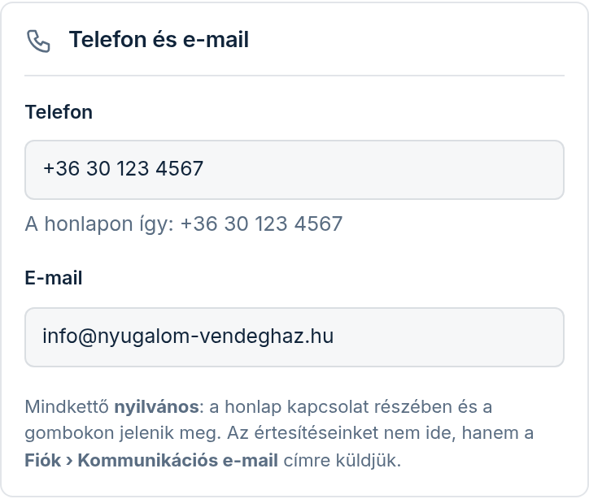

Az **Elérhetőség** menüpontban (az „Az oldalam” csoportban) javíthatja, hol találja meg és hogyan éri el
Önt a vendég: a szállás **címét**, a **pontos helyét a térképen**, a **telefonszámát** és az **e-mail-címét**.
Ezek a honlap tetején, a kapcsolat részben és a Google-nak szóló adatokban jelennek meg. Ha a Térkép
modul be van kapcsolva, a térkép is ezt a helyet mutatja.

## A szállás helye

1. A **„Cím”** mezőbe írja be a címet úgy, ahogy a vendégnek mondaná: település, utca, házszám, vagy ha
   nincs házszám, a helyrajzi szám.
2. A **„Megkeresem a térképen”** gombra a tű a cím alapján ugrik a térképre. Az állapotsor ilyenkor ezt írja:
   **„A cím alapján áll — ellenőrizze, és húzza pontosra”**.
3. **Koppintson a térképre, vagy húzza a tűt** oda, ahol a vendég megáll: a bejárathoz, a kapuhoz. Ha a ház nem
   látszik, váltson a térkép bal felső sarkában **„Műhold”** nézetre. Telefonon a térképet két ujjal lehet
   mozgatni, egy ujjal az oldal görget.
4. Ha elrontotta, a **„Vissza a mentett helyre”** gomb visszateszi a tűt oda, ahol legutóbb elmentette.

Ha a térkép a címet nem ismeri (tanyán, helyrajzi számnál gyakori), ezt írja ki: **„Ezt a címet a térkép nem
ismeri — húzza a tűt a helyére kézzel”**. Ilyenkor:

1. Írja a „Cím” mezőbe csak a **település nevét**, és koppintson a **„Megkeresem a térképen”** gombra —
   a térkép a településre ugrik.
2. Nagyítson rá a házra (telefonon két ujjal széthúzva, gépen az egér görgőjével vagy a **+** gombbal), és
   koppintson oda, ahol a vendég megáll. A tű oda kerül.
3. **Írja vissza a „Cím” mezőbe a teljes címet** (a helyrajzi számmal együtt) — különben a honlapon csak a
   település neve állna. Utána mentsen.

## Telefon és e-mail

- A telefonszámot írhatja bárhogy (pl. „06 30 123 4567”). A mező alatt rögtön látja, hogyan jelenik meg a
  honlapon: az **„A honlapon így:”** kezdetű sor a honlapra kerülő alakot mutatja (pl. +36 30 123 4567).
  Ha üresen hagyja, a honlapon nem lesz telefonszám.
- Mindkét adat **nyilvános**. A mi értesítéseinket nem ide küldjük, hanem a **Fiók** fülön megadott
  kommunikációs e-mail-címre.

## Mentés

A **„Mentés és frissítés”** gomb mellett mindig látja, mi nincs még elmentve: a **„Mentetlen:”** szó után
felsorolja a módosított mezőket (például cím, térkép-tű). Ha minden el van mentve, ezt írja: **„Nincs mentetlen
változás”**. Mentés után megjelenik a **„Mentve — az oldala frissült.”** visszajelzés, és a honlapja már
az új adatokat mutatja.

Ha egy mező hibás (például a telefonszám nem telefonszám), a mező alatt pirossal megjelenik a hiba, és
**semmi nem mentődik el** — a hibátlan mezők sem. Javítsa ki, és mentsen újra.

## A Térkép modul képernyőjén is

A **Modulok › Térkép, megközelítés** képernyő tetején ugyanez a **„A szállás helye”** kártya van, ugyanazzal
a címmel és tűvel. Amit az egyik helyen átír, az a másikon is megváltozik. Ott egy mentés a címet, a tűt és a
megközelítés-leírást együtt menti. A telefonszámot és az e-mailt csak az Elérhetőség menüpontban lehet
szerkeszteni.

Az ottani **„Vissza az előzőre”** gomb csak a megközelítés-mezőket állítja vissza, a **címet és a tűt nem**.
A tűt a **„Vissza a mentett helyre”** gomb teszi vissza; a régi címet kézzel írja vissza. A még el nem mentett
tű-módosítás a „Vissza az előzőre” gombra elvész.
