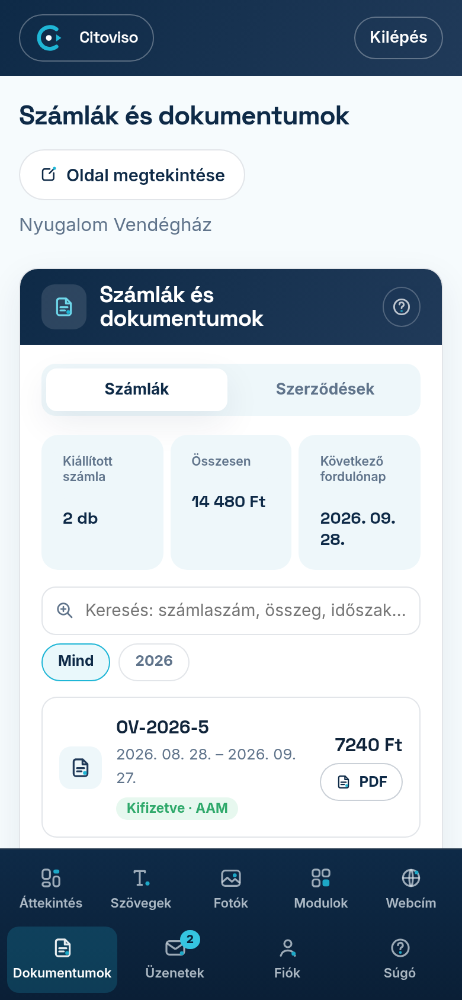

A **„Dokumentumok”** fülön egy helyen áll minden bizonylata: a számlái és azok a
nyilatkozatok, amelyeket a megrendeléskor elfogadott.

## A két lista

A fül tetején két gomb választja szét a kétféle iratot:

- **„Számlák”** — a rólunk kiállított számlák, letölthető PDF-fel.
- **„Szerződések”** — amihez hozzájárult: a megrendelés adatai, az Általános Szerződési
  Feltételek elfogadása és a fotó-jogi nyilatkozata.

## A számlák listája

A lista tetején három adat összegez:

- **„Kiállított számla”** — hány számla készült (a szűrésnek megfelelően).
- **„Összesen”** — ezek együttes összege.
- **„Következő fordulónap”** — mikor esedékes a következő díj.

Fontos: ha évre szűr, ez a három adat is az adott évre vált. Így pontosan azt látja,
amit a könyvelőnek meg kell adnia.

## A számla letöltése

Minden soron van egy **„PDF”** gomb — egy koppintás, és letöltődik a számla.
Ezt küldheti tovább a könyvelőjének.

Ha egy soron **„Számlázás folyamatban”** felirat áll a **„Még nincs bizonylat”** címkével,
az azt jelenti, hogy a számla kiállítása még tart. Ez nem hiba és nem az Ön teendője:
amint elkészül, itt megjelenik, és e-mailben is megküldjük.

## Keresés és szűrés

A kereső mezőbe beírhatja a **számlaszámot**, az **összeget** vagy az **időszakot** — a
lista azonnal szűkül. Mellette évszám-gombok állnak; ezek mindig csak azokat az éveket
kínálják, amelyekhez tényleg tartozik irat.

Ha szűrt, megjelenik a **„Szűrés törlése”** link, amivel visszakapja a teljes listát.

Ha a keresésnek a másik listában is van találata, a felület ezt kiírja a találatszám
mellett, és egy koppintással átvisz oda. Nem kell kétszer rákeresnie ugyanarra.

## Szerződések

Ezeket a bejegyzéseket nem lehet módosítani — épp az a szerepük, hogy megőrizzék, mihez
és mikor járult hozzá. Ahol a szöveget is eltároltuk, ott szó szerint elolvashatja, amit
elfogadott.
