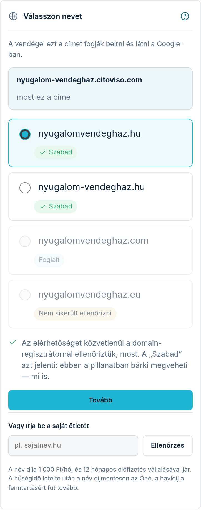
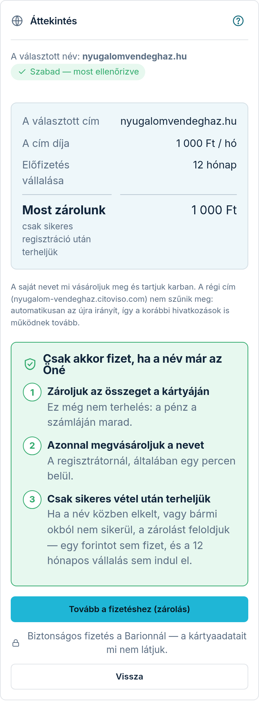

A honlapja induláskor egy nálunk lévő címen érhető el (például
`sajatnev.citoviso.com`). A **Webcím** fülön rendelhet helyette **saját nevet**
(például `sajatnev.hu`) — ez jelenik majd meg a vendégeinek, a névjegyén és a
Google-ban.

A nevet mi vásároljuk meg és mi tartjuk karban: Önnek nem kell regisztrátornál
számlát nyitni, DNS-t állítgatni vagy tanúsítványt intézni.

## Hogyan rendelhetem meg?

**1. lépés — Név.** A fül tetején látja a honlapja jelenlegi címét. Alatta néhány
javaslatot kínálunk a vállalkozása nevéből. Az elérhetőséget **közvetlenül a
domain-regisztrátornál** ellenőrizzük, abban a pillanatban, amikor megnyitja a fület.
Mindegyik név mellett ott a válasz:

- **Szabad** — most bárki megveheti, mi is; ezt kérheti,
- **Foglalt** — valaki más már birtokolja, ezt nem lehet kérni,
- **Nálunk nem igényelhető** — a regisztrátor ezt a nevet (például a végződése miatt)
  nem adja el nekünk; válasszon másikat,
- **Nem sikerült ellenőrizni** — a regisztrátor épp nem válaszolt. Amíg nem tudjuk
  biztosan, hogy szabad, nem kínáljuk megvételre. Frissítse a lapot kicsit később (a saját
  ötletnél erre az **„Újra”** gomb szolgál).

Ha egyik javaslat sem tetszik, a **„Vagy írja be a saját ötletét”** mezőbe beírhatja
a magáét, és az **„Ellenőrzés”** gombbal megnézzük. Nyugodtan írja úgy, ahogy a
böngészőben látná (`https://`, `www.`, nagybetűk) — magunktól rendbe tesszük, és
vissza is írjuk a mezőbe a letisztázott alakot, hogy lássa, mire kérdezünk rá.
Ha valami nem használható benne, egyszerű magyar mondatban megírjuk, miért.
Úgynevezett **prémium (emelt díjas)** nevet — amiért a névkereskedő a szokásos
többszörösét kéri — nálunk nem lehet igényelni; ha ilyet ír be, ezt az
ellenőrzésnél azonnal jelezzük, és érdemes másik nevet választani.

Az első szabad nevet eleve kijelöljük (a név előtti pötty). Ha másikat kér, koppintson
arra, majd a lista alatti **„Tovább”** gombra. Ha a listában egyetlen szabad név sincs, a
„Tovább” gomb nem nyomható — ilyenkor írjon be saját ötletet. Ha saját nevet írt be és
azt ellenőriztette, az eredmény-doboznál az **„Ezt kérem”** gombbal viheti tovább.

**2. lépés — Áttekintés.** Ha ide lép, a nevet még egyszer megnézzük a regisztrátornál
(„Szabad — most ellenőrizve”). Itt egy helyen látja, mit rendel: a választott címet, a
cím **havi díját**, a vállalt előfizetési időt, és hogy most mennyit **zárolunk** a
kártyáján. Ha meggondolta magát, a **„Vissza”** gombbal új nevet választhat. Ha rendben
van, koppintson a **„Tovább a fizetéshez (zárolás)”** gombra — a Barion biztonságos
fizetési oldalára jut.

Ha a név az újbóli ellenőrzéskor már nem szabad, a lépésen **nincs fizetés-gomb**: a lap
megírja, hogy a név foglalt vagy nálunk nem igényelhető, és a **„Vissza”** gombbal
választhat másikat. Ha a regisztrátor épp nem válaszolt, az **„Újra”** gombbal kérdezhet rá
ismét. Ha a fizetési oldal nem nyílt meg, a lap tetején ez áll: „A fizetést nem sikerült
elindítani. Kérjük, próbálja újra.” — ilyenkor semmit nem zároltunk.

**Csak akkor fizet, ha a név már az Öné.** A fizetési oldalon az összeget **csak
zároljuk** a kártyáján — ez még nem terhelés, a pénz a számláján marad. Ezután azonnal
megvásároljuk a nevet, és **csak a sikeres vétel után terheljük** a kártyáját. Ha a név
közben elkelt, vagy bármi okból nem sikerül megvenni, a zárolást feloldjuk: egy forintot
sem fizet, és az előfizetési vállalás sem indul el.

Két dolgot érdemes tudnia a zárolásról. A bankja az alkalmazásában **függőben lévő
tételként** mutathatja — ez még nem levonás. És mivel valódi kártyazárolás, **csak
bankkártyával** lehet fizetni (Barion-egyenleggel nem).

**3. lépés — Kész.** A fülön lépésről lépésre követheti, hol tart: összeg zárolva →
megvásároltuk a nevet → terheltük a kártyáját (a számlát e-mailben küldjük) → beállítjuk
a címet és a biztonsági tanúsítványt. E-mailben is szólunk, amint kész.

A `.hu` nevek bejegyzése napokig tart (lásd lent) — a képernyő ezt ki is írja („A .hu
neveknél ez néhány nap”). A kártyáját ettől függetlenül már a név megvásárlásakor
terheljük, nem a várakozás végén.

Az ok: a magyar nyilvántartó (a `.hu` neveket kezelő szervezet) minden igénylést külön
megerősítéshez köt. **Ezt a lépést mi végezzük el, nem Ön** — a nyilvántartó a mi
kapcsolattartói címünkre ír, mert a nevet mi vásároljuk meg az Ön számára. Önnek tehát
tényleg nincs teendője; csak azt érdemes tudnia, hogy emiatt tart tovább.

🛡️ **Ezért fontos:** ha Ön mégis kapna egy levelet, ami „domain-megerősítést” kér és
linkre kattintást sürget, az **nem tőlünk és nem a nyilvántartótól jön** — ilyet Önnek nem
küldünk. Ne kattintson benne, hanem továbbítsa nekünk, és megnézzük.

## Meddig tart, és mi történik közben?

Nem magyar (`.com`, `.eu` és hasonló) neveknél általában rövid: a név megvásárlása után
a címet és a biztonsági tanúsítványt néhány perc alatt beállítjuk, és a honlapja
átköltözik az új névre. A tanúsítvány az, ami miatt a böngésző lakatot mutat a cím
mellett.

⚠️ **`.hu` névnél napokban számoljon**, nem percekben: a nyilvántartói megerősítés után is
van egy nyolcnapos várakozási idő, amíg a név véglegessé válik. Ez a magyar szabályozás
rendje, minden szolgáltatónál ugyanez. A honlapja addig is elérhető marad a régi címén —
a költözés **nem jár leállással**.

## A régi cím megszűnik?

Nem. A régi cím automatikusan az újra irányít, így a korábban kiadott névjegyek,
szórólapok és a máshol elhelyezett hivatkozások is működnek tovább. A Google is
átvezeti az új címre azt, amit a régi cím addig összegyűjtött.

## Mi van, ha a nevet közben elviszi valaki?

Ritkán előfordul: a domain nevek érkezési sorrendben kelnek el, és az ellenőrzés meg a
tényleges vásárlás között eltelik pár másodperc. Ha ez történik, a rendszer inkább
leáll, mint hogy rossz nevet vegyen Önnek.

**Ilyenkor nem fizet semmit.** Mivel az összeget csak zároltuk, a zárolást feloldjuk, és a
kártyáját nem terheljük. A bankjától függően néhány munkanapon belül eltűnik a
számlájáról. Az előfizetési vállalás sem indul el. A fülön és e-mailben is
megírjuk, melyik nevet nem sikerült megszerezni, és a **„Másik név választása”** gombbal
rögtön választhat másikat.

## Mennyibe kerül?

Az árat mindig az **„Áttekintés”** képernyőn látja, mielőtt fizet: a cím havi díját
és a vele járó előfizetési vállalást.

**A saját cím HAVI díjas.** A díj minden hónapban ott van az előfizetési számláján,
külön soron megnevezve — nincs egyszeri nagy tétel, és nincs évfordulós meglepetés.
Addig fut, amíg a nevet nálunk tartja: a nyilvántartó a nevet évről évre újra
kiszámlázza nekünk, ezért a fenntartásáért folyamatosan fizet.

Három dolgot érdemes tudni:

- **A saját cím csak egy bizonyos csomagmérettől választható** — a pontos összeget a
  „Webcím” fülön írjuk ki. Ez belépési feltétel, nem kedvezmény: kisebb csomag mellett
  a név nem olcsóbb, hanem nem elérhető. A feltételt a csomag **listaára** dönti el,
  tehát egy időszakos kedvezmény nem számít bele.
- **A díjra kedvezmény nem vonatkozik.** A bemutatkozó vagy egyéb engedmény a mi
  szolgáltatásunk árát csökkenti; a név díja a nyilvántartónak fizetett, továbbhárított
  költség, ezért mindig teljes összegben szerepel.
- **A hűségidő letelte után a név díjmentesen az Öné**, és nincs többé sem kötbér, sem
  csomag-minimum. A havi díj viszont tovább fut, amíg a nevet nálunk tartja — ez a
  fenntartás díja, nem a névé.

## Ha már van saját domainem

Ha korábban máshol vásárolt nevet, azt is rá lehet kötni a honlapjára, de ez ma még
nem önkiszolgáló. Írjon nekünk, és elintézzük.
