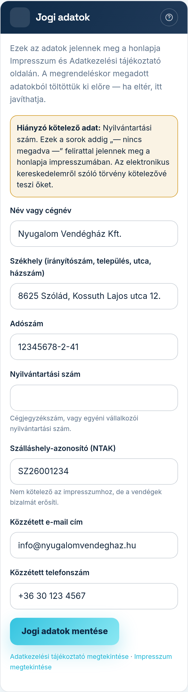

A honlapjának két jogi oldala van: az **Impresszum** és az **Adatkezelési tájékoztató**.
Mindkettőt mi állítjuk elő és tartjuk karban — Önnek csak az adatait kell megadnia, azokat
pedig a **Fiók** fül **„Jogi adatok”** részében kezeli — telefonon ehhez görgessen a fiókadatok
alá.

## Miért kell ez?

Ha a honlapján a vendég beír bármit — nevet, e-mail-címet, telefonszámot egy foglalási
kéréshez —, a jogszabály előírja, hogy tájékoztatnia kell arról, mi történik ezekkel az
adatokkal. Az impresszumot pedig az elektronikus kereskedelemről szóló törvény írja elő minden
üzleti célú honlapnak. Ezt nem kell megírnia: a szövegek készen vannak, és az Ön adataival
töltődnek ki.

## Az adatok, amiket megad

A legtöbb mezőt már kitöltöttük a megrendeléskor megadott adataiból. Nézze át, és ha valamelyik
eltér, javítsa:

- **„Név vagy cégnév”** — akinek a nevében a szálláshely működik. Cég esetén a cégnév,
  egyéni vállalkozóként a saját neve.
- **„Székhely (irányítószám, település, utca, házszám)”** — a bejegyzett cím. Nem feltétlenül
  a szálláshely címe: ha otthonról intézi az ügyeket, ide a hivatalos cím kerül.
- **„Adószám”** — a vállalkozás adószáma, `12345678-2-41` formában.
- **„Nyilvántartási szám”** — cégeknél a cégjegyzékszám, egyéni vállalkozóként a
  nyilvántartási szám. Ezt a megrendeléskor nem kértük, ezért itt kell megadnia.
- **„Szálláshely-azonosító (NTAK)”** — nem kötelező az impresszumhoz, de érdemes kitölteni:
  a vendég ebből látja, hogy bejelentett szálláshelyről van szó.
- **„Közzétett e-mail cím”** és **„Közzétett telefonszám”** — ezek a jogi oldalakon jelennek
  meg. Nem ugyanaz, mint a **„Kommunikációs e-mail”**: oda mi írunk Önnek, ez pedig az, amin a
  vendég vagy egy hatóság elérheti.

A végén koppintson a **„Jogi adatok mentése”** gombra. A honlapja jogi oldalai azonnal
frissülnek — nem kell külön közzétenni semmit.

## Ha hiányzik egy kötelező adat

Amíg egy **kötelező** mező üres, a panel tetején figyelmeztetés jelenik meg, és felsorolja, mi
hiányzik. Ilyenkor a honlap impresszumában az adott sor helyén **„— nincs megadva —”** olvasható,
kiemelve.

Ezt szándékosan csináljuk így: nem találunk ki adatot Ön helyett, és nem is tüntetjük el a
sort, mintha nem is kellene. Így Ön is látja, és a vendég is látja, hogy ott valami hiányzik —
és egy perc alatt pótolható.

A **nem kötelező** mezők (szálláshely-azonosító, telefonszám) másképp működnek: ha üresen hagyja
őket, egyszerűen nem jelennek meg az impresszumban. Nem kap figyelmeztetést, és a vendég sem lát
hiányra utaló feliratot — olyat nem kérünk számon Önön, amit a jogszabály nem ír elő.

Hogy melyik mező kötelező, az attól függ, magánszemélyként vagy vállalkozásként rendelte meg a
honlapot: az adószám és a nyilvántartási szám a vállalkozásoknál kötelező.

## Hol nézheti meg az eredményt?

Ha a honlapja már élesítve van, a panel alján megjelenik az **„Adatkezelési tájékoztató
megtekintése”** és az **„Impresszum megtekintése”** hivatkozás: ezekkel pontosan azt látja, amit
a vendége lát. (Amíg a honlap csak előnézetben van, ezek a hivatkozások még nem jelennek meg.)

A vendég a honlap legalján, a sötét sávban éri el ugyanezt a két oldalt — minden aloldalról,
a szobák aloldalait is beleértve.

## Sütik: nálunk nincs süti-ablak

A honlapja **nem használ sütit** — sem elemzőt, sem hirdetésit —, ezért nincs is az a bosszantó
süti-elfogadó ablak, ami sok más oldalon az első kattintást elveszi. A látogatottságot a saját
kiszolgálónkon mérjük, süti és külső szolgáltatás nélkül; erről az adatkezelési tájékoztató
látogatottság-mérésről szóló szakasza szól.

## Többnyelvű honlap esetén

A jogi oldalak egyelőre **magyar nyelven** jelennek meg akkor is, ha megvásárolta a többnyelvű
modult. Ennek az az oka, hogy a jogi szöveg nem fordítás kérdése: minden országnak saját jogi
csomagja van, amit nem géppel fordítunk. A honlap többi része természetesen a megvásárolt
nyelveken jelenik meg.

## Ki felel miért?

A honlapján keresztül érkező vendégadatok (foglalási kérés, vélemény) **az Ön adatai**: Ön az
adatkezelő. Mi adatfeldolgozóként járunk el — tároljuk és továbbítjuk Önnek, de a saját
céljainkra nem használjuk. Ez az Adatfeldolgozási feltételekben (GDPR 28. cikk) van rögzítve,
amely az ÁSZF része.
