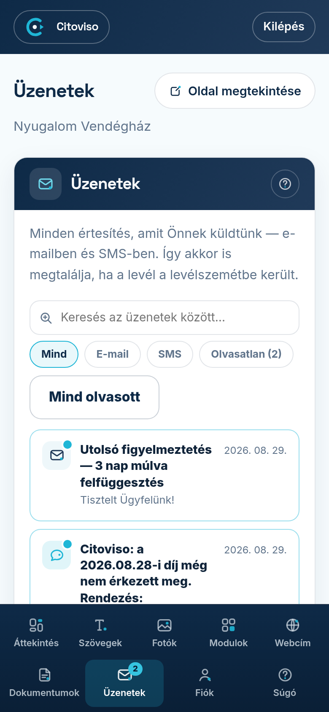

Az **„Üzenetek”** fülön visszanézheti mindazt, amit küldtünk Önnek: számlaértesítőt,
fizetési emlékeztetőt, a honlapját érintő híreket — e-mailben és SMS-ben egyaránt.

## Mire jó ez?

Ha egy levelünk a levélszemét mappába került, vagy az SMS egy másik telefonra érkezett,
itt akkor is megtalálja. Nem kell a postafiókjában keresgélnie.

## Az olvasatlan üzenetek

A bal oldali menüben (telefonon az alsó sávban) az **„Üzenetek”** felirat mellett egy kis
szám jelzi, hány olvasatlan üzenete van. A listában az olvasatlan sorok vastagabb betűvel
és színes kerettel emelkednek ki.

Egy üzenetre koppintva az helyben kinyílik, és egyben olvasottá is válik. Ha egyszerre
akarja mindet olvasottnak jelölni, használja a **„Mind olvasott”** gombot.

## Szűrés és keresés

A gombokkal szűkítheti a listát:

- **„Mind”** — minden üzenet.
- **„E-mail”** — csak a leveleink.
- **„SMS”** — csak a szöveges üzenetek.
- **„Olvasatlan”** — amit még nem nyitott meg.

A kereső mezőbe bármilyen szót beírhat: a felület az üzenet tárgyában és szövegében is
keres. Ha szűrt vagy keresett, a **„Szűrés törlése”** linkkel áll vissza a teljes lista.

## Mellékletek

Ha egy üzenethez számla tartozott, a megnyitott üzenet alján a **„Melléklet letöltése”**
gombbal töltheti le a PDF-et. Ugyanez a bizonylat a **„Dokumentumok”** fülön is megvan.

## Ha üres a lista

Az üzenetek gyűjtését 2026 augusztusában kapcsoltuk be. Az ennél korábbi leveleink nem
szerepelnek itt — azok csak az Ön e-mail postafiókjában találhatók meg.
