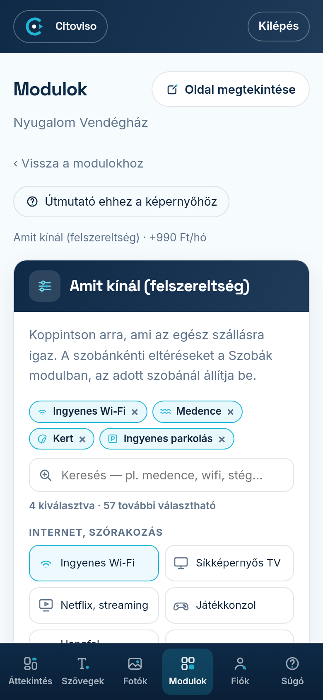

A felszereltség-képernyőt a Modulok fülön, az „Amit kínál (felszereltség)” modul melletti
**„Beállítás”** linkkel nyitja meg. Itt pipálja ki, mit kap a vendég az egész szálláson —
a vendég ezt áttekinthető listaként látja a honlapján.

## Hogyan válasszon?

Koppintson az ikonos csempékre — ami igaz a szállására, azt jelölje be, a csempe színnel jelzi
a kiválasztást. A tételek kategóriákba rendezve követik egymást (internet, konyha, wellness,
kültér és a többi), összesen 70 választható tétel.

Gyorsabb út a kereső: írja be, amit keres (pl. „medence” vagy „stég”), és csak az egyező
csempék maradnak a listán. A kiválasztott tételek felül, kis címkéken is látszanak — egy címke
**×** jelére koppintva ki is kapcsolhatja őket, görgetés nélkül.

Ami nincs a listában, azt az **„Egyéb, ami nincs a listában”** mezőbe írhatja, soronként egyet.
A listás tételeket a vendég a honlap nyelvén látja; a szabad szöveg úgy jelenik meg, ahogy beírja.

## Mi tartozik ide, és mi a szobákhoz?

Ez a képernyő az **egész szállásra** vonatkozik (pl. medence, kert, parkolás, reggeli).
Ami egy-egy szobára igaz (pl. saját fürdőszoba, erkély), azt a **Szobák, apartmanok** modulban,
az adott szoba kártyáján jelöli be — ott a szállás-szintű tételei halvány csempeként látszanak,
mert azokat a szoba automatikusan örökli. Ezért egy-egy tétel csak az egyik helyen választható:
így nem kerülhet ellentmondásba a két lista.

## Mentés és visszaállítás

A **„Beállítások mentése”** gombbal rögzíti a listát — a honlapja ezután frissül. Ha meggondolta
magát, a **„Vissza az előzőre”** gomb az előző mentett állapotot állítja vissza.
