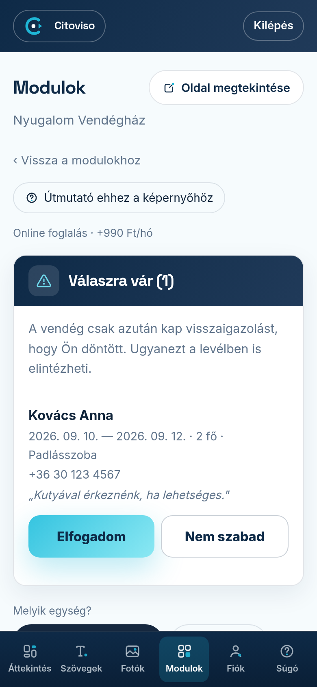

A foglalás-modul beállító-képernyőjét a Modulok fülön, a modul melletti **„Beállítás”** linkkel éri
el. Itt három dolgot kezel: a beérkezett foglalási kéréseket, a naptárát és a kiadott egységeit.

## Foglalási kérés érkezett — mit tegyek?

Ha egy vendég foglalást kért, a képernyő tetején a **„Válaszra vár”** részben látja a nevét, az
időpontot, a létszámot és az üzenetét. Két gomb közül választhat:

- **„Elfogadom”** — a vendég e-mailben visszaigazolást kap, és a napok foglalttá válnak a naptárban.
- **„Nem szabad”** — a vendég udvarias értesítést kap, hogy az időpont nem elérhető; a naptár nem változik.

Ugyanezt a döntést a kérésről kapott e-mailből is elintézheti egy koppintással, belépés nélkül —
a vendég csak azután kap választ, hogy Ön döntött.

## A naptár kezelése

A **„Mikor van tele?”** naptárban koppintson azokra a napokra, amikor nem tud vendéget fogadni —
a megjelölt (sötét) napokra a vendég nem tud foglalni. Újra koppintva a nap ismét szabad lesz.
A **„Naptár mentése”** gombbal rögzíti a változást. A ‹ és › nyilakkal lapozhat a hónapok között.

A jelmagyarázat: „Szabad” = foglalható nap, „Tele van” = az Ön által jelölt vagy már lefoglalt nap.
Az elfogadott foglalások napjait nem lehet koppintással felszabadítani — így nem történhet
véletlen duplafoglalás.

## Egységek (szobák, apartmanok)

A **„Mit ad ki?”** részben veszi fel, amit kiad: ha több szobája vagy apartmanja van, mindegyiknek
saját naptára lesz, így külön telhetnek be. Új egységet a név és a férőhely megadásával, a
**„Hozzáadás”** gombbal vehet fel; a meglévőt átnevezheti, a **„Törlés”** gombbal eltávolíthatja.
Több egységnél a naptár fölött a „Melyik egység?” választóval vált közöttük.
