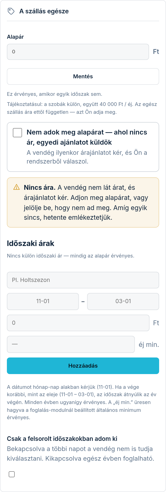
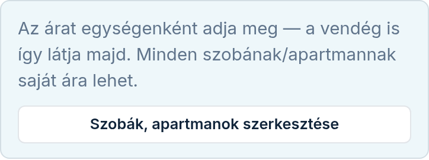

Az ár-modul beállító-képernyőjét a Modulok fülön, a modul melletti **„Beállítás”** linkkel éri el.
Az árat egységenként (szobánként, apartmanonként) adja meg — a vendég is így látja majd az oldalán.
Minden egységnek saját kártyája van.

## Alapár

Az **„Alapár”** mezőbe írja be, mennyibe kerül egy éjszaka ebben az egységben, és koppintson a
**„Mentés”** gombra. Ez az ár érvényes mindig, amikor egyik időszaki ár sem — nyugodtan kezdje
ennyivel, a többi ráér.

Ha az árat üresen hagyva ment, az ár törlődik az oldaláról — jobb, ha nincs kint szám, mint ha
rossz szám van kint.

## Ha szándékosan nem ad meg árat

Van szoba, aminek az árát mindig a vendéghez szabja (hányan jönnek, mennyi időre). Ilyenkor az
alapár alatti négyzetet pipálja be: **„Nem adok meg alapárat — ahol nincs ár, egyedi ajánlatot
küldök”**. A pipa azonnal ment, nem kell külön gombot nyomnia.

Mi történik utána:

- Azokra az éjszakákra, amelyekre nincs ár, a vendég nem lát számot, és foglalás helyett
  **árajánlatot kér**. Ön a rendszerből válaszol rá (a kérésről e-mailt kap). Ha a szobának
  vannak időszaki árai, azokban az időszakokban a vendég továbbra is az árat látja.
- Az oldala **„Árak”** részében a szoba „Egyedi ajánlat alapján” sorral szerepel. Ha vannak
  időszaki árai, azok érvényesek, és a sor „Egyéb időszakban” mondja ki, hogy a többi
  éjszakára ajánlatot ad.
- A szobáról **nem kap emlékeztetőt**, és az Áttekintés teendői között sem jelenik meg.

A kártyán egy kék sor erősíti meg: **„Kimondva: nem ad meg alapárat.”** A pipa levételével
bármikor visszavonhatja. Ha alapárat ad meg, a pipa magától lekerül, hiszen akkor már minden
éjszakának van ára. Amíg alapár van, a négyzet szürke, és nem jelölhető be.

## Ha egy szobának nincs (teljes) ára

Ha egy szobának egyáltalán nincs ára, vagy csak az év egy részére van (például csak főszezoni
ár, alapár nélkül), a kártyán sárga sor jelzi: **„Nincs ára.”**, illetve **„Az év egy részére
nincs ára.”** Ilyenkor a vendég ezekre az éjszakákra nem lát árat, és árajánlatot kér. Két
kiút van: adjon meg alapárat, vagy pipálja be, hogy szándékosan nem ad meg. Amíg egyik sincs,
hetente e-mailben emlékeztetjük.

## Időszaki árak (pl. főszezon)

Az **„Időszaki árak”** résznél adhat meg eltérő árat az év egyes szakaszaira:

1. Adjon nevet az időszaknak (pl. Főszezon).
2. Adja meg a kezdetét és végét **hónap-nap** alakban (pl. 06-15 és 08-31) — évszám nélkül,
   mert minden évben ugyanígy érvényes, nem kell januárban újra beírnia. Pontokkal is írhatja
   (06.15), a rendszer átalakítja.
3. Írja be az árat, és koppintson a **„Hozzáadás”** gombra.

Gépelés közben a mezők alatt kiírjuk, pontosan mettől meddig lesz érvényes az időszak.

**Az év végén átnyúló időszak** (pl. téli holtszezon novembertől márciusig): írja be úgy, ahogy
mondaná — kezdet 11-01, vég 03-01. Ha a vége korábbi, mint az eleje, az időszak átnyúlik az év
végén, és a soron az **„átnyúlik az év végén”** jelölés áll. Az évek ilyenkor két évszámot
kapnak, például 2026/27.

### Egy időszak módosítása

A sor melletti **„Szerkesztés”** gombbal a nevet, a napokat és az árat átírhatja — ha online
foglalása is van, a minimumot is —, majd **„Mentés”** (vagy **„Mégse”**). Az évekre megadott
külön árak megmaradnak.

Egy időszakot a **„Törlés”** gombbal távolíthat el — az évekre megadott külön árai is vele
mennek, és utána ott újra az alapár érvényes. Ha nincs egyetlen időszaki ár sem, mindig az
alapár él.

### Ha két időszak ugyanarra a napra esik

Ahol két időszak átfed (pl. a „Téli ár” novembertől februárig, és benne az „Ünnepek”), ott a
**listán feljebb álló** időszak ára számít. A **„Szerkesztés”** gomb előtti kis fel- és le-nyíllal
rendezheti át őket. Ha egy új vagy átírt időszak átfed egy másikkal, a mezők alatt sárga
sorban kiírjuk, melyiké lesz a közös napok ára.

## Más ár egy adott évben

Minden időszak alatt ott vannak az évek, egy-egy kártyán (a legközelebbi, még le nem zajlott
évtől kezdve). Oldalra húzva — vagy a két nyíllal — további évekhez jut, akármeddig előre.

- Ha egy évben mást kér (pl. jövőre drágább lesz a főszezon), írja be az árat az adott év
  kártyáján, és koppintson a **„Mentés”** gombra. A kártya ekkor **„saját ár”** jelölést kap.
- Ahol nem ír semmit, ott **„az ismétlődő ár”** érvényes — semmi nem romlik el, ha nem ad meg
  külön árat.
- A **„Vissza az ismétlődőre”** gomb törli az adott év külön árát.
- Ha egy évben más napokra esik az időszak (pl. húsvét), a kártyán nyissa le a **„Más napokon
  ebben az évben”** részt, adja meg a kezdetet és a véget, majd koppintson a kártya
  **„Mentés”** gombjára. Ezután a kártyán „saját napok” áll, és a napokat a **„Napok
  módosítása”** alatt írhatja át.

A honlapján az évet csak akkor írjuk ki, ha annak az időszaknak van külön éves ára — ilyenkor
a vendég a foglalható hónapokra évenként látja az árat.

### Levél a szezon végén

Egy időszak utolsó napja utáni reggelen e-mailt küldünk: mennyi volt idén az ára, és mi
legyen jövőre. Ha marad, nem kell tennie semmit. Ha változtatna, a levél linkje egyenesen a
következő év kártyájára visz — ha előbb belépést kér, a belépés után is oda. Egy időszakról évente egyszer írunk, és nem írunk, ha a következő
évre már megadott árat.

## Mikor adja ki, és legalább hány éjszakára — online foglalással

Ez a két beállítás a **foglalási naptárra** hat, ezért csak akkor jelenik meg, ha az Online
foglalás modul is be van kapcsolva:

- **„éj min.”** — az új időszak sorában, az ár mellett: ebben az időszakban legalább ennyi
  éjszakára lehet foglalni (pl. nyáron 3). Ha üresen hagyja, a foglalás-modulnál beállított
  általános minimum érvényes. A meglévő időszak sorában az ár alatt látja, amit megadott.
- **„Csak a felsorolt időszakokban adom ki”** — kapcsoló az egység kártyájának alján.
  Bekapcsolva a felsorolt időszakokon kívüli napokat a vendég a naptárban ki sem tudja
  választani (pl. télen zárva tart). Kikapcsolva egész évben foglalható, és az időszakok csak
  az árat és a minimumot finomítják. Egységenként külön állítható.

Ha nincs online foglalása, a vendég időpontkérést küld, és azt Ön bírálja el — ilyenkor ez a
kettő nem hat semmire, ezért nem is látja. A helyükön egy rövid sor mondja meg, mit adna hozzá
a foglalás. Ha korábban, még foglalással már beállította őket, nem vesznek el: foglalás nélkül
szünetelnek (a portálokkal megosztott naptárát sem zárják), és ha újra bekapcsolja a
foglalást, ugyanúgy élnek tovább.

Az Online foglalás külön havidíjas modul. A sor alatti **„Online foglalás”** link a Modulok
fülre visz; ott a **„Bővítés — amit még hozzáadhat”** részben keresse meg az Online foglalás
kártyáját — rajta látja a havidíjat is —, és koppintson a **„Hozzáadom”** gombra.

## Több szoba, több ár

Ha több egysége van, mindegyik kártyáján külön árazhat — a kertre néző apartman kerülhet többe,
mint a padlásszoba. Ha még nem vette fel a szobáit (például eddig csak „A szállás egésze” szerepel,
de szobánként adna ki), azt előbb a szoba-modulnál tegye meg; az árazás ugyanazokat az egységeket
látja. Nem kell keresgélnie: a képernyő tetején, a bevezető sor mellett a **„Szobák, apartmanok
szerkesztése”** gomb egyenesen a szoba-modul beállító-képernyőjére visz. Ha a Szobák modul még nincs
bekapcsolva, a gomb felirata **„Szobák modul bekapcsolása”**, és a Modulok fülre visz — ott a
Szobák, apartmanok kártyán a **„Hozzáadom”** gombbal kapcsolja be, utána a gomb már a
szerkesztőre mutat.

## Az egész szállás árát is adja meg

Ha a házat egyben is kiadja, az egész szállásnak jelölt egység ugyanolyan egység, mint a szobák: ha a
vendég a teljes szállást foglalja, ennek az egységnek az árát látja. Az árat Ön adja meg — a szobák
ára nem adódik össze helyette, mert az egész ház ára a valóságban sem a részek összege. Segítségül
a kártyáján az alapár alatt egy tájékoztató sor mutatja, mennyibe kerülnek a szobák külön, együtt
(„Tájékoztatásul: a szobák külön, együtt … / éj.”) — ezt csak Ön látja, a vendég nem. Ha itt nincs
ár, a teljes ház foglalásához nem tudunk árat mutatni: a vendég árajánlatot kér.
