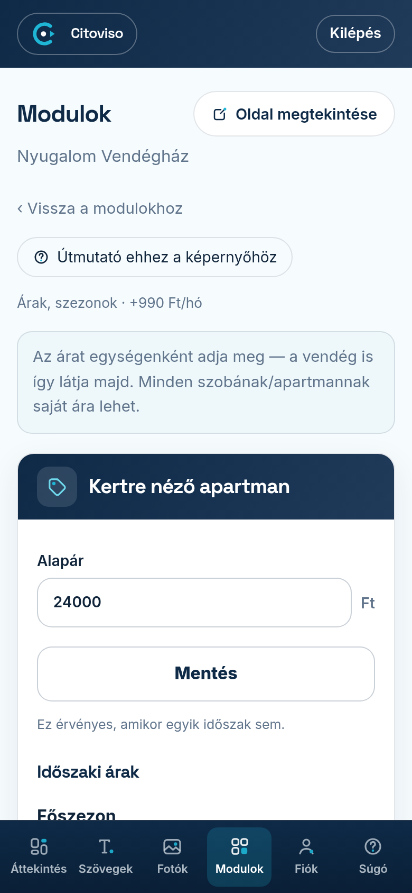

Az ár-modul beállító-képernyőjét a Modulok fülön, a modul melletti **„Beállítás”** linkkel éri el.
Az árat egységenként (szobánként, apartmanonként) adja meg — a vendég is így látja majd az oldalán.
Minden egységnek saját kártyája van.

## Alapár

Az **„Alapár”** mezőbe írja be, mennyibe kerül egy éjszaka ebben az egységben, és koppintson a
**„Mentés”** gombra. Ez az ár érvényes mindig, amikor egyik időszaki ár sem — nyugodtan kezdje
ennyivel, a többi ráér.

Ha az árat üresen hagyva ment, az ár törlődik az oldaláról — jobb, ha nincs kint szám, mint ha
rossz szám van kint.

## Időszaki árak (pl. főszezon)

Az **„Időszaki árak”** résznél adhat meg eltérő árat az év egyes szakaszaira:

1. Adjon nevet az időszaknak (pl. Főszezon).
2. Adja meg a kezdetét és végét **hónap-nap** alakban (pl. 06-15 és 08-31) — évszám nélkül,
   mert minden évben ugyanígy érvényes, nem kell januárban újra beírnia.
3. Írja be az árat, és koppintson a **„Hozzáadás”** gombra.

Egy időszakot a sora melletti **„Törlés”** gombbal távolíthat el — utána ott újra az alapár
érvényes. Ha nincs egyetlen időszaki ár sem, mindig az alapár él.

## Több szoba, több ár

Ha több egysége van, mindegyik kártyáján külön árazhat — a kertre néző apartman kerülhet többe,
mint a padlásszoba. Ha még nem vette fel a szobáit, azt előbb a szoba-modulnál tegye meg; az
árazás ugyanazokat az egységeket látja.
