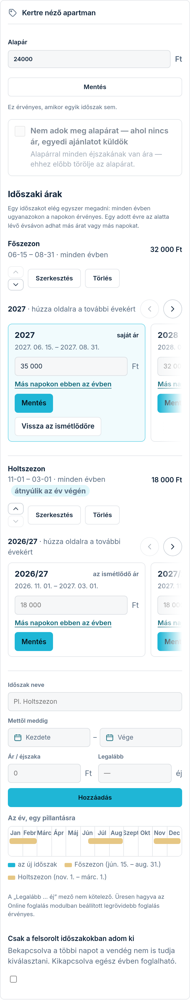
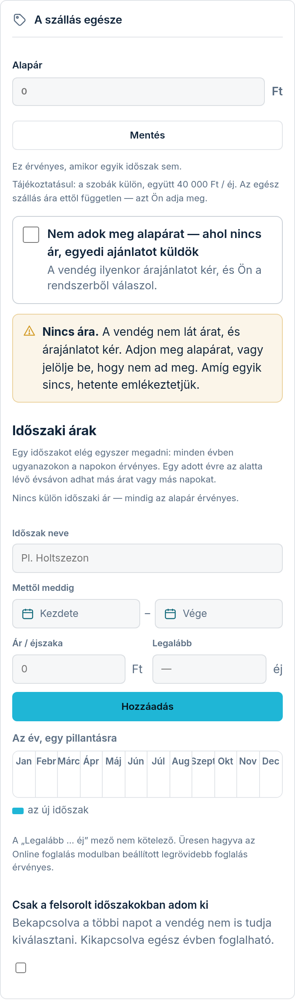
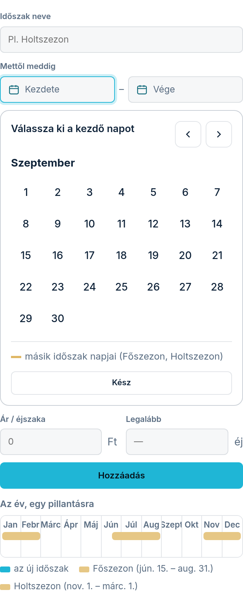
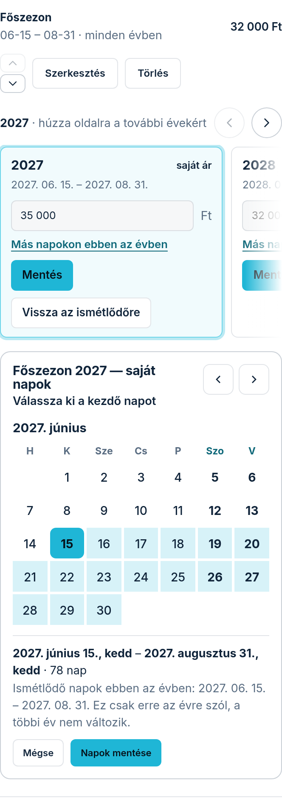
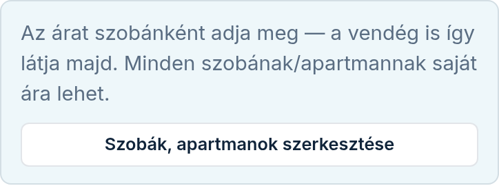

Az ár-modul beállító-képernyőjét a Modulok fülön, a modul melletti **„Beállítás”** linkkel éri el.
Az árat szobánként (apartmanonként) adja meg — a vendég is így látja majd az oldalán.
Minden szobának saját kártyája van.

## Hol látják a vendégek az árait?

A képernyő tetején, a jegyzet alatt egy doboz mondja meg, hol jelennek meg most az árai a
honlapján. A szobakártyákon minden szobánál az az ár áll, amit a vendég lát (több ár esetén a
legkisebb, „-tól” jelzéssel). A dobozban ezek fel is vannak sorolva.

Külön **ártáblázat** csak akkor van a honlapon, ha többet mondana, mint a kártyák. Amíg minden
szobának csak alapára van, a táblázat ugyanazokat a számokat ismételné egy képernyővel lejjebb,
ezért ilyenkor nem jelenik meg — ezt a doboz ki is mondja. A táblázat magától megjelenik, amint
bármelyik szobához **időszaki árat** ad meg, vagy kitölti a lap alján a **„Megjegyzés az
árakhoz”** mezőt. Ilyenkor a doboz azt írja, hogy az árai két helyen látszanak, és megmondja,
miért van táblázat.

Ha egy szobának nincs ára, a doboz egy sárga, **„Ár nélkül:”** kezdetű sorban megnevezi — a névre koppintva
a szoba kártyájára ugrik. Ott a sárga **„Nincs ára.”** sor is kimondja, hogy a honlapon a
szobakártyáján nem lesz ár, és az ártáblázatban sem szerepel.

## Alapár

Az **„Alapár”** mezőbe írja be, mennyibe kerül egy éjszaka ebben a szobában, és koppintson a
**„Mentés”** gombra. Ez az ár érvényes mindig, amikor egyik időszaki ár sem — nyugodtan kezdje
ennyivel, a többi ráér.

Ha az árat üresen hagyva ment, az ár törlődik az oldaláról — jobb, ha nincs kint szám, mint ha
rossz szám van kint.

## Ha szándékosan nem ad meg árat

Van szoba, aminek az árát mindig a vendéghez szabja (hányan jönnek, mennyi időre). Ilyenkor az
alapár alatti négyzetet pipálja be: **„Nem adok meg alapárat — ahol nincs ár, egyedi ajánlatot
küldök”**. A pipa azonnal ment, nem kell külön gombot nyomnia.

Mi történik utána:

- Azokra az éjszakákra, amelyekre nincs ár, a vendég nem lát számot, és foglalás helyett
  **árajánlatot kér**. Ön a rendszerből válaszol rá (a kérésről e-mailt kap). Ha a szobának
  vannak időszaki árai, azokban az időszakokban a vendég továbbra is az árat látja.
- Az oldala **„Árak”** részében a szoba „Egyedi ajánlat alapján” sorral szerepel. Ha vannak
  időszaki árai, azok érvényesek, és a sor „Egyéb időszakban” mondja ki, hogy a többi
  éjszakára ajánlatot ad.
- A szobáról **nem kap emlékeztetőt**, és az Áttekintés teendői között sem jelenik meg.

A kártyán egy kék sor erősíti meg: **„Kimondva: nem ad meg alapárat.”** A pipa levételével
bármikor visszavonhatja. Ha alapárat ad meg, a pipa magától lekerül, hiszen akkor már minden
éjszakának van ára. Amíg alapár van, a négyzet szürke, és nem jelölhető be.

## Ha egy szobának nincs (teljes) ára

Ha egy szobának egyáltalán nincs ára, vagy csak az év egy részére van (például csak főszezoni
ár, alapár nélkül), a kártyán sárga sor jelzi: **„Nincs ára.”**, illetve **„Az év egy részére
nincs ára.”** Ilyenkor a vendég ezekre az éjszakákra nem lát árat, és árajánlatot kér. Két
kiút van: adjon meg alapárat, vagy pipálja be, hogy szándékosan nem ad meg. Amíg egyik sincs,
hetente e-mailben emlékeztetjük.

Kivétel az egész szállás, ha nem adja ki egyben, és a vendég elől el van rejtve: azt senki nem
foglalhatja, ezért nem kérünk rá árat — se sárga sor, se teendő, se emlékeztető.

## Időszaki árak (pl. főszezon)

Az **„Időszaki árak”** résznél adhat meg eltérő árat az év egyes szakaszaira:

1. Az **„Időszak neve”** mezőbe írjon nevet (pl. Főszezon).
2. A **„Mettől meddig”** alatt koppintson a **„Kezdete”** gombra: naptár nyílik. Koppintson a
   kezdő napra, aztán a záró napra — a naptár ezután magától bezárul. A hónapok között a két
   nyíllal lapozhat. A naptárban nincs évszám, mert az időszak minden évben ugyanazokon a napokon
   érvényes, nem kell januárban újra megadnia.
3. Az **„Ár / éjszaka”** mezőbe írja be az árat, és koppintson a **„Hozzáadás”** gombra.

A mezők alatt kiírjuk, mit jelent a választása — melyik naptól melyik napig érvényes minden
évben, és mikor lesz legközelebb. A naptárban a szoba többi időszakának napjai alatt sárga
vonal van, így látja, hol fednének át. Alatta **„Az év, egy pillantásra”** sáv mutatja az egész
évet: kékkel az új időszakot, sárgával a meglévőket. Egy hónapjára koppintva a naptár oda ugrik.

**Az év végén átnyúló időszak** (pl. téli holtszezon novembertől márciusig): válassza ki a
kezdő napot novemberben, aztán lapozzon előre, és válassza ki a záró napot márciusban. Ilyenkor
a mezők alatt és a soron az **„átnyúlik az év végén”** jelölés áll. Az évek ilyenkor két
évszámot kapnak, például 2026/27.

### A név: használja ugyanazt, mint a többi szobánál

Ha a névmezőbe koppint, és a szálláson már van időszak, lenyílik a lista az eddig használt nevekkel. Az **„Eddig használt
nevek”** alatt a szállás többi szobájának időszakai állnak, a napjaikkal és azzal, melyik
szobánál használja. Gépelés közben a lista szűkül. Ha egy nevet kiválaszt, a napjait is
átvesszük — ha ennél a szobánál más napokra esik, koppintson a dátumra, és módosítsa. Az
**„Ennél a szobánál már van”** alatti nevek nem választhatók: azt az időszakot a listán fent
szerkesztheti.

Ha egy nevet kicsit másképp ír, mint ahogy korábban (pl. kisbetűvel vagy ékezet nélkül), a mező
alatt szólunk, és egy gombbal egységesítheti — így a vendég ártáblájában sem áll két „főszezon”
egymás alatt. Ugyanannál a szobánál két időszak nem kaphatja ugyanazt a nevet.

### Egy időszak módosítása

A sor melletti **„Szerkesztés”** gombbal a nevet, a napokat és az árat átírhatja — ha online
foglalása is van, a minimumot is —, majd **„Mentés”** (vagy **„Mégse”**). A napokat itt is a
naptárban választja ki; ha csak a záró napot változtatná, elég a **„Vége”** gombra koppintania. Az évekre megadott külön árak megmaradnak.

Egy időszakot a **„Törlés”** gombbal távolíthat el — az évekre megadott külön árai is vele
mennek, és utána ott újra az alapár érvényes. Ha nincs egyetlen időszaki ár sem, mindig az
alapár él.

### Ha két időszak ugyanarra a napra esik

Ahol két időszak átfed (pl. a „Téli ár” novembertől februárig, és benne az „Ünnepek”), ott a
**listán feljebb álló** időszak ára számít. A **„Szerkesztés”** gomb előtti kis fel- és le-nyíllal
rendezheti át őket. Ha egy új vagy átírt időszak átfed egy másikkal, a mezők alatt sárga
sorban kiírjuk, melyiké lesz a közös napok ára.

## Más ár egy adott évben

Minden időszak alatt ott vannak az évek, egy-egy kártyán (a legközelebbi, még le nem zajlott
évtől kezdve). Oldalra húzva — vagy a két nyíllal — további évekhez jut, akármeddig előre.

- Ha egy évben mást kér (pl. jövőre drágább lesz a főszezon), írja be az árat az adott év
  kártyáján, és koppintson a **„Mentés”** gombra. A kártya ekkor **„saját ár”** jelölést kap.
- Ahol nem ír semmit, ott **„az ismétlődő ár”** érvényes — semmi nem romlik el, ha nem ad meg
  külön árat.
- A **„Vissza az ismétlődőre”** gomb törli az adott év külön árát.
- Ha egy évben más napokra esik az időszak (pl. húsvét, vagy szombattól szombatig adja ki),
  koppintson a kártyán a **„Más napokon ebben az évben”** feliratra. Az évsáv alatt naptár nyílik
  — ebben már az évszám és a hét napjai is látszanak. Válassza ki a kezdő és a záró napot; alul
  kiírjuk, milyen napra esnek és hány nap. Koppintson a **„Napok mentése”** gombra. Ezután a
  kártyán „saját napok” áll, és a napokat a **„Napok módosítása”** alatt változtathatja meg. Ez
  csak arra az egy évre szól, a többi év nem változik.

A honlapján az évet csak akkor írjuk ki, ha annak az időszaknak van külön éves ára — ilyenkor
a vendég a foglalható hónapokra évenként látja az árat.

### Levél a szezon végén

Egy időszak utolsó napja utáni reggelen e-mailt küldünk: mennyi volt idén az ára, és mi
legyen jövőre. Ha marad, nem kell tennie semmit. Ha változtatna, a levél linkje egyenesen a
következő év kártyájára visz — ha előbb belépést kér, a belépés után is oda. Egy időszakról évente egyszer írunk, és nem írunk, ha a következő
évre már megadott árat.

## Mikor adja ki, és legalább hány éjszakára — online foglalással

Ez a két beállítás a **foglalási naptárra** hat, ezért csak akkor jelenik meg, ha az Online
foglalás modul is be van kapcsolva:

- **„Legalább”** — az új időszak sorában, az ár mellett: ebben az időszakban legalább ennyi
  éjszakára lehet foglalni (pl. nyáron 3). Nem kötelező: ha üresen hagyja, az Online foglalás
  modulban beállított legrövidebb foglalás érvényes. A meglévő időszak sorában az ár alatt
  látja, amit megadott.
- **„Csak a felsorolt időszakokban adom ki”** — kapcsoló a szoba kártyájának alján.
  Bekapcsolva a felsorolt időszakokon kívüli napokat a vendég a naptárban ki sem tudja
  választani (pl. télen zárva tart). Kikapcsolva egész évben foglalható, és az időszakok csak
  az árat és a minimumot finomítják. Szobánként külön állítható.

Ha nincs online foglalása, a vendég időpontkérést küld, és azt Ön bírálja el — ilyenkor ez a
kettő nem hat semmire, ezért nem is látja. A helyükön egy rövid sor mondja meg, mit adna hozzá
a foglalás. Ha korábban, még foglalással már beállította őket, nem vesznek el: foglalás nélkül
szünetelnek (a portálokkal megosztott naptárát sem zárják), és ha újra bekapcsolja a
foglalást, ugyanúgy élnek tovább.

Az Online foglalás külön havidíjas modul. A sor alatti **„Online foglalás”** link a Modulok
fülre visz; ott a **„Bővítés — amit még hozzáadhat”** részben keresse meg az Online foglalás
kártyáját — rajta látja a havidíjat is —, és koppintson a **„Kosárba teszem”** gombra.

## Több szoba, több ár

Ha több szobája van, mindegyik kártyáján külön árazhat — a kertre néző apartman kerülhet többe,
mint a padlásszoba. Ha még nem vette fel a szobáit (például eddig csak „A szállás egésze” szerepel,
de szobánként adna ki), azt előbb a szoba-modulnál tegye meg; az árazás ugyanazokat a szobákat
látja. Nem kell keresgélnie: a képernyő tetején, a bevezető sor mellett a **„Szobák, apartmanok
szerkesztése”** gomb egyenesen a szoba-modul beállító-képernyőjére visz. Ha a Szobák modul még nincs
bekapcsolva, a gomb felirata **„Szobák modul bekapcsolása”**, és a Modulok fülre visz — ott a
Szobák, apartmanok kártyán a **„Kosárba teszem”** gombbal tegye a kosarába, és a kosárban véglegesítse; utána a gomb már a
szerkesztőre mutat.

## Az egész szállás árát is adja meg

Ha a házat egyben is kiadja, az egész szállásnak jelölt szobát ugyanúgy árazza, mint a többit: ha a
vendég a teljes szállást foglalja, ennek a szobának az árát látja. Az árat Ön adja meg — a szobák
ára nem adódik össze helyette, mert az egész ház ára a valóságban sem a részek összege. Segítségül
a kártyáján az alapár alatt egy tájékoztató sor mutatja, mennyibe kerülnek a szobák külön, együtt
(„Tájékoztatásul: a szobák külön, együtt … / éj.”) — ezt csak Ön látja, a vendég nem. Ha itt nincs
ár, a teljes ház foglalásához nem tudunk árat mutatni: a vendég árajánlatot kér.
