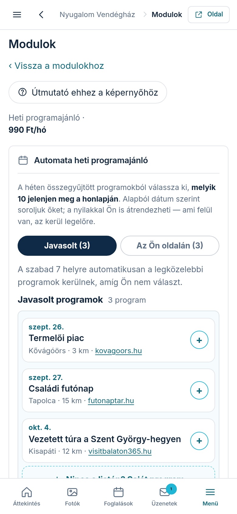

Ez a modul minden héten összegyűjti a környéke programjait — fesztiválokat, falunapokat, vásárokat,
koncerteket, futóversenyeket —, Ön pedig kiválasztja, melyik 10 jelenjen meg a honlapján.
A képernyőt a Modulok fülön, a modul melletti **„Beállítás”** linkkel éri el.

## Honnan jönnek a programok?

Hétfő reggelenként végignézzük a szállása 30 km-es körzetében lévő települések nyilvános
program-oldalait, és kigyűjtjük a következő két hét programjait. Minden programnál ott a forrás:
a sor alján lévő linkre koppintva megnyílik az az oldal, ahonnan vettük — így ellenőrizheti,
mielőtt kiteszi.

A település mellett látja, milyen messze van a szállásától. A saját településén tartott program
mellett **„Helyben”** áll — ezek a legértékesebbek a vendégnek.

Ha most vette meg a modult, körülbelül egy órán belül begyűjtjük a környéke programjait —
addig a képernyő ezt jelzi, és a honlapján még nem jelenik meg a szakasz.

## Kiválasztás

1. A **„Javasolt programok”** listában koppintson a program melletti **+** gombra.
2. A program átkerül az **„Az Ön oldalán”** listába.
3. Legfeljebb 10 programot választhat. Ha betelt, a többi **+** gomb szürke lesz, és megjelenik a
   figyelmeztetés — vegyen le egyet a **×** gombbal, ha mást szeretne helyette.
4. Koppintson a **„Mentés a honlapra”** gombra.

Telefonon a két lista két fülön van: a fülek feliratában lévő szám mutatja, hány program van az
egyikben és a másikban.

## Sorrend: alapból dátum szerint

A kiválasztott programokat alapból dátum szerint soroljuk — minden újonnan felvett program a dátuma
szerinti helyére kerül. A lista fölött ezt a **„dátum szerint”** felirat jelzi.

Ha mást szeretne előre venni, a program melletti nyilakkal (▲ ▼) mozgathatja fel és le. Ettől kezdve
az Ön sorrendje érvényes (a felirat: **„saját sorrend”**), és ami legfelül van, az kerül a honlapján is
legelőre. A **„dátum szerint rendezem”** linkkel bármikor visszaállhat a dátum szerinti sorrendre.

## Saját program felvétele

Ha olyan programot ajánlana, amit mi nem találtunk — például a saját rendezvényét —, felveheti Ön is:

1. Koppintson a **„Saját program hozzáadása”** sorra az „Az Ön oldalán” lista tetején (vagy a
   **„Nincs a listán? Saját program”** sorra a javasolt programok alján).
2. Írja be a program címét, és adja meg, mikor kezdődik. Ha több napos, a végét is.
3. A **„Hol lesz?”** résznél hagyja a „Helyben” választást, ha a saját településén lesz; különben
   válassza a **„Máshol”** lehetőséget, és írja be a település nevét.
4. Ha van a programnak weboldala vagy Facebook-eseménye, a **„Webcím”** mezőbe beírhatja — nem
   kötelező.
5. Koppintson a **„Felveszem az oldalra”** gombra, majd a **„Mentés a honlapra”** gombra.

A saját program is a 10 hely egyike. A listában **„Saját ajánlás”** jelölést kap, a honlapján pedig
a forrás helyett az áll mellette, hogy a szállás ajánlja. Módosítani vagy törölni a program alatti
**„szerkesztem”** gombbal tudja.

A honlapon mindig a következő két hét programjai látszanak. Ha egy saját programot több héttel
előre vesz fel, a képernyő megmondja, melyik naptól jelenik meg a honlapján. A lejárt saját programok
— a többihez hasonlóan — maguktól lekerülnek.

## A cím átírása

Ha egy program neve túl hosszú vagy furcsa, a kiválasztott program alatti **„átírom”** gombbal
átírhatja. Ha kész, koppintson a **„kész”** gombra, majd mentsen. A honlapján az Ön által írt cím
jelenik meg.

## Ha nem választ

Nem marad üres a honlapja: a szabad helyekre automatikusan a legközelebbi programok kerülnek.
Amint Ön választ, az Ön választása kerül előre, és csak a maradék helyeket tölti ki az automatika.

## Mi történik hetente?

Hétfő reggel frissül a lista, és e-mailt kap arról, hány programot találtunk. Az Ön választása és
sorrendje megmarad; a lejárt programok maguktól lekerülnek a honlapjáról — nem kell velük
foglalkoznia.
