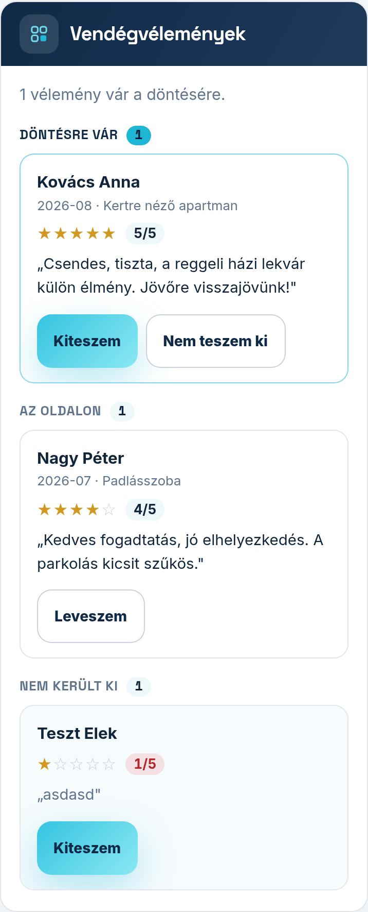

A vendégei az oldalán, egy űrlapon írhatnak véleményt: nevet, egy–öt csillagot és pár mondatot.
**Semmi nem kerül ki az Ön döntése nélkül** — a vélemény addig nem látszik az oldalon, amíg Ön nem
dönt róla.

## Döntés a levélből — belépés nélkül

Minden új véleményről e-mailt kap. A levélben két gomb van: „Kiteszem az oldalra” és
„Nem teszem ki”. Egy koppintás elég, belépni nem kell.

A levél gombjai egyszer döntenek: ha később mégis meggondolja magát, azt már itt, a vélemény-képernyőn
teheti meg (lásd lent).

## A vélemény-képernyő

A Modulok fülön a vélemény-modul melletti **„Beállítás”** linkkel éri el. A
**„Vendégvélemények”** kártyán minden beérkezett véleményt lát, három csoportba rendezve — elöl
azokat, amelyek még a döntésére várnak. A csoport címe mellett az is látszik, hány vélemény van benne:

- **„Döntésre vár”** — még nem döntött róla, az oldalon nem látszik.
- **„Az oldalon”** — kint van, a látogatók olvassák.
- **„Nem került ki”** — úgy döntött, hogy nem teszi ki.

Minden véleménynél látja a vendég nevét, a vendég által megadott hónapot és szobát (ha megadta), a
csillagokat és a szöveget. A csillagok mellett számmal is ott áll az értékelés (például „4/5”), így
egy rossz értékelés akkor is azonnal feltűnik, ha a csillagokat nem nézi meg közelebbről; a 2 vagy
kevesebb csillagos értékelés száma pirosas. A hosszú véleményből az első három sor látszik — a
**„Teljes szöveg”** linkkel nyithatja ki.

A gombok mindig azt kínálják, amit az adott véleménnyel még tehet:

- **„Kiteszem”** — kiteszi az oldalra (akkor is, ha korábban nem tette ki).
- **„Nem teszem ki”** — a döntésre váró véleménynél: nem kerül ki.
- **„Leveszem”** — a már kint lévő véleményt leveszi az oldaláról. Az oldal az Öné: egy kitett
  véleményt bármikor visszavonhat.

Döntés után a kártya tetején egy sor megmondja, mit tett, és kinek a véleményével (például
„Nagy Péter véleményét levette az oldaláról.”). A változás azonnal látszik az oldalán is.

Ha még nem jött vélemény, a kártya ezt írja ki, és azt is, hogy amint jön egy, e-mailt kap róla.

## Mit kap a vendég?

Ha kiteszi a véleményt, és a vendég megadta az e-mail címét, egy köszönő levelet kap arról, hogy a
véleménye mostantól látható az oldalán. Ezt a levelet egy vendég legfeljebb egyszer kapja meg: ha
később leveszi, majd újra kiteszi a véleményét, nem megy ki újabb köszönőlevél. Ha nem teszi ki, a
vendég nem kap értesítést.

## Google-értékelés

Ha a szállása megtalálható a Google-térképen, és az adatai egyértelműen az Önéi, a
**„Google-értékelés”** kártya megmutatja a Google-os átlagát és az értékelések számát. A
**„Megnézem, mit írnak a Google-on”** gombbal megnézheti magukat a véleményeket.

A kártya azt is megmondja, látszik-e most ez a szám az oldalán. Ha lent, a **„Szabályok”** között
kikapcsolta **„A Google-értékelés csillagai az oldalon”** kapcsolót, a kártya ezt jelzi, és az
**„Ugrás a kapcsolóhoz”** linkkel egyből odaér.

A Google-vélemények **szövegét** a Google feltételei miatt nem másolhatjuk át az oldalára — csak az
átlagot és a darabszámot mutathatjuk, és a rákattintó látogató a Google-véleményekhez jut. Ha a
Google-os adat nem egyértelmű vagy régi, inkább nem mutatunk számot, mint hogy esetleg egy másik
szállásét tegyük ki.

## Szabályok

A képernyő alján, a **„Szabályok”** kártyán állíthatja be, hogyan működjön a modul — ezeket ritkán
kell módosítani:

- **„Vendégek írhatnak véleményt az oldalon”** — kikapcsolva az űrlap eltűnik az oldaláról; a már
  kitett vélemények maradnak.
- **„Hány vélemény jelenjen meg”** — a legfrissebb kitett véleményekből legfeljebb ennyi látszik
  (1–20).
- **„A Google-értékelés csillagai az oldalon”** — ez dönti el, hogy a Google-os átlag az oldalán is
  látszik-e. Kikapcsolva a szám lekerül az oldaláról.
- **„A véleményt író vendéget hívjuk meg Google-értékelésre is”** — bekapcsolva a köszönő levélben
  arra is megkérjük a vendéget, hogy a Google-on is írjon pár szót. Ez csak annak megy ki, aki már
  Önnél járt és már írt Önnek — a Google-értékelés a térképes találhatóságát javítja.
- **„Értesítési cím”** — ide küldjük az új véleményeket. Üresen hagyva a belépéshez tartozó címre
  megy.

A változtatást a **„Beállítások mentése”** gombbal rögzítheti.
