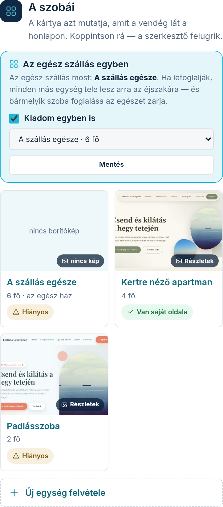

A szoba-modul beállító-képernyőjét a Modulok fülön, a modul melletti **„Beállítás”** linkkel éri
el. Itt adja meg, milyen egységeket (szobákat, apartmanokat) ad ki, és mit tudjon róluk a vendég.

Fontos: ugyanezeket az egységeket használja a foglalási naptár és az árazás is — elég egy helyen
karbantartani, és mindenhol egyezni fog.

## Egységek felvétele

A **„Mit ad ki?”** részben sorolja fel az egységeit névvel és férőhellyel. Új egységet a
**„Hozzáadás”** gombbal vesz fel; a meglévő nevét, férőhelyét átírhatja és a **„Mentés”** gombbal
rögzíti. Ha csak egyben adja ki az egész szállást, elég egyetlen egység — ilyenkor a vendég nem is
találkozik a szobaválasztással.

## Mit írjon az egységekről?

Minden egységnek saját kártyája van:

1. **„Leírás”** — pár mondat arról, mi jellemzi ezt a szobát, mit szeretnek benne a vendégek.
2. **„Ebben az egységben van”** — ikonos csempéken pipálja ki, mi van ebben a szobában
   (pl. saját fürdőszoba, erkély, klíma). A kereső mezőbe beírva gyorsan megtalál bármit
   (pl. „stég”), a kiválasztottak felül, kis címkéken látszanak — a címke ×-ével ki is
   kapcsolhatja őket. Ami az egész szállásra vonatkozik (pl. medence, parkolás), az
   halvány, szaggatott csempeként látszik itt: azt a Felszereltség modulnál állítja, és a
   szoba automatikusan örökli. Ami nincs a listában, azt az **„Egyéb, ami nincs a listában”**
   mezőbe írhatja, soronként egyet.

   Ez a rész csak akkor szerkeszthető, ha a **Felszereltség** modul be van kapcsolva — ha
   nincs, a kártya megmutatja, mit tudna itt beállítani, és a Modulok fülre hív.

A **„Mentés”** gombbal rögzíti; a kártyán azt is látja, hány fotót rendelt már ehhez az egységhez
(a fotó-hozzárendelés a Fotók fülön történik).

## Mikor lesz saját oldala egy egységnek?

Ha egy egységhez van legalább **egy hozzárendelt fotó** ÉS **leírás vagy felszereltség**, az
egység saját aloldalt kap az Ön honlapján — a keresők (Google) külön is megtalálják, ami több
vendéget hozhat. A kártya alján mindig kiírjuk, hogy az adott egységnek lesz-e saját oldala, és
ha nem, mi hiányzik hozzá. Üres oldalt sosem készítünk — az többet ártana, mint használna.
