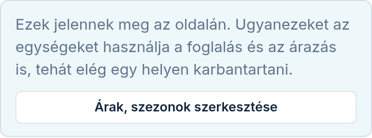
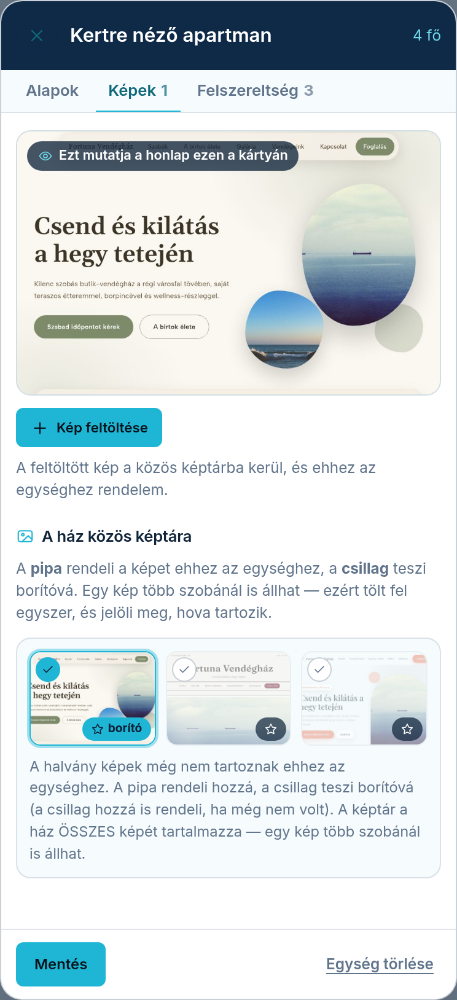

A szoba-modul beállító-képernyőjét a Modulok fülön, a modul melletti **„Beállítás”** linkkel éri
el. Itt adja meg, milyen egységeket (szobákat, apartmanokat) ad ki, és mit tudjon róluk a vendég.

Fontos: ugyanezeket az egységeket használja a foglalási naptár és az árazás is — elég egy helyen
karbantartani, és mindenhol egyezni fog. Ha a szobák megvannak, és árat adna nekik, nem kell
keresgélnie: a képernyő tetején, a bevezető sor mellett az **„Árak, szezonok szerkesztése”** gomb
egyenesen az ár-modul beállító-képernyőjére visz. Ha az Árak modul még nincs bekapcsolva, a gomb
felirata **„Árak modul bekapcsolása”**, és a Modulok fülre visz — ott az Árak, szezonok kártyán a
**„Hozzáadom”** gombbal kapcsolja be.

## A szobák rácsa

A **„A szobái”** cím alatt minden egysége egy kártyán látszik, és a kártya pontosan azt mutatja,
amit a vendég lát a honlapon: a **borítóképet**, a nevet, a férőhelyet. A képen jobb alul a
jelvény a képek számát írja, egyetlen képnél a **„Részletek”** szót — mert az „1 kép” galériát
ígérne. A név alatt az állapot áll: **„Van saját oldala”** vagy **„Hiányos”**.

Ha ugyanaz a fénykép két egység borítója, azt a kártya piros jelvénnyel kimondja, és megnevezi a
másik egységet — így nem fordulhat elő észrevétlenül, hogy a honlapon két szoba ugyanazzal a
képpel szerepel.

Új egységet a rács alatti **„Új egység felvétele”** résznél vesz fel: adja meg a nevét, a
férőhelyét, és nyomja meg a **„Hozzáadás”** gombot. Ha csak egyben adja ki az egész szállást, elég
egyetlen egység — ilyenkor a vendég nem is találkozik a szobaválasztással.

Amikor a **második** egységet veszi fel, ugyanebben az űrlapban egy kérdés vár: **„Az egész
szállást is kiadja egyben?”** Két válasz közül kell választania, enélkül a **„Hozzáadás”** nem megy
el. **„Igen, az egészet is kiadom egyben”**: az eddigi egysége marad az egész szállás, a most
felvett szoba pedig külön naptárat kap — a kettő egymást zárja (lásd lejjebb). **„Nem, csak külön
egységeket adok ki”**: az eddigi egysége sima szobává válik, és a szobák egymástól függetlenül
telnek be. Ezt később a rács fölötti kártyán bármikor átállíthatja.

Ha az Árak modul is be van kapcsolva, a **„Hozzáadás”** megnyomása ELŐTT ugyanitt az árat is
megadhatja (**„Alapár”** mező), vagy bepipálhatja a gomb alatti négyzetet: **„Nem adok meg árat —
egyedi ajánlatot küldök”**. Egyiket sem kötelező kitölteni, a szoba mindenképp felkerül. Ha a
beírt árat nem tudjuk értelmezni (például betűvel írta), a szoba ár nélkül kerül fel, és a sárga
sor ezt is megmondja. Ha se ár, se pipa nincs, a mentés után egy sárga sor mondja ki,
hogy a szobát felvettük, de nincs ára. Mellette az **„Árat adok meg”** gomb az Árazás lapra visz, a
**„Nem adok meg árat”** gomb pedig ott helyben rögzíti, hogy egyedi ajánlatot ad.

## A szerkesztő: koppintson a kártyára

A kártyára koppintva felugrik a szerkesztő. Bezárni a bal felső **×**-szel, a felugró melletti
sötét háttérre koppintva vagy az `Esc` billentyűvel tud. A **„Mentés”** gomb végig a felugró
alján marad, tehát nem kell hozzá végiggörgetni. Három fül van benne:

### „Alapok”

Itt van egy helyen az egység **neve**, a **férőhelye** és a **leírása** — pár mondat arról, mi
jellemzi ezt a szobát, mit szeretnek benne a vendégek. Számítógépen a jobb oldalon rögtön látja is
azt a kártyát, amit a vendég kapni fog.

### „Képek”

Felül nagyban látszik a **borítókép**, azzal a felirattal, hogy **„Ezt mutatja a honlap ezen a
kártyán”**. Ez az a kép, amit a vendég a szoba kártyáján lát.

A **„Kép feltöltése”** gombbal innen, a szobából is tölthet fel fényképet. A feltöltött kép a
**ház közös képtárába** kerül, és egyből ehhez az egységhez is hozzárendeljük — egy képet tehát
elég egyszer feltölteni, akkor is, ha több szobánál szeretné megmutatni. Ha az egységnek még nem
volt borítóképe, az első feltöltött lesz az; ha volt, azt nem írjuk felül.

Ha valamelyik fájlt nem tudjuk elfogadni (nem JPEG/PNG/WEBP, vagy nagyobb 6 MB-nál), megírjuk,
**melyik fájl** és **miért** maradt ki — a többit ilyenkor is feltöltjük.

Alatta **„A ház közös képtára”** következik, benne a szállás összes képe. A halvány képek még nem
tartoznak ehhez az egységhez.

* a **pipa** (bal felső sarok) rendeli a képet ehhez az egységhez — a mentéssel rögzül;
* a **csillag** (jobb alsó sarok) teszi borítóképpé. Ha a kép még nem tartozott ehhez az
  egységhez, a csillag hozzá is rendeli, és ezt ki is írjuk.

Ha kivesz egy képet az egységből (a pipát leveszi, majd ment), a kép a **közös képtárban benne
marad** — nem törli. Ha éppen az volt a borítókép, a sorban következő lép a helyébe; ha nem
maradt kép, azt is megírjuk.

### „Felszereltség”

Itt azt sorolja fel, ami **ebben az egységben** van (a ház egészére vonatkozó tételeket a
Felszereltség modulnál állítja). A kiválasztott tételek kis címkéken látszanak; újat a
**„Hozzáadás a listából”** résznél vesz fel, ikonos csempéken. Ha még egy tétel sincs kiválasztva,
a lista rögtön nyitva van. A kereső mezőbe beírva gyorsan megtalál bármit (pl. „stég”). Ami nincs
a listában, azt az **„Egyéb, ami nincs a listában”** mezőbe írhatja, soronként egyet. Amit a
Felszereltség modulnál a ház egészénél már bejelölt (pl. wifi, reggeli), az itt is választható, és
a csempéjén egy kis felirat jelzi: **„a ház egészénél is”**. Nyugodtan jelölje be a szobánál is —
a vendég a szoba saját oldalán csak a szoba listáját olvassa.

Ez a fül csak akkor szerkeszthető, ha a **Felszereltség** modul be van kapcsolva — ha nincs, a fül
megmutatja, mit tudna itt beállítani, és a Modulok fülre hív.

## Mikor lesz saját oldala egy egységnek?

Ha egy egységhez van legalább **egy hozzárendelt fotó** ÉS **leírás vagy felszereltség**, az
egység saját aloldalt kap az Ön honlapján — a keresők (Google) külön is megtalálják, ami több
vendéget hozhat. A rács kártyáján és az **„Alapok”** fülön is mindig kiírjuk, hogy az adott
egységnek lesz-e saját oldala, és ha nem, mi hiányzik hozzá. Üres oldalt sosem készítünk — az
többet ártana, mint használna.

## Az egész szállás egyben — ha a házat egyben is kiadja

Ha egynél több egysége van, a rács fölött egy kártya áll: **„Az egész szállás egyben”**. Itt dönti
el, hogy a házat egyben is kiadja-e. A **„Kiadom egyben is”** négyzet bepipálva, mellette a
legördülőben kiválasztva, melyik egység jelenti az egész szállást — a **„Mentés”** gombbal rögzíti.
Ennek az egységnek a kártyáján a rácson ott áll: „az egész ház”. Ha lefoglalják, minden más
egység tele lesz arra az éjszakára — és fordítva, ha bármelyik szobája foglalt, az egész szállás
nem adható ki aznap. A kártya mindig kiírja, melyik egység az egész.

Ha a négyzet nincs bepipálva, nincs ilyen egység: a szobák egymástól függetlenül telnek be, és
egyik kártyán sem szerepel „az egész ház”. Egyetlen egységnél a kártya nem is jelenik meg — ilyenkor
nincs mit eldönteni.

Bármelyik egységet törölheti a felugrója alján lévő **„Egység törlése”** gombbal — azt is, amelyik
az egész szállás (utána a szobák egymástól függetlenül telnek be). Két kivétel: az utolsó egység
nem törölhető (a gomb nem is jelenik meg), és az olyan egység sem, amelyikhez még elfogadott
jövőbeli foglalás tartozik — ezt a képernyő tetején egy sáv mondja meg.
