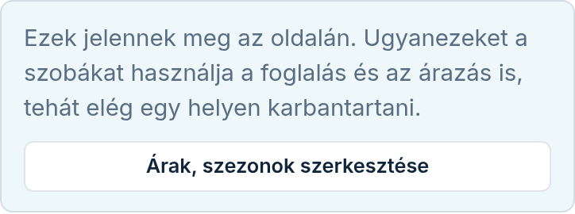
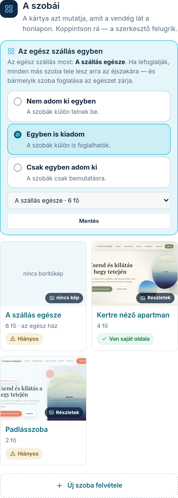
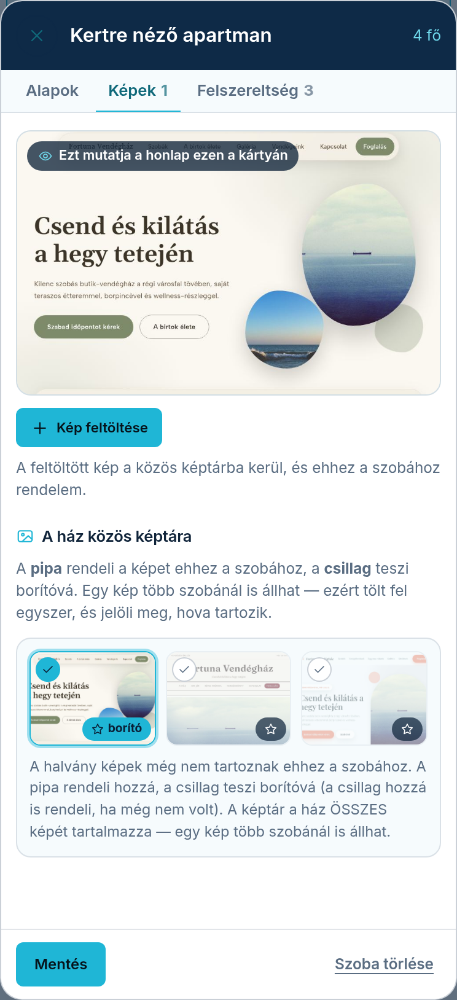

A szoba-modul beállító-képernyőjét a Modulok fülön, a modul melletti **„Beállítás”** linkkel éri
el. Itt adja meg, milyen szobákat, apartmanokat ad ki, és mit tudjon róluk a vendég.

Fontos: ugyanezeket a szobákat használja a foglalási naptár és az árazás is — elég egy helyen
karbantartani, és mindenhol egyezni fog. Ha a szobák megvannak, és árat adna nekik, nem kell
keresgélnie: a képernyő tetején, a bevezető szöveg alatt (számítógépen mellette) az **„Árak, szezonok szerkesztése”** gomb
egyenesen az ár-modul beállító-képernyőjére visz. Ha az Árak modul még nincs bekapcsolva, a gomb
felirata **„Árak modul bekapcsolása”**, és a Modulok fülre visz — ott az Árak, szezonok kártyán a
**„Kosárba teszem”** gombbal tegye a kosarába, és a kosárban véglegesítse.

## A szobák rácsa

A **„A szobái”** cím alatt minden szobája egy kártyán látszik, és a kártya pontosan azt mutatja,
amit a vendég lát a honlapon: a **borítóképet**, a nevet, a férőhelyet. A képen jobb alul a
jelvény a képek számát írja, egyetlen képnél a **„Részletek”** szót — mert az „1 kép” galériát
ígérne. A név alatt az állapot áll: **„Van saját oldala”** vagy **„Hiányos”**.

Ha ugyanaz a fénykép két szoba borítója, azt a kártya piros jelvénnyel kimondja, és megnevezi a
másik szobát — így nem fordulhat elő észrevétlenül, hogy a honlapon két szoba ugyanazzal a
képpel szerepel.

Új szobát a lap alján, a szaggatott keretes **„Új szoba felvétele”** sávra koppintva vesz fel:
kinyílik egy kiemelt doboz, abban adja meg a nevét, a férőhelyét, és nyomja meg a
**„Hozzáadás”** gombot. A doboz alapból csukva van, hogy a lapon ne álljon két egyforma űrlap
egymás alatt: egy szobánál a meglévő szoba sora a **„Meglévő szobája”** felirat alatt áll. Ha csak egyben adja ki az egész szállást, elég
egyetlen szoba — ilyenkor a vendég nem is találkozik a szobaválasztással.

Amikor a **második** szobát veszi fel, ugyanebben az űrlapban, közvetlenül a **„Hozzáadás”**
fölött egy kérdés vár: **„Az egész szállást is kiadja egyben?”** Három válasz közül kell választania.
Ha kihagyja, a gomb alatt piros sor mondja meg, mi hiányzik, és a kérdés pirosan kiemelődik —
válasszon, és nyomja meg újra a gombot. **„Igen, az egészet is kiadom egyben”**: az eddigi szobája marad az egész szállás, a most
felvett szoba pedig külön naptárat kap — a kettő egymást zárja (lásd lejjebb). **„Csak egyben adom ki — a szobák bemutatásra”**: a vendég csak az egész szállást foglalhatja; a
szobák a honlapon képpel, férőhellyel és felszereltséggel látszanak, de külön nem foglalhatók, és
árat sem kérünk tőlük — az ár mezője ilyenkor el is tűnik az űrlapról. **„Nem, csak külön
szobákat adok ki”**: az eddigi szobája sima szobává válik, és a szobák egymástól függetlenül
telnek be. Ezt később a rács fölötti kártyán bármikor átállíthatja.

Ha az Árak modul is be van kapcsolva (és nem csak egyben adja ki a házat), a **„Hozzáadás”** megnyomása ELŐTT ugyanitt az árat is
megadhatja (**„Alapár”** mező), vagy bepipálhatja az alatta lévő négyzetet: **„Nem adok meg árat —
egyedi ajánlatot küldök”**. Egyiket sem kötelező kitölteni, a szoba mindenképp felkerül. Ha a
beírt árat nem tudjuk értelmezni (például betűvel írta), a szoba ár nélkül kerül fel, és a sárga
sor ezt is megmondja. Ha se ár, se pipa nincs, a mentés után egy sárga sor mondja ki,
hogy a szobát felvettük, de nincs ára. Mellette az **„Árat adok meg”** gomb az Árazás lapra visz, a
**„Nem adok meg árat”** gomb pedig ott helyben rögzíti, hogy egyedi ajánlatot ad.

## A szerkesztő: koppintson a kártyára

A kártyára koppintva felugrik a szerkesztő. Bezárni a bal felső **×**-szel, a felugró melletti
sötét háttérre koppintva vagy az `Esc` billentyűvel tud. A **„Mentés”** gomb végig a felugró
alján marad, tehát nem kell hozzá végiggörgetni. Három fül van benne:

### „Alapok”

Itt van egy helyen a szoba **neve**, a **férőhelye** és a **leírása** — pár mondat arról, mi
jellemzi ezt a szobát, mit szeretnek benne a vendégek. Számítógépen a jobb oldalon rögtön látja is
azt a kártyát, amit a vendég kapni fog.

### „Képek”

Felül nagyban látszik a **borítókép**, azzal a felirattal, hogy **„Ezt mutatja a honlap ezen a
kártyán”**. Ez az a kép, amit a vendég a szoba kártyáján lát.

A **„Kép feltöltése”** gombbal innen, a szobából is tölthet fel fényképet. A feltöltött kép a
**ház közös képtárába** kerül, és egyből ehhez a szobához is hozzárendeljük — egy képet tehát
elég egyszer feltölteni, akkor is, ha több szobánál szeretné megmutatni. Ha a szobának még nem
volt borítóképe, az első feltöltött lesz az; ha volt, azt nem írjuk felül.

Ha valamelyik fájlt nem tudjuk elfogadni (nem JPEG/PNG/WEBP, vagy nagyobb 6 MB-nál), megírjuk,
**melyik fájl** és **miért** maradt ki — a többit ilyenkor is feltöltjük.

Alatta **„A ház közös képtára”** következik, benne a szállás összes képe. A halvány képek még nem
tartoznak ehhez a szobához.

* a **pipa** (bal felső sarok) rendeli a képet ehhez a szobához — a mentéssel rögzül;
* a **csillag** (jobb alsó sarok) teszi borítóképpé. Ha a kép még nem tartozott ehhez az
  szobához, a csillag hozzá is rendeli, és ezt ki is írjuk.

Ha kivesz egy képet a szobából (a pipát leveszi, majd ment), a kép a **közös képtárban benne
marad** — nem törli. Ha éppen az volt a borítókép, a sorban következő lép a helyébe; ha nem
maradt kép, azt is megírjuk.

### „Felszereltség”

Itt azt sorolja fel, ami **ebben a szobában** van (a ház egészére vonatkozó tételeket a
Felszereltség modulnál állítja). A kiválasztott tételek kis címkéken látszanak; újat a
**„Hozzáadás a listából”** résznél vesz fel, ikonos csempéken. Ha még egy tétel sincs kiválasztva,
a lista rögtön nyitva van. A kereső mezőbe beírva gyorsan megtalál bármit (pl. „stég”). Ami nincs
a listában, azt az **„Egyéb, ami nincs a listában”** mezőbe írhatja, soronként egyet. Amit a
Felszereltség modulnál a ház egészénél már bejelölt (pl. wifi, reggeli), az itt is választható, és
a csempéjén egy kis felirat jelzi: **„a ház egészénél is”**. Nyugodtan jelölje be a szobánál is —
a vendég a szoba saját oldalán csak a szoba listáját olvassa.

Ez a fül csak akkor szerkeszthető, ha a **Felszereltség** modul be van kapcsolva — ha nincs, a fül
megmutatja, mit tudna itt beállítani, és a Modulok fülre hív.

## Mikor lesz saját oldala egy szobának?

Ha egy szobához van legalább **egy hozzárendelt fotó** ÉS **leírás vagy felszereltség**, a
szoba saját aloldalt kap az Ön honlapján — a keresők (Google) külön is megtalálják, ami több
vendéget hozhat. A rács kártyáján és az **„Alapok”** fülön is mindig kiírjuk, hogy az adott
szobának lesz-e saját oldala, és ha nem, mi hiányzik hozzá. Üres oldalt sosem készítünk — az
többet ártana, mint használna.

## Az egész szállás egyben — ha a házat egyben is kiadja

Ha egynél több szobája van, a rács fölött egy kártya áll: **„Az egész szállás egyben”**. Itt dönti
el három állás közül, hogyan adja ki a házat, a legördülőben kiválasztja, melyik szoba jelenti az
egész szállást, és a **„Mentés”** gombbal rögzíti:

- **„Nem adom ki egyben”**: nincs ilyen szoba, a szobák egymástól függetlenül telnek be, és egyik
  kártyán sem szerepel „az egész ház”.
- **„Egyben is kiadom”**: a kiválasztott szoba kártyáján a rácson ott áll: „az egész ház”. Ha
  lefoglalják, minden más szoba tele lesz arra az éjszakára — és fordítva, ha bármelyik szobája
  foglalt, az egész szállás nem adható ki aznap.
- **„Csak egyben adom ki”**: a vendég csak az egész szállást foglalhatja. A többi szoba a rácson
  „csak bemutatásra” jelölést kap: a honlapon képpel és felszereltséggel látszik, de ár és
  foglalás nélkül. Árat csak az egész szállásra kérünk — az Árak lapon a szobáknak nincs kártyája,
  és az ár hiánya miatt sem a teendők között, sem levélben nem szólunk.

A kártya mindig kiírja, melyik szoba az egész, és mit jelent a választott állás. Egyetlen szobánál a kártya nem is jelenik meg — ilyenkor
nincs mit eldönteni.

Bármelyik szobát törölheti a felugrója alján lévő **„Szoba törlése”** gombbal — azt is, amelyik
az egész szállás (utána a szobák egymástól függetlenül telnek be). Két kivétel: az utolsó szoba
nem törölhető (a gomb nem is jelenik meg), és az olyan szoba sem, amelyikhez még elfogadott
jövőbeli foglalás tartozik — ezt a képernyő tetején egy sáv mondja meg.
