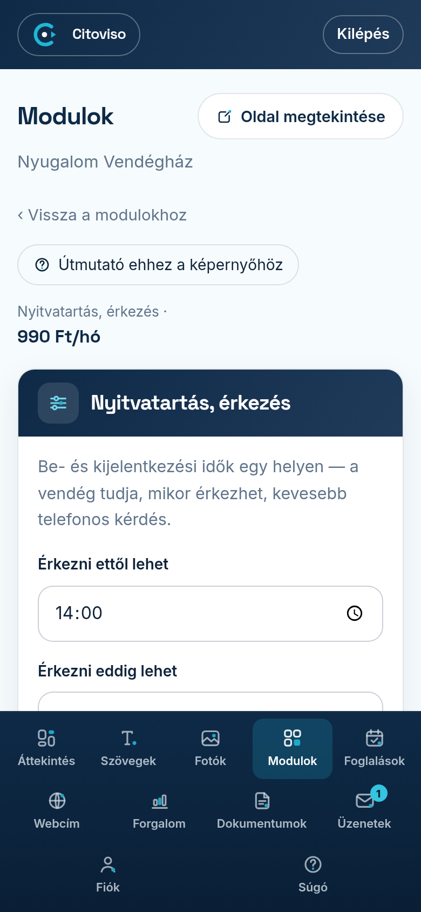

A legtöbb modulnak van saját beállító-képernyője: a Modulok fülön a bekapcsolt modul sora mellett
megjelenő **„Beállítás”** linkkel nyitja meg. Egy képernyő mindig egy modulról szól — nem kell
hosszú beállítás-oldalakon keresgélnie.

## Hogyan néz ki egy beállító-képernyő?

Fent mindig visszatalál a **„Vissza a modulokhoz”** linkkel (a felirat előtt egy ‹ nyíl áll). Ha a modulnak havi díja van, azt is
itt látja. Alatta jönnek a mezők: kapcsolók, szövegek, számok — mindegyik mellett rövid magyarázat,
hogy mire való. A speciális képernyőknél (foglalási naptár, szobák, árak) a szabály-mezők a
**„Szabályok”** cím alatt vannak; ezeket ritkán kell módosítani — alapból működnek.

## Mentés

A **„Beállítások mentése”** gombbal rögzíti, amit beállított. A mentett beállítás az oldala
következő közzétételekor jelenik meg a honlapján. Ha valamit nem tudtunk elmenteni (például egy
mező hibás), a képernyő tetején pontosan kiírjuk, mit javítson.

## Elrontottam valamit — vissza tudom csinálni?

Igen. Ha korábban már mentett beállítást, a mentés gomb mellett megjelenik a
**„Vissza az előzőre”** gomb — ezzel egy koppintással visszaállítja a legutóbbi előtti állapotot.
Nyugodtan kísérletezzen: egy rossz mentés nem végleges.

## Miért nem látom egy modul beállítását?

A **„Beállítás”** link csak a bekapcsolt moduloknál jelenik meg — előbb kapcsolja be a modult a
listában, és mentse a **„Modulok mentése”** gombbal. Van néhány modul, amelynél nincs mit
beállítani: azok maguktól, helyesen működnek.
