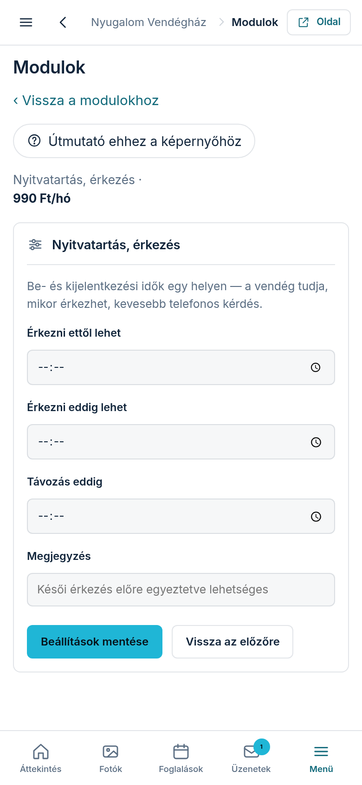

A legtöbb modulnak van saját beállító-képernyője: a Modulok fülön a bekapcsolt modul sora mellett
megjelenő **„Beállítás”** linkkel nyitja meg. Egy képernyő mindig egy modulról szól — nem kell
hosszú beállítás-oldalakon keresgélnie.

Gyorsabb út a menüből: a bal oldali menüben a **„Modulok”** alatt lenyílik a moduljai listája
(telefonon a **„Menü”** fiókban ugyanígy). Egy modul nevére kattintva rögtön annak a
beállításai nyílnak meg, a listában pedig ki van emelve, melyiknél jár. A Modulok lapon és a
modulok képernyőin a lista magától nyitva van, más lapokon a **„Modulok”** melletti kis nyíllal
nyithatja le. A listában azok a modulok szerepelnek, amelyeknek van beállító-képernyője.

## Hogyan néz ki egy beállító-képernyő?

Fent mindig visszatalál a **„Vissza a modulokhoz”** linkkel (a felirat előtt egy ‹ nyíl áll). Ha a modulnak havi díja van, azt is
itt látja. Alatta jönnek a mezők: kapcsolók, szövegek, számok — mindegyik mellett rövid magyarázat,
hogy mire való. A speciális képernyőknél (foglalási naptár, szobák, árak, felszereltség) a szabály-mezők a
**„Szabályok”** cím alatt vannak; ezeket ritkán kell módosítani — alapból működnek.

## Mentés

A **„Beállítások mentése”** gombbal rögzíti, amit beállított. A mentés után a honlapja
**azonnal újra elkészül** az új beállítással — nincs külön közzétételi lépés, és nem kell
megvárnia semmit. Ha valamit nem tudtunk elmenteni (például egy mező hibás), a képernyő
tetején pontosan kiírjuk, mit javítson.

**Kivétel: a „Térkép, megközelítés” képernyő.** Ennek a tetején a szállás címe és a térkép-tű van
(**„A szállás helye”** kártya), ezért ott a gomb neve **„Mentés és frissítés”**, és egy mentés a címet, a
tűt és a megközelítés-leírást együtt menti. A cím vagy a tű hibáját ott a mező alatt írjuk ki. A részleteket
az Elérhetőség súgója írja le (a kártya fejlécében a kérdőjel ikon oda visz).

## Elrontottam valamit — vissza tudom csinálni?

Igen. Ha korábban már mentett beállítást, a mentés gomb mellett megjelenik a
**„Vissza az előzőre”** gomb — ezzel egy koppintással visszaállítja a legutóbbi előtti állapotot.
Nyugodtan kísérletezzen: egy rossz mentés nem végleges.

A „Térkép, megközelítés” képernyőn a **„Vissza az előzőre”** csak a megközelítés-mezőket (térkép ki/be,
„Hogyan találnak oda?”, parkolás) állítja vissza — a **címet és a térkép-tűt nem**. A tűt a térkép alatti
**„Vissza a mentett helyre”** gomb teszi vissza oda, ahol legutóbb elmentette; a régi címet írja vissza a
„Cím” mezőbe.

## Miért nem látom egy modul beállítását?

A **„Beállítás”** link csak a bekapcsolt moduloknál jelenik meg — előbb kapcsolja be a modult a
kirakatban (**„Kosárba teszem”**), és véglegesítse a kosárban (fizetős modulnál a
**„Tovább a fizetéshez”** gombbal). Van néhány modul, amelynél
nincs mit beállítani: azok maguktól, helyesen működnek.
