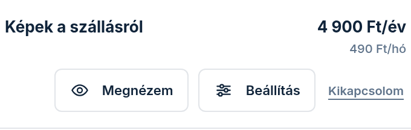
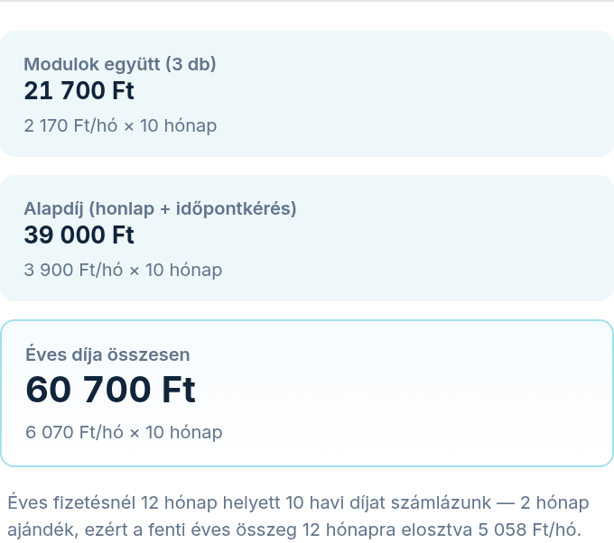

A **Modulok** fülön dönti el, milyen szolgáltatások legyenek az oldalán — például szoba-bemutató,
árak vagy foglalási naptár. A fül két részből áll: fent **„Az én moduljaim”** (ami már az Öné),
alatta **„Bővítés — amit még hozzáadhat”** (amit még választhat). Bármelyiket meg is nézheti a
saját oldalán, mielőtt dönt.

## „Így nézne ki az oldalamon” — nézze meg, mielőtt fizet

Minden modulnál ott a **„Megnézem”** gomb. Megnyílik a saját honlapja úgy, ahogy azzal
a modullal kinézne, és a kérdéses szakasz ki van emelve. Fent válthat a **„Mobil”** és az
**„Asztali”** nézet között, a **„Teljes képernyő”** gombbal pedig kitölti az egész kijelzőt. A
**„Bezárom”** gombbal lép vissza.

Ez csak előnézet: **nem élesít és nem kerül pénzbe**. A felül látható
**„Előnézet — még nincs élesítve”** felirat mindig erre emlékeztet.

Amit még nem vásárolt meg, azon a szakaszon sárga **„MINTA — az Ön adataival töltjük fel”** címke
áll. Ez azt jelenti, hogy a szakasz elrendezését látja, de a tartalom majd az Ön adataiból lesz —
így nem gondolja tévesen, hogy ez már a kész oldala.

## Hozzáadás és kikapcsolás

1. A **„Bővítés — amit még hozzáadhat”** részben minden modul egy kártyán van: a kártya tetején a
   szakasz kicsinyített képe, alatta hogy mit ad és mennyibe kerül. Az **„az árban”** címkéjű
   modulok az alapdíj részei, a többinél a felár szerepel — abban az ütemben, ahogyan Ön fizet
   (lásd a következő szakaszt).
2. A **„Hozzáadom”** gombbal teszi a tervébe. Meggondolta magát? Ugyanott a **„Visszaveszem”**
   gomb áll.
3. Ami már az Öné, azt az **„Az én moduljaim”** részben a **„Kikapcsolom”** gombbal mondhatja le;
   ha meggondolja magát, ugyanott a **„Mégis megtartom”** gomb áll.
4. A gombok itt még **nem élesítenek**: a lap alján megjelenő sötét sáv összegyűjti, mi változna.
   Fizetős új modulnál a sáv soronként mutatja a **most fizetendő** összeget és a
   **„Fizetendő most”** végösszeget is; az ingyenes változásoknál csak azt, mi módosul.
5. A záró gombbal véglegesít mindent egyszerre — fizetős bővítésnél a felirata
   **„Fizetés és alkalmazás”** (tárolt kártya-megbízásnál azt mondja ki, mennyivel terheljük);
   az **„Elvetem”** gomb mindent visszaállít.

## Mennyibe kerül? — az árak abban az ütemben állnak, ahogy fizet

Minden fizetős modul mellett egy árcímke áll. Hogy mit ír, az attól függ, **havi vagy éves
fizetést** választott. Ezt fentebb, az **„Előfizetés”** dobozban a **„Jelenlegi díj”** mezőn
olvassa le: ha „/hó” áll a végén, havi a fizetése; ha „/év”, akkor éves.

- **Havi fizetésnél** a címke egyszerűen a havi felár, például „+490 Ft/hó”.
- **Éves fizetésnél** a címke mindkettőt kiírja: „+490 Ft/hó = 4 900 Ft/év”.

Az éves összeg azért kevesebb, mint a havi tizenkétszerese, mert éves fizetésnél **néhány
hónapot ajándékba kap** — hogy pontosan hányat, azt az összegző alatt mindig kiírjuk (a fenti
képen két hónapot). Így egy pillantással látja, mennyivel nő a következő éves számlája, ha
bekapcsolja a modult.

Ez a szám arról szól, mennyi lesz a **következő** éves díja. Hogy most, a bekapcsoláskor
mennyit vonunk le, az más — időarányos, és a lentebbi *„Mikor fizet az új modulért?”* szakasz
mondja meg.

### A lista végén ott a végösszeg

Az **„Az én moduljaim”** lista alatt három doboz összegzi, mit fizet:

- **„Modulok együtt”** — a megvásárolt modulok díja együtt, zárójelben a darabszámmal. Ez a
  szám a **számlázott** modulokat jelenti: azokat, amikért ténylegesen fizet.
- **„Alapdíj (honlap + időpontkérés)”** — a csomag alapdíja, ami mindig jár.
- **„Éves díja összesen”** (havi fizetésnél **„Havi díja összesen”**) — **ez az, amit
  ténylegesen fizet**, ezért ez a doboz a kiemelt. Éves fizetésnél alatta kiírjuk, mennyi ez
  havonta és hány hónap az ajándék; havi fizetésnél azt, mikor a következő fordulónap.

> **Miért két különböző „per hó” szám?** A képen az első két dobozban a *listaár* áll havi
> bontásban (2 170 + 3 900 = 6 070 Ft/hó), a harmadikban viszont **5 058 Ft/hó** — mert az éves
> díjat elosztottuk tizenkettővel. A kettő különbsége éppen az ajándékhónapok kedvezménye.
> Ha éves fizetést választott, a **kisebbik** szám a valóság.

Ez a végösszeg **ugyanaz**, mint amit fentebb az **„Előfizetés”** doboz **„Következő számla”**
mezője mutat — a lapon nem lehet kétféle összeg.

> **A kapcsolók azonnal átszámolják.** Ha egy modult a **„Kikapcsolom”** gombbal lemond vagy a
> **„Hozzáadom”** gombbal betesz a tervébe, a végösszeg rögtön az új állapotot mutatja, még
> mielőtt bármit véglegesítene. Így előre látja, mit jelentene a döntés a számláján.

## Mikor fizet az új modulért?

A fizetős modul **a díj kifizetése után jelenik meg az oldalán** — bekapcsolás előtt egy
megerősítő kártya tételesen mutatja, mit, hány hónapra és mennyiért vesz meg, és a
**„Mégsem”** gombbal következmény nélkül kiléphet belőle.

- Az **első díj időarányos**: a mai naptól a fordulónapig hátralévő (megkezdett) hónapokra
  szól — éves fizetésnél sosem több, mint amennyi havi díj az éves csomagban egyébként is
  szerepel (az ajándékhónapokkal csökkentve). A következő számlán a modul már normál
  tételként szerepel.
- Ha él a **tárolt kártya-megbízása**, a **„Terhelés és élesítés”** gombbal azonnal fizet, és a
  modul rögtön megjelenik az oldalán.
- Megbízás nélkül a **„Tovább a fizetéshez”** gomb a fizetőoldalra visz; a modul a fizetés
  beérkezésekor élesedik. Ha a fizetés elmarad, semmit nem kapcsolunk be és semmit nem
  számolunk fel.

Az **ingyenes** modul bekapcsolása és a lemondott modul visszakapcsolása továbbra is azonnali,
fizetés nélkül.

## Mi történik lemondáskor?

Amit lemond, a már kifizetett időszak végéig (a fordulónapig) **aktív marad** — addig a modul
sorában a pontos dátumot látja, és a **„Mégis megtartom”** gombbal bármikor, ingyenesen
meggondolhatja magát. A fordulónap után a modul lekerül az oldalról és a számláról is.

Egy kivétel van: ha **saját webcímet** kapott tőlünk, és a hozzá vállalt hűségidő még tart, a
csomagja nem csökkenhet a vállaláskor rögzített minimum alá. Ilyenkor a lemondás nem megy át, és
egy üzenet mondja meg a minimumot — bővíteni közben is bármikor lehet, a csökkentés a hűségidő
letelte után nyílik meg.

## Egy modul beállítása

A bekapcsolt, beállítható modul sorában megjelenik a **„Beállítás”** gomb — ezen keresztül éri el
az adott modul saját beállító-képernyőjét (például a foglalási naptár napjait vagy a szobák árait).
Egy képernyő mindig egy dologról szól, lépésenként vezetve.

## Miért „nem számítjuk” némelyik modul?

Ha egy modult egy másik vált ki (mert a kettő ugyanazon a helyen jelenne meg az oldalon), a
kiváltott modul **„nem számítjuk”** címkével látszik — ilyenkor nem is fizet érte. A kiváltott
szakasz **nem jelenik meg** a honlapján: helyette az a modul látszik, amelyik kiváltotta,
ugyanazon a helyen. A modul a listában marad, hogy lássa: megvan, csak most nincs szerepe (és
nincs ára). Ezért fordulhat elő, hogy az **Áttekintés** fülön több aktív modult számolunk, mint
amennyiért fizet — a csempe a darabszám mellé ki is írja, ebből hány a számlázott.
A mindig aktív alap-modul pedig azért nem kapcsolható ki, mert ezen keresztül keresik meg a
vendégek — enélkül az oldal nem hozna megkeresést.

## Mi az a kupon a Bővítés fölött?

Ha kapott tőlünk kupont (például az induló előfizetéséért), azt a **Bővítés**
rész tetején látja: mennyi a kedvezmény és meddig él. A kirakat-kártyákon ilyenkor
az eredeti ár áthúzva jelenik meg, mellette a kedvezményes ár — ennyit fizet, ha
most veszi meg. A levonás magától történik, nem kell kódot beírnia.

**Kedvezmények nem adódnak össze:** ha többre is jogosult, mindig a nagyobb
érvényesül.
