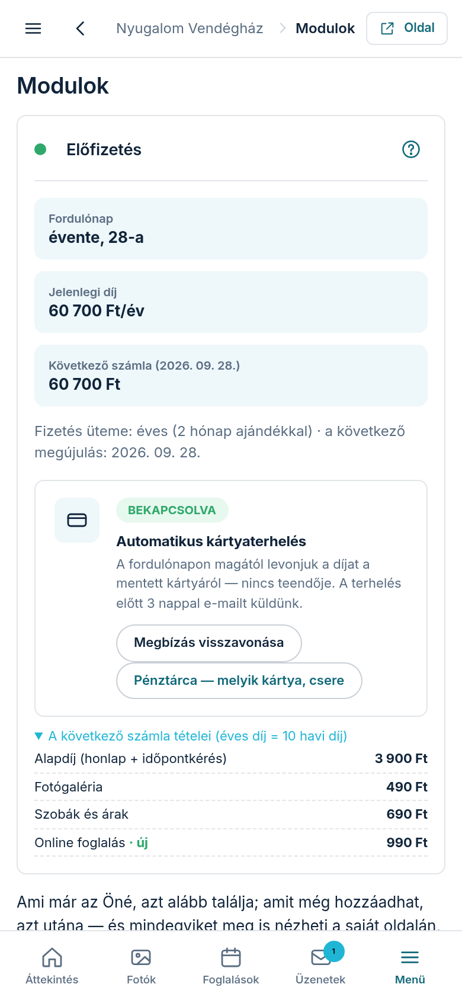

A **Modulok** fülön dönti el, milyen szolgáltatások legyenek az oldalán — például szoba-bemutató,
árak vagy foglalási naptár. A fül két részből áll: fent **„Az én moduljaim”** (ami már az Öné),
alatta **„Bővítés — amit még hozzáadhat”** (amit még választhat). Bármelyiket meg is nézheti a
saját oldalán, mielőtt dönt.

## „Így nézne ki az oldalamon” — nézze meg, mielőtt fizet

Minden modulnál ott a **„Megnézem az oldalamon”** gomb. Megnyílik a saját honlapja úgy, ahogy azzal
a modullal kinézne, és a kérdéses szakasz ki van emelve. Fent válthat a **„Mobil”** és az
**„Asztali”** nézet között, a **„Teljes képernyő”** gombbal pedig kitölti az egész kijelzőt. A
**„Bezárom”** gombbal lép vissza.

Ez csak előnézet: **nem élesít és nem kerül pénzbe**. A felül látható
**„Előnézet — még nincs élesítve”** felirat mindig erre emlékeztet.

Amit még nem vásárolt meg, azon a szakaszon sárga **„MINTA — az Ön adataival töltjük fel”** címke
áll. Ez azt jelenti, hogy a szakasz elrendezését látja, de a tartalom majd az Ön adataiból lesz —
így nem gondolja tévesen, hogy ez már a kész oldala.

## Hozzáadás és kikapcsolás

1. A **„Bővítés — amit még hozzáadhat”** részben minden modul egy kártyán van: a kártya tetején a
   szakasz kicsinyített képe, alatta hogy mit ad és mennyibe kerül. Az **„az árban”** címkéjű
   modulok az alapdíj részei, a többinél a havi felár szerepel.
2. A **„Hozzáadom”** gombbal teszi a tervébe. Meggondolta magát? Ugyanott a **„Visszaveszem”**
   gomb áll.
3. Ami már az Öné, azt az **„Az én moduljaim”** részben a **„Kikapcsolom”** gombbal mondhatja le;
   ha meggondolja magát, ugyanott a **„Mégis megtartom”** gomb áll.
4. A gombok itt még **nem élesítenek**: a lap alján megjelenő sötét sáv összegyűjti, mi változna,
   és számmal mutatja, mennyivel módosulna a havidíja.
5. Az **„Alkalmazom a módosításokat”** gombbal véglegesíti egyszerre az összes változást; az
   **„Elvetem”** gomb mindent visszaállít.

## Mikor fizet az új modulért?

Amit bekapcsol, **azonnal megjelenik az oldalán** — az első díja viszont csak a következő havi
számlán jelenik meg, a fordulónapon. Nincs külön fizetés bekapcsoláskor.

## Mi történik lemondáskor?

Amit lemond, a már kifizetett időszak végéig (a fordulónapig) **aktív marad** — addig a modul
sorában a pontos dátumot látja, és a **„Mégis megtartom”** gombbal bármikor, ingyenesen
meggondolhatja magát. A fordulónap után a modul lekerül az oldalról és a számláról is.

Egy kivétel van: ha **saját webcímet** kapott tőlünk, és a hozzá vállalt hűségidő még tart, a
csomagja nem csökkenhet a vállaláskor rögzített minimum alá. Ilyenkor a lemondás nem megy át, és
egy üzenet mondja meg a minimumot — bővíteni közben is bármikor lehet, a csökkentés a hűségidő
letelte után nyílik meg.

## Egy modul beállítása

A bekapcsolt, beállítható modul sorában megjelenik a **„Beállítás”** gomb — ezen keresztül éri el
az adott modul saját beállító-képernyőjét (például a foglalási naptár napjait vagy a szobák árait).
Egy képernyő mindig egy dologról szól, lépésenként vezetve.

## Miért „nem számítjuk” némelyik modul?

Ha egy modult egy másik vált ki (mert a kettő ugyanazon a helyen jelenne meg az oldalon), a
kiváltott modul **„nem számítjuk”** címkével látszik — ilyenkor nem is fizet érte.
A mindig aktív alap-modul pedig azért nem kapcsolható ki, mert ezen keresztül keresik meg a
vendégek — enélkül az oldal nem hozna megkeresést.

## Mi az a kupon a Bővítés fölött?

Ha kapott tőlünk kupont (például az induló előfizetéséért), azt a **Bővítés**
rész tetején látja: mennyi a kedvezmény és meddig él. A kirakat-kártyákon ilyenkor
az eredeti ár áthúzva jelenik meg, mellette a kedvezményes ár — ennyit fizet, ha
most veszi meg. A levonás magától történik, nem kell kódot beírnia.

**Kedvezmények nem adódnak össze:** ha többre is jogosult, mindig a nagyobb
érvényesül.
