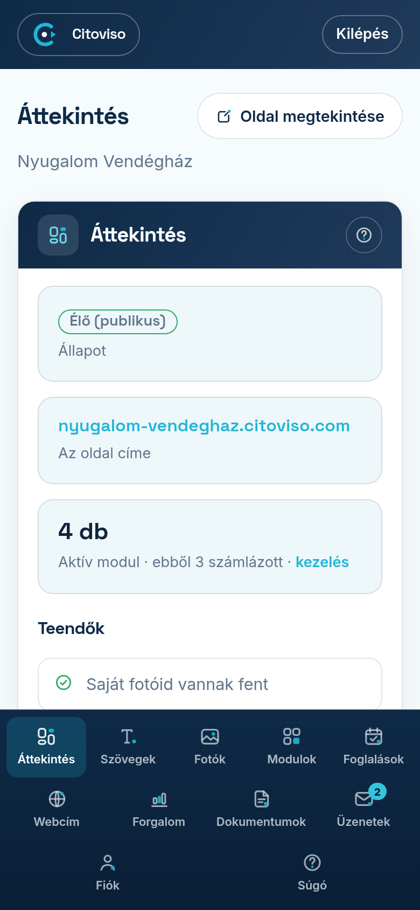

Az **Áttekintés** fül a kezelőfelület nyitóoldala: itt látja egyben, milyen állapotban van az
oldala, és mi a következő teendője.

## Mit mutatnak a csempék?

- **„Állapot”** — az oldala jelenlegi állapota. Az „Előnézet (még nem publikus)” azt jelenti, hogy
  az oldal elkészült, de még csak Ön látja egy privát címen; az „Élő (publikus)” azt, hogy bárki
  megtalálhatja az interneten.
- **„Az oldal címe”** — ide kattintva megnyílik az oldala (élő cím, vagy amíg nincs élesítve, a
  privát előnézet).
- **Aktív modul** — hány szolgáltatás-modul van bekapcsolva; a „kezelés” linkkel egyből a Modulok
  fülre jut. Ha egy bekapcsolt modulnak nincs külön ára (mert az alapdíj része, vagy mert egy
  másik modul váltja ki), a csempe a darabszám mellé azt is kiírja, ebből hány a **számlázott**.
  A két szám nem ellentmondás: az első azt mondja meg, mi működik az oldalán, a második azt,
  miért fizet. Az összesített díjat a Modulok fülön, az **„Az én moduljaim”** lista alján lévő
  összegzőben látja; a tételes bontást pedig az **„Előfizetés”** doboz **„A következő számla
  tételei”** nyithatójában.

## A „Teendők” lista

A lista magától frissül: a pipa azt jelzi, hogy egy lépés kész, a felkiáltójel azt, hogy még
hátravan. A két legfontosabb teendő az induláskor:

1. **Saját fotók feltöltése** — amíg nem tölt fel sajátot, bemutató képek láthatók az oldalán.
2. **Bemutatkozó szöveg megírása** — ez a szöveg fogadja a vendégeit az oldal elején.

Ha mindkettő kész, és a csomagja rendezett, a Citoviso élesíti az oldalt — Önnek ehhez nincs
külön teendője.

## Az oldal megnyitása

A lap tetején lévő **„Oldal megtekintése”** gombbal bármikor megnézheti, hogyan látják az oldalát
a vendégek — minden mentett módosítása ott azonnal látszik.
