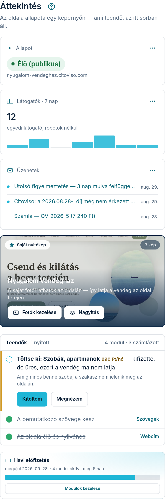

Az **„Áttekintés”** lap a kezelőfelület nyitóoldala: itt látja egyben, milyen állapotban van az
oldala, és mi a következő teendője.

## A kezelőfelület felépítése

- **Gépen** a bal oldali menü csoportokba rendezve mutatja a lapokat: **„Az oldalam”** (Szövegek,
  Fotók, Elérhetőség, Modulok), **„Vendégek”** (Foglalások, Üzenetek), **„Üzlet”** (Webcím, Forgalom,
  Dokumentumok, Pénztárca) és **„Fiók”** (Fiók, Súgó). A Fotók és a Modulok mellett a darabszám, az Üzenetek
  mellett az olvasatlanok száma áll. A **„Modulok”** alatt lenyíló lista a beállítható moduljait
  sorolja fel — egy névre kattintva az adott modul beállításai nyílnak meg. A menü tetején lévő nyíllal a menü keskeny ikonsávvá
  csukható, és úgy is marad, amíg vissza nem nyitja.
- **Telefonon** az alsó sávban négy fő pont van (**„Áttekintés”**, **„Fotók”**, **„Foglalások”**,
  **„Üzenetek”**), az ötödik, a **„Menü”** nyitja meg a teljes listát egy bal oldali fiókban —
  ugyanazokkal a csoportokkal, alul a **„Kilépés”** gombbal.
- **Minden lap tetején** egy ← gomb és az útvonal áll (például „Boróka ház › Fotók”): a nyíl és a
  szállás neve is az Áttekintésre visz vissza, és a böngésző saját Vissza gombja is működik.
  Jobbra az **„Oldal”** gomb új lapon nyitja meg, amit a vendégek látnak.
- **Világos vagy sötét mód:** gépen a fejléc és a menü alján lévő nap/hold gomb, telefonon a
  Menüben a **„Sötét mód”** / **„Világos mód”** sor váltja; a választását a készüléke megjegyzi.

## Mit mutatnak a csempék?

Az Áttekintés tetején három csempe áll:

- **„Állapot”** — az oldala jelenlegi állapota, alatta az oldal címe. Az „Előnézet (még nem
  publikus)” azt jelenti, hogy az oldal elkészült, de még csak Ön látja egy privát címen; az
  „Élő (publikus)” azt, hogy bárki megtalálhatja az interneten. A címre kattintva megnyílik az
  oldala (élő cím, vagy amíg nincs élesítve, a privát előnézet). A csempe sarkában lévő „…” a
  Webcím lapra visz.
- **„Látogatók · 7 nap”** — hány különböző ember nyitotta meg az oldalát az elmúlt héten
  (**„egyedi látogató, robotok nélkül”**: a keresőrobotokat nem számoljuk). Az apró oszlopsor a
  hét napjait mutatja; a „…” a Forgalom lapra visz, ahol a részletes kimutatás van.
- **„Üzenetek”** — a három legutóbbi üzenet, amit Önnek küldtünk; a sor eleji pötty az
  olvasatlanokat jelöli. Egy sorra koppintva megnyílik az üzenet; a „…” az Üzenetek lapra visz.

## A nyitókép

A csempék alatt a **nyitókép-mutató** azt a képet mutatja, amit a vendég az oldal tetején lát —
a sarkában az áll, hogy ez **„Bemutató nyitókép”** vagy **„Saját nyitókép”**, és hogy összesen hány
képe van. A **„Fotók kezelése”** gomb a Fotók lapra visz — ha szeretné, ott feltölthet saját
képeket. A **„Nagyítás”** teljes képernyőn mutatja a képet.

## Előfizetés-kártya

Gépen a menü alján, telefonon az Áttekintés alján egy kis kártya mutatja az előfizetését:
**„Éves előfizetés”** vagy **„Havi előfizetés”**, a megújulás napja, hány modul aktív, és éves
csomagnál az, hogy a 12 hónapból hányadikban jár (a 12 kis szegmens ezt rajzolja ki). A
**„Modulok kezelése”** gomb a Modulok lapra visz, ahol a részletes számla és a modulok is vannak.

## A „Teendők” lista

A lista fejléce megmondja, hány **nyitott** teendője van, és jobb oldalon azt, hogy hány modul
működik az oldalán — ugyanazt a számot, amit az előfizetés-kártya „modul aktív” sora és a
Modulok lap is mond. Egy kiváltott modul (például az „Időpontkérés”, amikor az „Online foglalás”
lép a helyére) nem jelenik meg az oldalon, ezért ebbe a számba nem tartozik bele. Ha egy működő
modulnak nincs külön ára (mert az alapdíj része, vagy mert lemondta, és a kifizetett időszak
végéig még fut), a fejléc azt is kiírja, ebből hány a **számlázott** (például
„11 modul · 10 számlázott”). A két szám nem ellentmondás: az első azt mondja meg, mi működik az
oldalán, a második azt, miért fizet. Az összesített díjat a Modulok lapon, az **„Az én
moduljaim”** lista alján lévő összegzőben látja; a tételes bontást pedig az **„Előfizetés”** doboz
**„A következő számla tételei”** nyithatójában.

A lista magától frissül: a zöld pötty és az áthúzott szöveg azt jelzi, hogy egy lépés kész, a
szaggatott kör azt, hogy még hátravan. Minden sor jobb szélén annak a lapnak a neve áll, ahol a
teendőt elintézheti — rákoppintva oda jut. Amíg az oldal nincs élesítve, a nyitott sorokon az
**„Élesítés előtt”** címke áll. A legfontosabb teendő az induláskor:

- **„Írja meg a bemutatkozó szöveget”** — ez a szöveg fogadja a vendégeit az oldal elején.
  Ha megvan, a sor így szól: **„A bemutatkozó szövege kész”**.

Ha ez kész, és a csomagja rendezett, a Citoviso élesíti az oldalt — Önnek ehhez nincs
külön teendője. Saját fotó nem feltétele az élesítésnek: ha szeretné, a Fotók lapon bármikor
feltölthet saját képeket.

## „Kifizette, de üres” — ha egy modul nem látszik az oldalán

Van olyan modul, amelyik csak akkor jelenik meg a vendégek előtt, ha Ön feltölti tartalommal.
Amíg üres, a szakasz **egyáltalán nem kerül ki az oldalra** — a díja viszont már fut. Ezért az
ilyen modulok külön sort kapnak a Teendők között.

A sor a „Töltse ki:” felszólítással kezdődik, utána annak a modulnak a neve áll, amelyikről szó
van (például a Szobák, apartmanok), majd a modul ára, végül a lényeg:
**„— kifizette, de üres, ezért a vendég ma nem látja”**. Alatta egy mondat megmondja,
pontosan mi hiányzik belőle: „Amíg nincs benne szoba, a szakasz nem jelenik meg az oldalán.”
Éves számlázásnál az éves összeg a vezető szám, a havi díj halkabban mellette.

Két gomb tartozik hozzá:

- **„Kitöltöm”** — egyenesen a modul beállító lapjára visz, ahol beírhatja a tartalmat.
- **„Megnézem”** — új lapon megmutatja a szakaszt. ⚠️ Amit ott lát, az **minta**: mi töltjük ki
  példa-tartalommal, hogy lássa a formáját. A vendég ebből ma semmit nem lát — a sajátját a
  „Kitöltöm” alatt írhatja be.

Amint mentette a tartalmat, a sor magától eltűnik a listáról, és a szakasz megjelenik az oldalán.

Öt modulnál fordulhat elő: **Árak, szezonok**; **Heti programajánló**; **Nyitvatartás, érkezés**;
**Amit kínál (felszereltség)**; **Szobák, apartmanok**. A többi modul üresen is mutat valamit a
vendégnek, ezért azoknál ilyen sor nem jelenik meg.

## „… szobájának nincs ára”

Ha az Árak modul be van kapcsolva, és egy szobának nincs ára, vagy csak az év egy részére van, a
Teendők között sor jelenik meg, ami megmondja, hány szobájának nincs ára (például „2 szobájának
nincs ára”). Alatta felsoroljuk, melyik
szobáról van szó, és mi hiányzik belőle. A vendég ezekre az éjszakákra nem lát árat, és foglalás
helyett árajánlatot kér.

A **„Megadom az árakat”** gomb az Árazás lapra visz. Ha egy szobára szándékosan nem ad meg árat,
mert mindig egyedi ajánlatot küld, ott pipálja be — akkor a szoba lekerül a sorról, és
emlékeztetőt sem küldünk róla. Ha az Árak modulban egyáltalán nincs tartalom, ez a sor nem
jelenik meg, mert akkor a „Töltse ki:” sor szól róla.

## Ingyenes próba — a sáv a lap tetején

Amíg az oldalát ingyenes próbában használja, **minden lap tetején** egy vékony sáv mutatja, meddig tart
még a próba: hány nap van hátra, és melyik napig (például „2026. okt. 22. (csütörtök)-ig”). A sávot nem lehet
bezárni — a próba végét ne veszítse szem elől. Ha a próbához kedvezményt is kapott, és az még érvényes, a sáv kiírja, hány
százalékot kap az első díjból, ha folytatja.

- **3 nappal a vége előtt** a sáv sárgára vált. Az utolsó előtti napon „holnap jár le”, az utolsó napon
  **„Ma jár le az ingyenes próba.”** áll benne.
- A **„Folytatom”** gombbal a saját honlapja előnézetére jut, mellette a rendelő panellel: itt kiválasztja,
  mely modulokat tartja meg, és kifizeti (a próbához kapott kedvezmény már be van számítva). Kártyát a próba
  alatt nem kértünk, és magától nem is terhelünk semmit. Ha mégsem fizet most, a böngésző Vissza gombjával
  visszatér a kezelőfelületre.
- **Telefonon** a haladás-csík elmarad, a gomb a sáv teljes szélességében áll.
- Ha a próba utolsó napja már elmúlt, de a honlap még nem állt le (ez reggel 7-kor történik), a sávban
  **„Az ingyenes próba lejárt.”** áll.
- Ha már kifizette, a sáv eltűnik — onnantól a **Modulok** fül **Előfizetés** kártyája mutatja a díjat
  és a fordulónapot.

### Lejárt a próba — a honlap szünetel

Ha a próba vége után nem folytatta, a honlapja **szünetel**: a látogatók egy udvarias lapot kapnak a szállás
nevével, településével és az Ön elérhetőségeivel, hogy foglalási kérdéssel közvetlenül Önt kereshessék.
A kezelőfelülete viszont él — ebben most is dolgozhat.

Ilyenkor minden lap tetején egy piros doboz áll, a címében a próba utolsó napjával: a honlapja szünetel, mert a próba lejárt. Az Áttekintésen
ebben látja a próbához kapott kedvezményt (ha volt), a **„Folytatom — fizetés”** gombot, és a
**„Mi maradt meg”** listát: a szerkesztő felülete, minden szöveg, kép és beállítás, és a beérkezett üzenetek.
Ezek **nem maradnak meg örökre**: a próba utolsó napjától számított 90 napig őrizzük őket (ÁSZF 1.4), és a lista
alatt ott a nap, amikor véglegesen töröljük őket. A törlés előtt legalább egy héttel levélben is szólunk („… nap múlva töröljük a próba-honlap adatait” tárggyal) — ha addig
folytatja, semmi nem törlődik.
A doboz alján lévő **„Megnézem, mit lát a látogató”** linkkel meg is nézheti, hogy a vendégei most is
elérik-e Önt. A többi lapon a doboz rövidebb. **Tartozása nincs** — nem terheltünk semmit. A fizetés után a honlap
magától, azonnal visszakapcsol.

A **Teendők** listában is ugyanez áll: a honlapja szünetel, mert a próba lejárt, és nem terheltünk semmit. A sor
végén lévő „Folytatom — fizetés” link ugyanoda visz, mint a piros doboz gombja. Fizetendő díja ilyenkor nincs —
a díj csak akkor születik, ha folytatja. Az **„Állapot”** csempén és a bal oldali sávban ilyenkor „Szünetel” áll.

### A „Modulok” kártya lejárt próbánál

Az Áttekintésen a piros doboz alatt egy **„Modulok”** kártya sorolja fel, mely modulokat használta a próba alatt.
A kártya csak olvasható: **„Szünet alatt csak olvasható. Fizetéskor a választott csomag kapcsol vissza; amit csak
kipróbált, azt a Modulok fülön később is hozzáadhatja.”** Minden sor mellett egy halvány címke:

- **„csomag · fizetéskor vissza”** — ez a modul minden csomagban benne van, a fizetéssel biztosan visszakapcsol.
- **„csak a próbában volt”** — ezt csak a próba adta. Ha a fizetéskor kiválasztja, visszakapcsol; ha nem, a
  Modulok fülön később is hozzáadhatja.

### Ha folytatja: a folytatás a fizetés

A „Folytatom” vagy a „Folytatom — fizetés” gombbal a rendelő panelre jut, ahol kiválasztja a csomagját és a
moduljait, és bankkártyával kifizeti — a próbához kapott kedvezmény, ha még érvényes, már be van számítva, és
egyszer, ennél az első fizetésnél használható fel. A fizetés után:

- a honlapja azonnal újra él (ha szünetelt), és a kiválasztott modulok bekapcsolva maradnak; amit csak kipróbált
  és nem választott ki, az kikapcsol — a beállításai megmaradnak;
- elindul az előfizetése, és a **fordulónapja a fizetés napja** lesz, nem a próba első napja: ettől a naptól
  számítva újul meg minden hónapban (vagy évben). Az előfizetéséről a **Modulok** fül **Előfizetés** kártyája szól.

### Meddig marad meg az oldala, ha nem folytatja?

A szünet alatt semmi nem vész el. A fiókja és minden adata — szövegek, képek, beállítások, üzenetek — a próba
utolsó napjától számított **90 napig** megmarad (ÁSZF 1.4), és ezalatt bármikor folytathatja. A 90 nap
leteltével a honlapját, a fotóit és a fiókját töröljük. A törlés előtt legalább 7 nappal e-mailben szólunk; ilyen
levél nélkül nem törlünk. Ugyanarra a szállásra új ingyenes próba nem indítható.

## Az oldal megnyitása

A lap tetején, jobb oldalon lévő **„Oldal”** gombbal bármikor megnézheti, hogyan látják az oldalát
a vendégek — minden mentett módosítása ott azonnal látszik.
