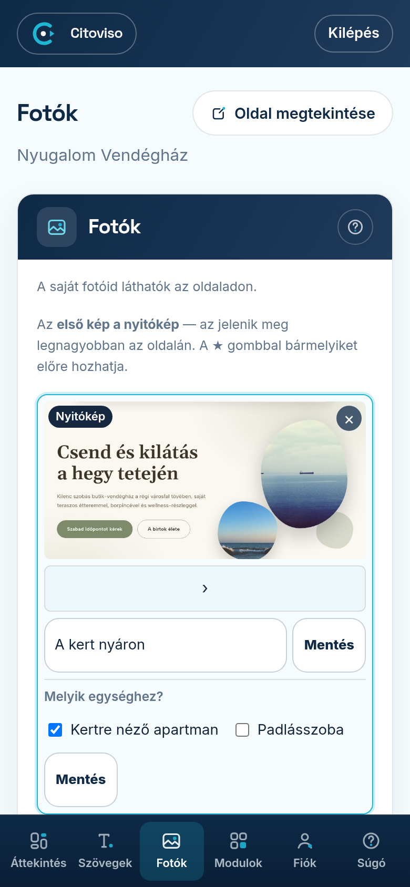

A **Fotók** fülön kezeli az oldalán megjelenő képeket. Amíg nem tölt fel sajátot, bemutató képek
láthatók — amint feltölti az első saját fotóit, az oldal azokra vált át.

## Saját fotók feltöltése

1. Nyissa meg az admin **Fotók** fülét.
2. Görgessen a lap aljára, és koppintson a fájl-választó mezőre. A telefonja felajánlja a
   galériáját — egyszerre több képet is kijelölhet. (JPEG, PNG vagy WebP formátum jó; ezeket
   készíti minden telefon.)
3. Koppintson a **„Kiválasztott fotók feltöltése”** gombra. A gomb alatt megjelenik a
   „Feltöltés…” felirat; amikor elkészült, az oldal frissül, és a képei megjelennek a rácsban.

## Nyitókép és sorrend

Az **első kép a nyitókép** — rajta „Nyitókép” felirat áll, és ez jelenik meg a legnagyobban az
oldala tetején. Ezért érdemes ide a legszebb, legjellemzőbb képét tenni.

- **★** („Legyen ez a nyitókép”): a képet előre, első helyre hozza.
- **‹** („Előrébb”) és **›** („Hátrébb”): a kép helyét finoman igazítja a sorrendben.

A sorrend azonnal mentődik, és ugyanebben a sorrendben látszik a nyilvános oldalán is.

## Képaláírás

Minden kép alatt van egy mező: **„Mi látszik a képen?”** — írjon ide egy rövid mondatot, majd
koppintson a **Mentés** gombra. Ez két dolgot szolgál: a gyengén látó vendégeknek felolvassa a
telefonjuk, és a Google is ebből érti meg, mi van a képen — vagyis segíti, hogy megtalálják az oldalát.

## Kép törlése

Saját fotó jobb felső sarkában **×** gomb van („Törlés”) — ezzel véglegesen eltávolítja a képet az
oldaláról. A bemutató képeken nincs törlés-gomb: azok maguktól eltűnnek, amint saját fotókat használ.

## Melyik egységhez tartozik a kép?

Ha több kiadható egysége van (több szoba vagy apartman), minden kép alatt megjelenik a
**„Melyik egységhez?”** kérdés a szobái nevével. Pipálja ki, hova tartozik a kép, és koppintson a
**Mentés** gombra. Egy kép több egységhez is tartozhat; amit nem jelöl meg sehova, az a ház közös
galériájában marad. Így elég egyszer feltölteni minden képet — a szoba-aloldalak a megjelölt
képeket mutatják majd.
