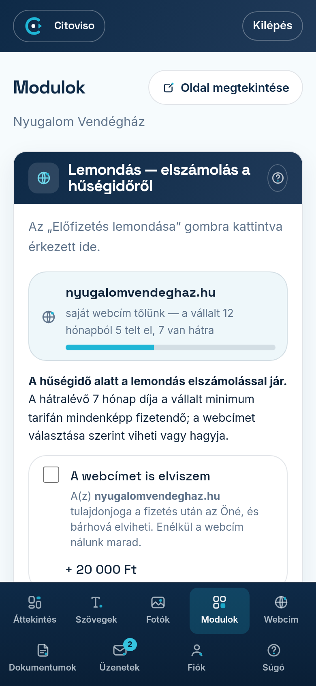

Ha a honlapjához **saját webcímet** rendelt tőlünk, ahhoz hűségidő tartozik: a
megrendeléskor vállalta, hogy az előfizetését meghatározott ideig fenntartja
(ezt az Áttekintés képernyőn látta, mielőtt fizetett). A hűségidő alatt a
lemondás ezért **elszámolással** jár — ez a képernyő ezt számolja ki, tételesen,
mielőtt bármit véglegesítene.

## Hogyan jutok ide?

A **Modulok** fül alján, az „Előfizetés lemondása” dobozban koppintson az
**„Előfizetés lemondása…”** gombra. Ha Önnek fut hűségidő, a rendszer nem a
szokásos megerősítést kérdezi, hanem erre az elszámolás-oldalra hozza. Ha nincs
hűségideje, minden a régi: a megerősítés után a lemondás a kifizetett időszak
végével érvényes.

## Mit látok az oldalon?

- **Hűség-sáv:** a webcíme neve, és hogy a vállalt hónapokból mennyi telt el,
  mennyi van hátra — folyamatjelzővel.
- **Tételes elszámolás:** a hátralévő hónapok díja a vállalt minimum tarifán
  (ez a kötbér — mindig fizetendő), és külön sorban a webcím vételára, ami csak
  akkor kerül bele, ha a webcímet el is viszi.
- **„A webcímet is elviszem” pipa:** ha bejelöli, a vételár-sor, a végösszeg, a
  piros gomb felirata és a következmény-szöveg együtt frissül — mindig azt
  látja, amit fizetne.
- **Következmény-sáv:** kimondja, mi lesz a webcímmel (elviszi → a fizetés után
  az Öné; nem viszi → nálunk marad), és meddig lesz elérhető a honlapja.

## Hogyan zárom le a lemondást?

A piros **„Elszámolás és lemondás”** gombbal — a felirat mellett mindig ott a
végösszeg is, így nem érheti meglepetés. Ezután:

1. Az elszámolást rögzítjük, és **e-mailben küldjük a fizetési linket**.
2. A honlapja a már kifizetett időszak végéig elérhető marad, utána lekerül.
3. Ha a webcímet elviszi: a tulajdonjog **a teljes elszámolás maradéktalan
   rendezése után** száll át (ÁSZF 9. pont) — a lépéseket ezután küldjük
   e-mailben. Ha nem viszi el, a webcím nálunk marad.

## Meggondoltam magam

- Az elszámolás-oldalon a **„Mégsem mondom le — vissza”** gomb mindent
  változatlanul hagy — semmi nem íródik, az előfizetése és a webcíme él tovább.
- Ha a lemondást már rögzítette, de a fizetési linket **még nem fizette ki**, a
  Modulok fülön a **„Meggondoltam magam — folytatom”** gombbal visszaléphet: az
  elszámolást töröljük, az előfizetése folytatódik.
- Ha az elszámolást már kifizette, írjon nekünk — ott már nem gomb, hanem
  egyeztetés kérdése.

## Mennyi a kötbér?

Hátralévő hónapok száma × a vállalt havi minimum. Ha a webcímet díjmentesen
kapta (nagyobb csomag mellett), a havi minimum a megrendeléskor rögzült, és a
későbbi árváltozások nem érintik. Ha a webcímért éves díjat fizetett, ott a
vállalás maga az előfizetés fenntartása — ilyenkor a kötbér alapja a jelenlegi
havi csomagjának díja. A pontos összeget mindig ez a képernyő mutatja, fizetés
előtt.
