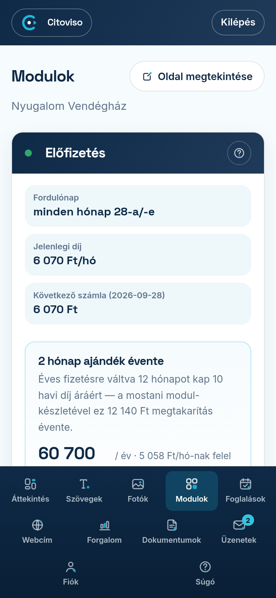

A **Modulok** fül tetején lévő **Előfizetés** kártya mutatja meg egy helyen, mit
fizet és mikor: a fordulónapot, a **„Jelenlegi díj”**-at és a következő számla
összegét, tételes bontásban.

## Havi vagy éves fizetés?

Kétféle ütem van, és a kártya minden mezője eszerint beszél. Hogy Öné melyik, azt a
**„Jelenlegi díj”** mezőn olvassa le: **„/hó”** végződésnél havi, **„/év”** végződésnél
éves a fizetése.

- **Havi fizetésnél** a **„Fordulónap”** mező azt írja, hogy „minden hónap …-a/-e”, és
  a díj minden hónapban esedékes. Ilyenkor a kártya alatt megjelenik egy ajánlat is,
  amivel átválthat éves fizetésre — kiírja, mennyit spórolna vele.
- **Éves fizetésnél** a **„Fordulónap”** mező azt írja, hogy „évente, …-a/-e”, és egy
  külön sor mondja ki a **„Fizetés üteme”**-t is, benne az ajándékhónapok számával.
  Ilyenkor a **„A következő számla tételei”** nyitható felirata is jelzi, hogyan áll
  össze az éves díj a havi tételekből.

Éves fizetésnél **nem tizenkét havi díjat** fizet: néhány hónapot ajándékba kap, ezért
a modulok árcímkéje is kiírja az éves összeget a havi mellé. Erről a **Modulok** fül
súgója (*„Mennyibe kerül?”*) szól részletesen.

## Mi az a fordulónap?

Az előfizetése mindig ugyanazon a napon újul meg — ez a fordulónap (az első fizetése
napja); havi fizetésnél havonta, éves fizetésnél évente. Minden modul díja **egy közös
számlán** érkezik; nincsenek szétszórt, külön-külön fizetnivalók.

## A következő számla tételei

A **„A következő számla tételei”** sorra koppintva látja a bontást: az alapdíjat
és a bekapcsolt modulokat. Ha a mostani hónapban kapcsolt be új modult, azt
**„új”** jelzéssel látja — annak most jelenik meg először a díja.

## Mi történik, ha nem érkezik be a díj?

A megújulás előtt 3 nappal előre szólunk e-mailben, a fordulónapon pedig
fizetési linket küldünk. Ha a díj nem érkezik be, emlékeztetőt küldünk (e-mailt,
majd SMS-t is), és a fordulónap után 10 nappal a honlapot **átmenetileg
felfüggesztjük**.

Ilyenkor a **Modulok** fül tetején egy piros kártya áll: **„A honlapja jelenleg
NEM elérhető”**. Ezen látja a **rendezendő tartozás pontos összegét** (ez a lap
legnagyobb száma), alatta a **„Befizetem”** gombot a fizetendő összeggel, és azt
a dátumot is, ameddig a díj rendezhető. **Semmi nem veszik el:** a moduljai megmaradnak,
csak szünetelnek, és a honlap a fizetés után azonnal, magától visszakapcsol.

A látogatói ezalatt nem hibaüzenetet kapnak, hanem egy udvarias lapot az **Ön
szállásának nevével és elérhetőségével** — a felfüggesztés okát a vendég nem
látja.

A felfüggesztés ideje alatt **új modult nem tud felvenni**: a vásárlás-gombok
helyén **„Rendezés után vehető fel”** felirat áll. A meglévő moduljait viszont
ugyanúgy le tudja mondani, és a lemondást vissza is vonhatja — ezeket a
felfüggesztés nem korlátozza.

Amikor a díj beérkezik, a piros kártya helyén **zöld visszaigazolás** jelenik
meg („A honlapja újra elérhető”), és erről e-mailt is küldünk — így biztosan
tudja, hogy a honlapja tényleg visszatért.

## Hogyan válthatok éves fizetésre?

Ha havonta fizet, az Előfizetés kártyán egy külön doboz mutatja, mennyit
spórolna éves fizetéssel: 12 hónapot kap 10 havi díj áráért. A
**„Váltok éves fizetésre a következő fordulónaptól”** gombra koppintva a váltást
előjegyezzük — **most nem fizet semmit**, és a már kifizetett időszaka
változatlanul végigfut. A következő fordulónapon a számlája éves lesz. (Ha a
következő havi számlája már ki van állítva — ez a fordulónap előtti napokban
fordulhat elő —, az még a régi áron érkezik, és a váltás az azutáni fordulótól
él; a zöld megerősítés mindig a pontos dátumot mutatja.)

A fordulónapig meggondolhatja magát: a zöld megerősítésben a
**„Mégsem — maradok a havi fizetésnél”** gombbal bármikor, következmény nélkül
visszaléphet. **Az éves számla kifizetése után a váltás végleges** — az éves díj
a teljes évre szól, visszatérítés nincs; ha később mondja le az előfizetést, a
kifizetett év a végéig él.

## Automatikus kártyaterhelés — mit jelent és hogyan vonhatom vissza?

Ha bankkártyával fizetett, a kártyát a fizetési szolgáltató tárolja (mi nem
látjuk), és a díjat a fordulónapon **automatikusan leemeljük** — nincs teendője.
A terhelés előtt 3 nappal e-mailben megírjuk, mennyi lesz és mikor. Az
Előfizetés kártyán látja, hogy ez épp **bekapcsolva** vagy **kikapcsolva** van.

Ha nem szeretné, a **„Megbízás visszavonása”** gombra koppintva megjelenik egy
kis ablak, amely felsorolja, mi változik ettől; ott a
**„Igen, visszavonom a megbízást”** gombbal érvényesíti, vagy a
**„Mégsem — marad az automatikus fizetés”** gombbal marad minden a régiben.

Visszavonás után **Önnek kell fizetnie** minden fordulónapon a kiküldött
fizetési linkkel. A díjfizetési kötelezettség megmarad, és ha a díj nem érkezik
be, ugyanaz történik, mint fentebb: emlékeztetők, majd a honlap átmeneti
felfüggesztése. A visszakapcsolás nem egy kattintás: a bankkártyás megerősítés
miatt a **következő fizetési link kiegyenlítésekor** adhat újra megbízást.

## Hogyan mondhatom le az előfizetést?

A Modulok fül alján, az **„Előfizetés lemondása…”** sorra koppintva. A lemondás
a fordulónapon lép életbe: addig a honlap változatlanul él — hiszen az az
időszak már ki van fizetve. Ha meggondolja magát, a **„Meggondoltam magam —
folytatom”** gombbal a fordulónapig visszaléphet.

**Kivétel a hűségidő.** Ha tőlünk rendelt saját webcímet, ahhoz hűségidő
tartozik, és amíg az fut, a lemondás elszámolással jár: az **„Előfizetés
lemondása…”** gomb ilyenkor egy külön elszámolás-oldalra visz, ahol tételesen
látja a fizetendőt, mielőtt döntene. A részleteket a „Lemondás hűségidő alatt —
elszámolás és a webcím sorsa” súgó-témában találja. Kifizetett elszámolás után
a visszalépés-gomb már nem elérhető — ilyenkor írjon nekünk.
