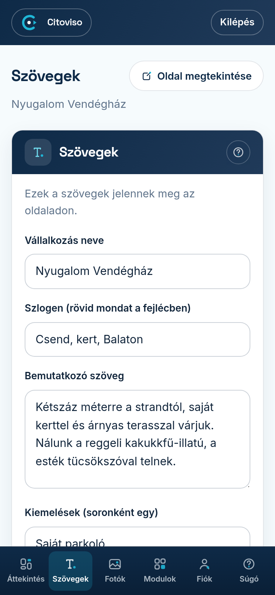

A **Szövegek** fülön írhatja át az oldalán megjelenő szövegeket. Nem kell semmit „programozni”:
amit ide beír és elment, az jelenik meg a honlapján.

## A négy mező

1. **„Vállalkozás neve”** — a szállása neve, ahogyan az oldal tetején és a Google-találatban
   szerepelni fog.
2. **„Szlogen (rövid mondat a fejlécben)”** — egyetlen mondat, ami a név alatt jelenik meg.
   Jó szlogen az, ami a lényeget mondja: pl. a fekvést vagy a hangulatot.
3. **„Bemutatkozó szöveg”** — pár bekezdés arról, mitől jó Önnél megszállni. Írjon úgy, ahogy egy
   vendégnek mesélné: mi van a közelben, mi az, amit csak Önnél kapnak meg.
4. **„Kiemelések (soronként egy)”** — rövid, felsorolás-szerű erősségek (pl. „Saját parkoló”).
   Minden sor külön kis címkeként jelenik meg az oldalon — soronként csak EGY dolgot írjon.

## Mentés

A **„Mentés és frissítés”** gombra koppintva a módosítás azonnal él: a zöld **„Mentve — az oldalad
frissült.”** visszajelzés után az oldalát megnyitva már az új szövegeket látja. Rontani nem tud —
bármikor visszaírhatja, ami korábban volt.
