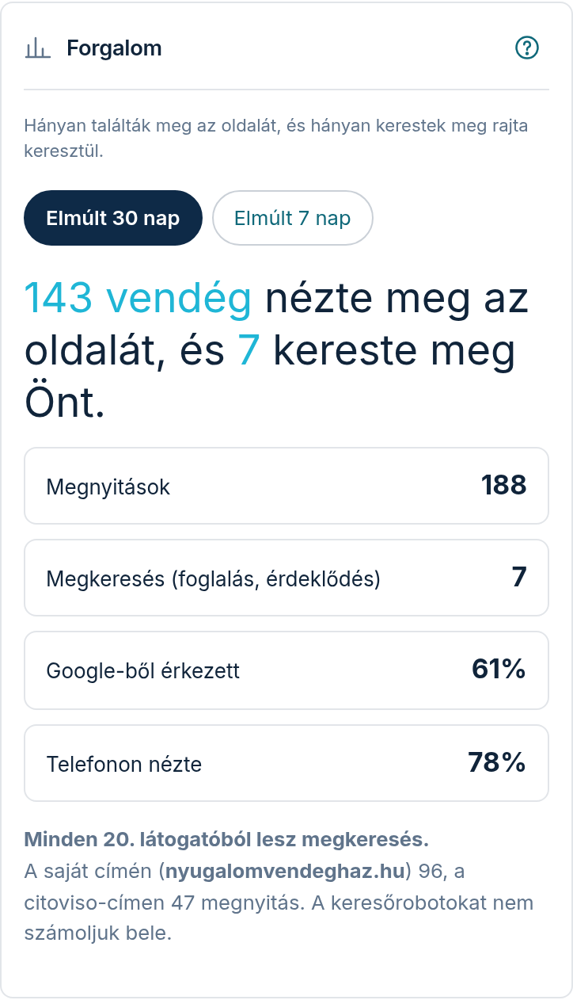

A **„Forgalom”** fülön egy kérdésre kap választ: **megérte-e?** Nem táblázatokat mutatunk,
hanem egyetlen mondatot arról, hogy hány vendég nézte meg az oldalát, és közülük hányan
keresték meg Önt.

## Mit jelentenek a számok?

- **Vendég** — hány külön látogató nyitotta meg az oldalát. ⚠️ **Naponta számoljuk:** aki
  egy napon belül többször visszanéz, az egyszer szerepel — aki viszont más napon is
  visszatér, azt új vendégként számoljuk. Ez azért van így, mert **nem követjük a
  látogatóit napokon át**: a megkülönböztetésre használt azonosító minden éjjel
  megsemmisül, így profil nem építhető belőle. Vagyis a szám inkább óvatos, mint hízelgő.
- **Megnyitások** — hányszor nyílt meg az oldal összesen. Ez mindig több (vagy annyi), mint
  a vendégek száma.
- **Megkeresés (foglalás, érdeklődés)** — hányan küldtek Önnek foglalási kérést vagy üzenetet
  az oldalról. **Ez a lényeg**: ezek a valódi vendégek.
- **Google-ből érkezett** — a megnyitások hány százaléka jött a Google keresőjéből
  (bármelyik Google-címről: google.hu, google.com és a többi).
- **Telefonon nézte** — a megnyitások hány százaléka történt mobilon vagy táblagépen.
  (Jellemzően a többség — ezért is fontos, hogy az oldala telefonon is jól nézzen ki.)

## „Minden 20. látogatóból lesz megkeresés"

A számok alatt ez a mondat mutatja, milyen arányban fordul a nézelődés valódi
érdeklődéssé. Ez a legbeszédesebb adat: ha az arány javul, az oldala jobban dolgozik.

⚠️ Ez a mondat csak akkor jelenik meg, ha **már volt legalább egy megkeresés** — enélkül
nem lenne mit arányosítani.

## Ha van saját webcíme

Ha rendelt saját domaint, egy külön mondat megmutatja, hány megnyitás érkezett a **saját
címén**, és hány a citoviso-címen. Ebből látja, mennyire terjedt el az új cím.

Saját webcím nélkül ez a mondat egyszerűen nem jelenik meg.

## Időszak

Két gomb választható: **„Elmúlt 30 nap”** (ez az alap) és **„Elmúlt 7 nap”**. A váltás az
egész képernyőt átszámolja.

## „Még nincs mit mutatni”

Ha az oldala nemrég indult, ezt az üzenetet látja. Ez **nem hiba**: egyszerűen még nem
nyitotta meg senki. Amint az első vendég megérkezik, a számok maguktól megjelennek.

Szándékosan nem mutatunk nullákkal teli táblázatot — az semmit nem mondana.

## Miért nem egyezik más mérőprogramok számaival?

Kétféle eltérés fordul elő, és mindkettő szándékos:

- **A keresőrobotokat nem számoljuk bele.** A Google és a többi kereső naponta többször
  végigolvassa az oldalát — ezek gépek, nem vendégek. Ha beleszámítanánk, szebb, de hamis
  számot mutatnánk.
- **Nálunk nincs sütik alapján mérés.** A saját kiszolgálónkon mérünk, ezért Önnek nem kell
  süti-figyelmeztetést kitennie, és a látogatóiról nem gyűjtünk profilt. A látogatók
  megkülönböztetése naponta újrainduló, visszafejthetetlen azonosítóval történik.

## Kap róla levelet?

Igen. **Havonta egyszer** e-mailben is elküldjük ugyanezeket a számokat, hogy ne kelljen
belépnie értük. A levélben ott a gomb, amivel egy kattintással megnyithatja ezt a
képernyőt.

⚠️ **Olyan hónapról nem küldünk levelet, amikor senki nem nyitotta meg az oldalát.** Egy
„0 vendég" levél nem mondana semmit — ilyenkor inkább hallgatunk.

