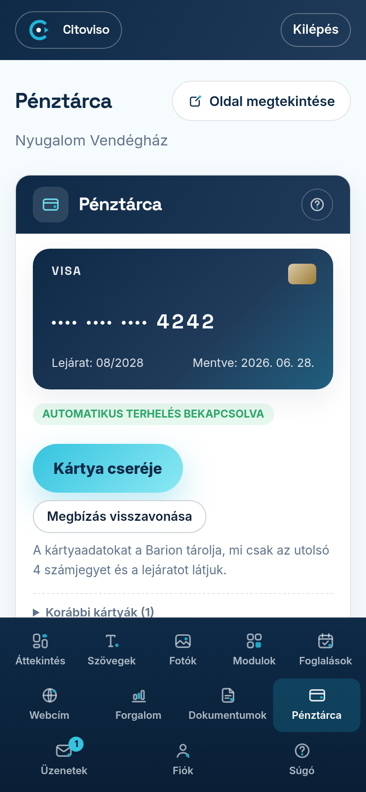

A **Pénztárca** fülön látja, melyik bankkártyáról vonjuk le a díjait, mikor jön a
következő terhelés, és itt tudja a kártyát lecserélni vagy az automatikus terhelést
visszavonni. A teljes kártyaszámot sem mi, sem a felület nem tárolja: a kártya képén
csak az **utolsó 4 számjegy** és a lejárat áll.

## Mit mutat a kártya képe?

A bal oldali kártya-kép a mentett kártya: a márka (például VISA), a kártyaszám utolsó
négy számjegye („···· ···· ···· 4242”), a **„Lejárat:”** és a **„Mentve:”** dátum.
Alatta egy színes címke mondja meg az állapotot:

- **„AUTOMATIKUS TERHELÉS BEKAPCSOLVA”** (zöld): a fordulónapon magától levonjuk a díjat
  erről a kártyáról, nincs teendője. A terhelés előtt 3 nappal e-mailt küldünk.
- **„LEJÁR:”** és egy dátum (sárga): a kártya a következő terhelés előtt lejár. Ha nem
  cseréli le, a fordulónapon fizetési linket kap e-mailben, és Önnek kell fizetnie.
- **„NINCS MENTETT KÁRTYA”** (piros): nincs automatikus terhelés. A díjakat a fordulónapon
  e-mailben küldött fizetési linkkel rendezi. A díjfizetési kötelezettség ettől nem változik.
- **„A TERHELÉS NEM SIKERÜLT”** (piros): a mentett kártyáról nem tudtuk levonni a díjat.
  A díj rendezését a **Modulok** fül vezeti végig; itt egy másik kártyát adhat meg.

Ha a kártyát még a Pénztárca megjelenése előtt mentette, előfordulhat, hogy a kép még
nem mutatja a számjegyeket: **„A kártya mentve van; az utolsó 4 számjegy és a lejárat a
következő terheléskor jelenik meg itt.”** Ez nem hiba — a részletek az első következő
terheléssel kerülnek ide.

## Hogyan cserélem le a kártyát?

1. Koppintson a **„Kártya cseréje”** gombra (ha még nincs kártyája: **„Kártya megadása”**).
2. Egy kis ablak elmagyarázza, mi következik: az új kártyát a fizetési szolgáltató (Barion)
   oldalán adja meg, a bankja pedig egyszeri megerősítést kér (SMS vagy banki alkalmazás).
   A megerősítéshez **100 Ft-ot zárolunk a kártyán, és a megerősítés után rögtön
   feloldjuk** — pénzt nem vonunk le; a bankja a feloldást néhány napon belül könyveli.
3. Koppintson a **„Tovább a bankkártyás megerősítéshez”** gombra, és adja meg az új kártyát
   a megnyíló fizetési oldalon. Ha meggondolta magát, a **„Mégsem”** gombbal bezárhatja az
   ablakot — ilyenkor semmi nem változik.
4. Sikeres megerősítés után visszakerül a Pénztárcába, ahol a kártya képe már az új
   kártyát mutatja, és a régi a **„Korábbi kártyák”** listába kerül. Mostantól minden díjat
   az új kártyáról vonunk.

Ha a bank elutasítja a megerősítést, vagy Ön visszalép a fizetési oldalról, a mentett
kártya változatlan marad — a fül ezt ki is írja.

Miért nem lehet egyszerűen beírni az új kártyaszámot? Mert a bankkártya-társaságok
szabálya szerint egy mentett kártyát csak az Ön által indított, banki megerősítéssel
hitelesített művelettel lehet megadni. Ezért nincs „kártyaszám átírása” mező, és ezért
kell a megerősítés akkor is, ha épp nem vásárol semmit.

## Mit jelent a „Következő terhelés”?

A jobb oldali **„Következő terhelés”** mező a fordulónapot és a várható összeget mutatja.
Az összeg a csomagja szerint változhat (például ha modult kapcsol be vagy mond le), a
terhelés előtt 3 nappal e-mailben jelezzük. Kártya nélkül itt a **„fizetési link
e-mailben”** felirat áll.

Alatta a **„Terhelések ezen a kártyán”** táblázat sorolja fel, mikor, milyen tételért,
mennyit vontunk le erről a kártyáról, és hogy a terhelés **„sikeres”** vagy **„elutasítva”**
lett. Ha még nem történt terhelés, a **„Még nem volt terhelés.”** sor áll ott.

## Hogyan vonom vissza az automatikus terhelést?

A **„Megbízás visszavonása”** gomb nem kapcsol ki azonnal: előbb egy ablak felsorolja a
következményeket — ezután Önnek kell fizetnie a kiküldött fizetési linkkel; ha a díj nem
érkezik be, emlékeztetőket küldünk, és a fordulónap után 10 nappal a honlapot
átmenetileg felfüggesztjük; a visszavonás nem szünteti meg a fizetési kötelezettséget
és nem mondja le az előfizetést; a visszakapcsolás nem egy kattintás. A döntést az
**„Igen, visszavonom a megbízást”** gombbal erősíti meg, vagy a **„Mégsem — marad az
automatikus fizetés”** gombbal marad minden a régiben.

Visszavonás után a kártya a **„Korábbi kártyák”** listába kerül „visszavonva” jelöléssel,
és újra a **„Kártya megadása”** gombbal tud kártyát megadni — a fenti, banki
megerősítéssel járó úton.

## Mi történik, ha modult vásárolok?

Amikor a **Modulok** fülön fizetős modult kapcsol be és van mentett kártyája, a lap alján
lévő sávban választhat: **„A mentett kártyámmal”** — ilyenkor azonnal, átirányítás nélkül
levonjuk az összeget, és a mentett kártya marad; vagy **„Másik kártyával”** — ilyenkor a
fizetési szolgáltató oldalán adja meg a kártyát, és **az lesz ezután a mentett kártya**,
a jövőbeli díjak erről mennek.
