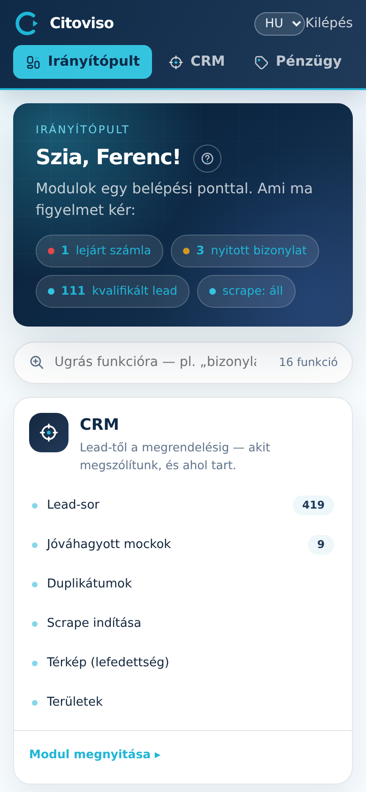

Az **„Irányítópult”** a konzol kezdőlapja: modul-kártyák (bennük a funkciók), gyors-kereső, és
felül a figyelmeztető sáv — **„Modulok egy belépési ponttal. Ami ma figyelmet kér:”**.

## A figyelmeztető sáv (chipek)

A köszöntés alatti színes chipek azt mutatják, ami MA teendőt jelenthet — mindegyik koppintva a
szűrt listára visz:

- **„lejárt számla”** (piros) és nyitott bizonylat (sárga) — a Pénzügy nyitott tételeire ugrik.
- **„kvalifikált lead”** — a lead-listára, eleve a fő célcsoportra szűrve.
- **scrape-állapot** — „fut" vagy „áll"; koppintva a Scrape képernyő.

## A modul-kártyák

Minden kártya egy modul: cím, egy mondat arról, mire való, és a funkciói listája élő
darabszámokkal. A **„Modul megnyitása ▸”** gomb a modul fő képernyőjére visz; a lista sorai
közvetlenül az adott funkcióra.

- **CRM** — „Lead-től a megrendelésig": **„Lead-sor”**, **„Jóváhagyott mockok”**,
  **„Duplikátumok”**, **„Scrape indítása”**, **„Térkép (lefedettség)”**, **„Területek”**.
- **„Pénzügy / Admin”** — bizonylatok, partnerek, árazás: **„Bizonylat keresése”**,
  **„Új bizonylat rögzítése”**, **„Nyitott tételek”**, **„Partnerek”**,
  **„Új partner rögzítése”**, **„Árazás”**.
- **Riport** — a pilot-tölcsér és a szegmens-bontás.
- **„Rendszer”** — fiók, jelszó, működési beállítások (a **„Beállítások”** képernyőre visz).

A felső menüsáv ugyanezt a szerkezetet követi (**„Irányítópult”** · CRM · **„Pénzügy”** ·
Riport · **„Beállítások”**) — a menü szándékosan rövid, a funkciókat a kártyák hordozzák.

## Gyors-kereső

A kártyák feletti kereső-mezőbe gépelve („Ugrás funkcióra…") a funkciók szűrődnek — ha nem
tudod, melyik modulban van a „bizonylat" vagy a „partner", ide írd be, és koppints a találatra.

## Súgó

Minden képernyő fejlécében kör alakú súgó-ikon van — az adott képernyő útmutatójára visz.
