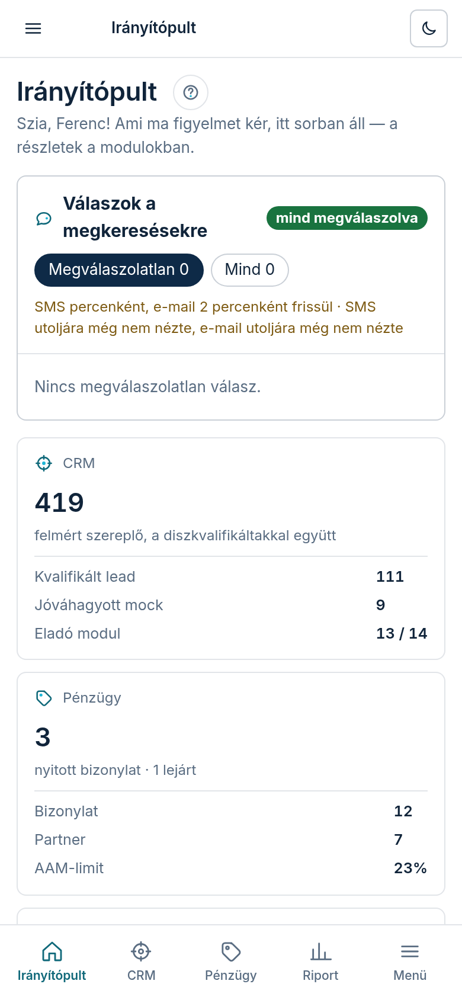

Az **„Irányítópult”** a konzol kezdőlapja. Bal oldalt az oldalsáv a teljes szerkezetet mutatja
(a modulokat és bennük a funkciókat), a lap közepén a számok és az, ami MA figyelmet kér.
A köszöntés: **„Szia, {name}! Ami ma figyelmet kér, itt sorban áll — a részletek a modulokban.”**

## A bal oldali menü (asztali gépen) és a Menü (telefonon)

A menü egy fa: **„Irányítópult”**, alatta a modulok — **CRM**, **„Pénzügy”**, **„Riport”**,
**„Rendszer”** —, legalul a **„Súgó”**.

- **A modul sorára koppintva** a modul saját irányítópultja nyílik meg (lásd lejjebb), és a
  modul funkciói lenyílnak alatta. A többi modul ilyenkor csukva marad — egyszerre azt látod
  nyitva, ahol dolgozol.
- **A sor végén álló nyíl** csak kinyitja vagy becsukja a listát, nem lép sehova.
- A funkciók mellett élő darabszám áll (például **„Lead-sor”** mellett a felmért szereplők
  száma, **„Partnerek”** mellett a partnerek száma), az **„Árazás”** mellett pedig egy jelvény
  mutatja, hány modul eladható a katalógusból (például „13/14 eladó”).
- Asztali gépen a bal felső nyíllal az oldalsáv keskeny ikonsávvá csukható; a választás
  megmarad. A sáv alján a világos/sötét váltó és a **„Kilépés”**.
- **Telefonon** az alsó sávon az **„Irányítópult”**, a **CRM**, a **„Pénzügy”** és a **„Riport”**
  egy koppintásra van; minden más a **„Menü”** alatt, bal oldali fiókban — ugyanaz a fa, ugyanígy
  nyitható-csukható, alul a **„Megjelenés”** (**„Sötét mód”** / **„Világos mód”**), a
  **„Nyelv”** és a **„Kilépés”**.

## A fejléc minden képernyőn

- **← (vissza)** — egy szinttel feljebb visz: egy funkcióról a modul irányítópultjára, onnan a
  kezdőlapra. Az Irányítópulton nincs hova, ott a gomb nem látszik.
- **Útvonal** — megmutatja, hol vagy: `Konzol › CRM › Lead-sor`; egy lead saját lapján a lead
  neve zárja a sort. Minden tagja koppintható. Telefonon a sor rövidebb: csak az eggyel
  feljebb lévő szint és az aktuális lap látszik (például `Partnerek › Vendégház Panoráma…`).
- **„Ugrás funkcióra…”** — a funkció-kereső (asztali gépen; a ⌘K / Ctrl+K billentyű is ide
  ugrik). Gépelj bele („bizonylat”, „partner”, „térkép”), és a találatok közül nyíllal vagy
  koppintással válassz; ha nincs ilyen funkció, azt mondja: **„Nincs ilyen funkció”**.
- A világos/sötét váltó, a konzol nyelve és a **„Súgó”** gomb.

## Az Irányítópult tartalma

**„Válaszok a megkeresésekre”** — a lap tetején, a kártyák fölött: ide kerül minden SMS és
e-mail, amivel egy lead a megkeresésünkre válaszolt. A gép az SMS-eket percenként, a postafiókot
két percenként nézi meg; a blokk alján lévő sor mutatja, mikor nézte utoljára (ha 10 percnél
régebben, a sor borostyán — a gyűjtés akadt el, nem a válaszok maradtak el). Csak olyan feladó
jelenik meg, akinek mi írtunk; más SMS vagy levél nem kerül ide.

- A cím mellett a jelvény: **„{n} megválaszolatlan”** (piros), vagy ha nincs ilyen,
  **„mind megválaszolva”** (zöld). Alatta két szűrő: **„Megválaszolatlan”** (ez az alap) és
  **„Mind”**, mellettük a darabszám.
- **Asztali gépen** bal oldalt a lista, a legújabb felül: piros pötty = megválaszolatlan, zöld
  karika = megválaszolt, a lead neve, SMS vagy E-mail, az időpont és a válasz eleje. Jobb oldalt
  a kiválasztott beszélgetés: felül a MI kiküldött üzenetünk (melyik csatornán, mikor, levélnél a
  tárgy), alatta a válasz teljes szövege.
- **Telefonon** csak a lista látszik; egy sorra koppintva a beszélgetés nyílik meg helyette, a
  **„Vissza”** gomb hozza vissza a listát.
- Ha válaszoltál a leadnek (telefonon, SMS-ben, levélben), koppints a **„Megválaszoltam”**
  gombra: a jelölés **„Megválaszolva”** lesz, mellette, hogy ki és mikor jelölte
  (**„Megválaszolta: {who} · {at}”**), és egy **„Visszavonás”**, ha tévedtél. Levélnél a gép
  magától is megválaszoltnak jelöli, ha a válasz után a postafiókból levél ment ugyanarra a címre
  (ilyenkor a jelölő „postafiók”) — de amit visszavontál, azt nem jelöli vissza.
- **„Lead lapja”** — a lead saját lapjára visz.
- Ha minden válasz meg van válaszolva: **„Nincs megválaszolatlan válasz.”** — a korábbiak a
  **„Mind”** szűrőn megmaradnak.

A megválaszolatlanok száma a menüben is ott áll, az **„Irányítópult”** sor mellett piros
jelvényként; 0-nál eltűnik.

**Egy kártya modulonként** a legfontosabb számokkal, mindegyik sor a saját listájára visz:

- **CRM** — a felmért szereplők száma (a diszkvalifikáltakkal együtt), alatta a kvalifikált
  leadek, a jóváhagyott mockok és az eladó modulok száma, és a két mock-sor, LEADENKÉNT
  számolva (a diszkvalifikáltak nélkül):
  - **„Generált, jóvá nem hagyott mock (lead)”** — hány leadnek van legenerált mockja, de még
    egy sincs jóváhagyva. Koppintva a Lead-sor a Mock oszlop **„legenerálva”** szűrőjével nyílik.
  - **„Jóváhagyott, ki nem küldött mock (lead)”** — hány leadnek van jóváhagyott mockja, de
    még egy csatornán sem ment ki hozzá megkeresés. Koppintva a Lead-sor a
    **„jóváhagyva, nincs kiküldve”** szűrővel nyílik.

  Mindkét szám pontosan annyi, ahány sort a link mögötti lista mutat.
- **„Pénzügy”** — a nyitott bizonylatok száma (és hogy van-e lejárt), alatta a bizonylatok, a
  partnerek és az AAM-limit kihasználtsága százalékban.
- **„Megkeresések”** — a kiküldött megkeresések száma, alatta a **„Válaszolt”** sor (hány válasz
  érkezett összesen; koppintva a fenti blokk a **„Mind”** szűrővel), a megkezdett rendelések és a
  tölcsér megnyitása.

**„Figyelmet kér”** — a kártyák alatti lista azt sorolja, ami MA teendőt jelenthet; minden sor a
megfelelő képernyőre visz, a sor jobb szélén a képernyő neve:

- a tesztfelület elmaradása (ha a konzol nem a mai kódot futtatja — a sor megnevezi a blokkoló
  fájlt);
- **„AAM-limit”** (80%-tól borostyán, 100%-tól piros) — az idei nettó árbevétel az alanyi
  adómentesség 18 M Ft-os keretéhez mérve; amíg 80% alatt van, a sor nem jelenik meg — ha
  felbukkan, a rendszer SMS-t/e-mailt is küldött róla (címzettek: Beállítások →
  „Riasztások — keret-kihasználtság”);
- **„megválaszolatlan válasz a megkeresésekre”** (piros) — hány lead válaszára nem reagáltunk
  még; a fenti blokkra ugrik;
- **„lejárt számla”** (piros) és **„nyitott bizonylat”** (borostyán) — a nyitott tételekre visz;
- hány modul eladó a katalógusból, ha nem mind — az Árazás és értékesítés lapra visz;
- **„kvalifikált lead”** — pontosan annyi, amennyit a Lead-sor a linkre koppintva mutat;
- **„adatgyűjtés”**: **„fut”** vagy **„áll”** — koppintva az Adatgyűjtés indítása képernyő.

## A modul irányítópultja

A menüben a modul sorára koppintva (vagy telefonon az alsó sáv gombjával) a modul saját lapja
nyílik: a modul neve és egy mondat arról, mire való; a modul kártyája a számokkal; a modul saját
„Figyelmet kér” sorai (ha van ilyen); és a **„Funkciók”** lista — a modul minden képernyője
egy-egy sorban, a darabszámmal vagy jelvénnyel, ahogy a menüben is.

- **CRM** — „Lead-től a megrendelésig”: **„Lead-sor”**, **„Jóváhagyott mockok”**,
  **„Duplikátumok”**, **„Adatgyűjtés indítása”**, **„Térkép (lefedettség)”**, **„Területek”**,
  **„Árazás és értékesítés”**.
- **„Pénzügy”** — bizonylatok és partnerek: **„Bizonylat keresése”**, **„Új bizonylat rögzítése”**,
  **„Nyitott tételek”**, **„Partnerek”**, **„Új partner rögzítése”**. Az árazás 2026-09-06 óta
  **nem itt** van, hanem a CRM-ben — értékesítési döntés lett belőle.
- **„Riport”** — **„Megkeresés-tölcsér — hol akadnak el”**, **„Viselkedés — eszköz, kilépés, miért”**.
- **„Rendszer”** — **„Beállítások”** (fiók, jelszó, működési beállítások).

## Súgó

A teljes tudástár a menü **„Súgó”** pontján át nyílik — ez az út minden képernyőről működik.
Ott az összes útmutató kereshető, munkafolyamat szerinti csoportokban: a lap érkezéskor az
első csoportot nyitva mutatja, mellette pedig — asztali gépen — az összes témakört a
cikkcímeivel, hogy ne kelljen találgatni, melyik csoport mögött lehet, amit keresel.

Ezen felül minden olyan képernyő fejlécében ott egy kör alakú súgó-ikon, amelyiknek saját
útmutatója van — a Pénzügy lapjain (Partnerek, Partner-lap, Új partner, Bizonylatok, Új
bizonylat) is. Az ikon rövidítés: egyenesen az ADOTT képernyő útmutatóját nyitja meg, nem a listát.
