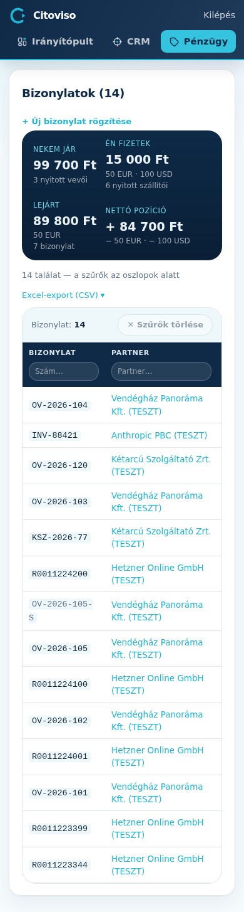

A **„Bizonylatok”** menüpont a cég ÖSSZES bizonylatát mutatja egyetlen táblában — kimenő és
bejövő nincs külön szekcióra szedve: az irány csak szűrő, és nem külön oszlop (a **„Vevői számla”**
/ **„Szállítói számla”** típus úgyis megmondja, be- vagy kimenő-e). Így egy kereséssel megtalál
bármit, akárhonnan jött.

## A felső sáv — hol áll a pénz

A táblázat fölött négy szám, pénznemenként külön bontva (soha nem összeadva): mennyi **jár nekem**
(a még ki nem egyenlített vevői számlák), mennyit **fizetek** (a nyitott szállítói számlák), mennyi
a **lejárt**, és a **nettó pozíció** (a kettő különbsége). Ha több devizában is van tétel, a fő
összeg alatt kisebb sorban jelennek meg a többiek (pl. EUR, USD).

## Keresés és szűrés — az oszlopok alatt

A szűrők közvetlenül a táblázat sötét fejlécében ülnek, oszloponként: a **„Szám…”** mezőbe a
bizonylatszám, a **„Partner…”** mezőbe a név töredéke; a Típus lenyílója a fajtára szűr; a Kelte és
a **„Fiz. határidő”** alatt egy-egy tól–ig dátumpár (két naptár-mező: mettől meddig); a **„Pénznem”**
és az Állapot (fizetve / nyitott) szintén lenyíló. A szűrés a szerveren fut, tehát akkor is a teljes
adatbázisból keres, ha az több ezer sor. A lenyílók és a dátumok választásra azonnal szűrnek, a
szöveg-mezők gépelés után maguktól; minden aktív szűrő egy kis címkeként (chip) is megjelenik a
táblázat tetején, egyenként törölhető ✕-szel, vagy mind egyszerre a **„Szűrők törlése”** gombbal.
A letöltés mindig a szűrt listát adja (**„Excel-export (CSV) ▾”**).

## Mit mutat a tábla?

Bizonylatszám · Partner (a nevére kattintva a partner-lapra ugrik) · Típus · Kelte ·
**„Fiz. határidő”** · **„Esedékesség”** (ebből számolt emberi olvasat: „3 nap múlva” vagy
„9 napja lejárt”) · Nettó · Bruttó · **„Pénznem”** · Állapot · **„Számlakép ▸”** (a tárolt
bizonylat-kép, ha van). A sztornó negatív összeggel, halványan jelenik meg ugyanabban a listában.
