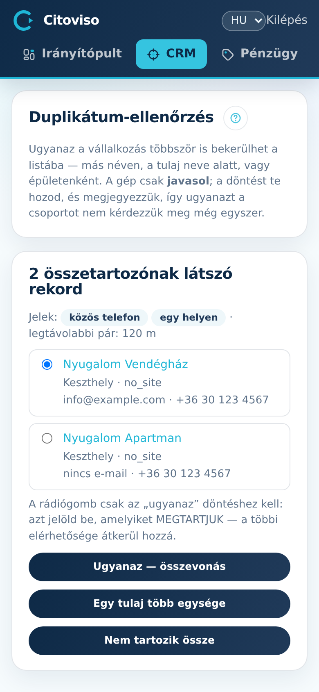

A **„Duplikátum-ellenőrzés”** képernyő azokat a lead-csoportokat mutatja, amiket a gép
összetartozónak gyanít — más néven, a tulaj neve alatt, vagy épületenként kerülhetett be
ugyanaz a vállalkozás többször. A gép csak javasol; a döntést te hozod, és a rendszer megjegyzi,
így ugyanazt a csoportot nem kérdezi meg még egyszer.

## Mi alapján gyanús?

A csoport tetején pill-ek mutatják a jelet: „közös honlap”, „közös telefon”, „közös e-mail”,
„egy helyen”. Figyelmeztetés jelenik meg, ha a rekordokat nagy távolság választja el — az a
mintázat általában közös ügynökségi oldal vagy több telephely, NEM ugyanaz az üzlet.

## A döntés

Minden csoportban a rádiógombbal kijelölöd, melyik rekord maradjon a fő (a nevek kattintva új
fülön nyílnak, össze tudod hasonlítani őket), majd három gomb közül választasz:

- **„Ugyanaz — összevonás”** — a többi rekord beolvad a kijelöltbe: az elérhetőség-hézagok
  (e-mail, telefon, honlap, város) és a kapcsolat-napló átkerülnek. ⚠️ A vesztes rekord
  FOTÓ-ANYAGA viszont NEM olvad be — összevonás előtt nézd meg, melyik rekordnál van a több
  fotó/anyag, és AZT jelöld megtartottnak.
- **„Egy tulaj több egysége”** — külön maradnak, de a rendszer megjegyzi az összefüggést
  (pl. egy tulaj két vendégháza — mindkettő önálló lead).
- **„Nem tartozik össze”** — fals riasztás volt; a csoport eltűnik, és nem jön vissza.

## Mikor nézz ide?

Scrape-futás után érdemes — az új felvételek hozhatnak átfedést a meglévő állománnyal. Ha nincs
eldöntetlen csoport, a képernyő üres: nincs teendő.
