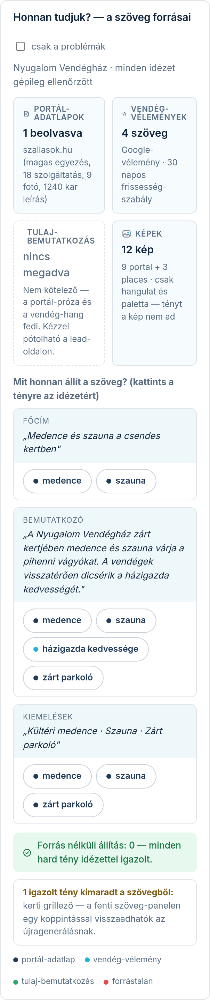

A lead-lap a napi munka szíve: itt fut végig egy szereplő a teljes láncon —
adat-ellenőrzés → mock-generálás → kurátori döntés → megkeresés → konverzió.

## A fejléc — mielőtt bármit csinálsz

A név melletti badge a honlap-kvalifikáció; a tény-sávban ország, város, régió, cím, a talált
honlap (kattintható), a **„Match-konfidencia”** (mennyire biztos, hogy a begyűjtött adatok tényleg
erről az üzletről szólnak — alacsony értéknél ELŐBB ellenőrizz, csak utána generálj), és a
legutóbbi mock állapota.

## Begyűjtött adatok

A **„Begyűjtött adatok — szerkeszthető”** panelben pótolhatod és javíthatod, amit a scrape hozott;
a mentett érték a következő mock-generáláskor már érvényes. Azt, hogy melyik mező honnan jött
(forrás + konfidencia, kattintható forrás-linkkel), az **Audit** fülön a **„Provenance (A4)”**
lenyíló táblázat mutatja. Ha az adat hiányos vagy gyanús, az **„Adatok újragyűjtése”** gomb
friss webes keresést futtat erre az egy leadre.

## Mock-generálás

A generáló panelben a **„Kinézet-típus”** kártyákon választod ki, milyen elrendezéssel
készüljön a mock, majd a gombbal indítod. A „generálás folyamatban…” jelzés alatt az oldal
magától frissül (~1–2 perc). Az elkészült mock az „előnézet ▸” linken nyílik.

⚠️ **A választó TÖBBSZÖRÖS, és alapból egy sincs bejelölve.** Amennyi kártyát bejelölsz, annyi
külön mock készül; ha egyet sem jelölsz be, egy alapértelmezett kinézettel készül el. Ezt
érdemes tudni, mert könnyű azt hinni, hogy „nem az készült, amit kértem”, holott választás
nélkül a rendszer maga döntött.

## A nyitókép felülbírálása

A rendszer maga választ nyitóképet — **a legjobbat, nem a legnagyobbat** —, és minden képnél
kiírja, mit lát rajta. Ha nem értesz egyet vele, felülbírálhatod.

**Két helyen tudsz jelölni, és másképp néznek ki:**

- A **Fotók panelen** minden képnél ott a pontszám és az indoklás, a kép alatt pedig a
  **„Legyen ez a nyitókép”** gomb; az aktuálison **„ez a nyitókép”** áll. Kockázatos
  választásnál megerősítést kér.
- **„A mock szövege”** panelen egy sáv mutatja a nagy aktuális nyitóképet — rajta a
  **„NYITÓKÉP”** címke —, mellette a többi kép alkalmasság szerint. Itt a bélyegre magára
  kattintasz: „Kattints, ha mást akarsz a lap tetejére — a mock azonnal újrarenderelődik.”

- A jelölés **a leadhez tapad**, és a mock **azonnal újrarenderelődik** vele — a sáv ki is írja:
  „Kézi nyitókép — … választotta. A mock már ezzel van renderelve.”
- ⛔ **Kiküldött mockot NEM cserél ki alattad.** Ha a mock már ki lett ajánlva a leadnek, a
  csere elmarad, és a lap tetején piros sávban megjelenik az indok: *„Ez a mock már ki lett
  ajánlva a leadnek — a nyitóképét nem cseréljük ki alatta. A választást elmentettük: a
  következő generálás már ezzel készül.”* Amit a szállásadó egyszer megkapott, azt utólag nem
  írjuk át — a jelölésed viszont nem vész el.
- A **„Vissza a gépi választásra”** gombbal visszavonod a jelölést. Ez **nem a korábbi állapotot
  állítja vissza**, hanem újra lefuttatja a szabályt — az eredmény lehet más kép is, mint ami
  a jelölés előtt volt.
- Ha egy képről nincs ítéletünk, a sáv ezt kimondja („Erről a képről nincs ítéletünk — a mock
  kurátor-sorban marad”), nem találgat.

⚠️ **A „nem találtunk fotót” a LEADRŐL szól, nem rólunk.** Ha nálunk akad el valami (például
elfogy a kép-forrás napi kerete), azt a panel külön mondja meg — olyankor a lead ártatlan, és
érdemes később újrapróbálni.

## „A mock szövege” — a szöveg-panel

Az **„A mock szövege”** panelen látod, amit a szállásadó olvasni fog — és itt kérhetsz rajta
változtatást. Két chip-csoport van, és **csak az alsó kattintható**:

- **„Ezeket a hirdetésből eladja”** — amit a szöveg már említ. Ezek csak tájékoztatnak,
  nem lehet rájuk koppintani.
- **„Ezeket nem említi — koppintson, hogy bekerüljön”** — a kimaradt tények. **Ezek a
  kattinthatók.**

⚠️ A koppintás **nem cseréli le a szöveget**, hanem beírja a tételt az alatta lévő utasítás-mezőbe
(**„Mit csináljon másképp? (elhagyható — vagy koppintson a fenti pontokra)”**) — ugyanoda,
ahova te is írhatsz saját kérést. A panel ezt maga is kimondja. A tényleges átírást a
**„Szöveg újragenerálása”** gomb indítja.

A forrás-panel „igazolt tény kimaradt” sora is ide mutat vissza. ⚠️ Előfordul, hogy egy ott
felsorolt tételhez **nincs chip** a felső panelen — ilyenkor egyszerűen írd be kézzel az
utasítás-mezőbe, mit emeljen be.

⛔ **Meddig írható át?** Nem a jóváhagyás a határ — az után is újragenerálhatod. A szöveg
abban a pillanatban fagy be, amikor a Megkeresés fülön megnyomod a
**„Követett link készítése”** gombot: onnantól a mock ki van ajánlva a leadnek, és nem
írjuk át a címzett alatt. ⚠️ **Ez a küldés ELŐTT történik** — hiába nem ment még ki levél,
a link elkészítése után már elutasítást kapsz. Ilyenkor a kiút: **generálj új mockot**, ha
másik ajánlatot akarsz adni.

## „Honnan tudjuk?” — a szöveg forrásai

A **„Mock és generálás”** fülön, a szöveg-panel alatt a **„Honnan tudjuk? — a szöveg forrásai”**
panel mutatja, MIBŐL dolgozott a generátor ennél a mocknál (a generáláskori pillanatképből — ha
azóta újragyűjtöttél, az itt nem látszik, csak a következő mockban). A panel csak azokon a
mockokon jelenik meg, amelyek **a forrás-panel élesítése ÓTA** készültek: a korábbiakhoz nincs
pillanatkép, ezért panel sincs — generálj újat, és megjelenik.

1. Fent négy forrás-kártya: portál-adatlapok, vendég-vélemények, tulaj-bemutatkozás, képek —
   számokkal. A szaggatott szegélyű kártya hiányzó forrást jelent (pl. „nincs megadva”
   tulaj-bemutatkozás): ez nem hiba, de ha pótolható, pótold — a tulaj-bemutatkozást az
   **„Adatok”** fülön, a **„Begyűjtött adatok — szerkeszthető”** blokk **„Tulaj-bemutatkozás”**
   mezőjében írhatod be; a hiányzó portál-adatra pedig ugyanott indíthatsz újragyűjtést.
2. Alatta a mock szöveg-elemei tény-chipekkel — főcím, bemutatkozó, kiemelések és így tovább.
   ⚠️ Itt **csak az az elem jelenik meg, amelyikhez tartozik chip**: ha egy elemre (tipikusan
   az alcímre) egyetlen tény sem illeszkedik, az a sor némán kimarad a panelről. Ne lepődj meg,
   ha nem látod mindegyiket — a képen sincs rajta mind.
   A chip színpöttye a forrás: cián = vendég-vélemény, zöld = tulaj-bemutatkozás,
   piros = forrástalan, **sötétkék = minden más** (jellemzően a portál-adatlap, de ide esik a
   szállás saját leírásából kinyert és a be nem azonosított forrású tény is).
   **A chipre kattintva megnyílik a forrás-doboz**, négyféle tartalommal:
   ① szó szerinti, gépileg ellenőrzött idézet a forrás nevével;
   ② **„A szolgáltatás-listájában szerepel (nincs külön szöveg-idézet).”**;
   ③ **„A leírás-elemző nyerte ki a szövegből (ehhez nem készül szó szerinti idézet).”**;
   ④ a PIROS chipnél **„FORRÁSTALAN”** — **„Ezt az állítást egyik forrás sem támasztja alá —
   a tényhűség-őr jelölte. Újragenerálás vagy kézi javítás javasolt.”**
   A ② és ③ nem hiba (ott nincs mit idézni), a ④ viszont **cselekvést kér** — ez az egyetlen,
   amivel dolgod van. Újabb kattintás csukja.
3. A zöld sáv azt igazolja, hogy nincs forrás nélküli állítás; ha lenne, piros sávot látsz a
   tételekkel. Alatta az „igazolt tény kimaradt” sor: ezek benne vannak a forrásokban, de a
   szövegből kimaradtak — a fenti szöveg-panelen egy koppintással visszaadhatod őket az
   újragenerálásnak.
4. A „csak a problémák” pipával a panel elrejti az egészséges részeket, és csak a piros
   chipes elemeket meg a figyelmeztetéseket hagyja fent — gyors ellenőrzéshez.

## Kuráció — ember dönt

Minden mockon két gomb: **„Jóváhagyás”** és **„Elutasítás”**. Kiküldeni CSAK jóváhagyott mockot
lehet — ez kőbe vésett szabály, a rendszer nem enged vak auto-sendet. Elutasításnál a mock a lap
alján az „Elutasított mockok” csoportba kerül, és bármikor generálhatsz újat.

## Megkeresés

A **„Megkeresés — követett link”** panel prospect-linket készít a jóváhagyott mockhoz. Az
**„E-mail / SMS megnyitása — küldés ▸”** gomb az Outreach-piszkozat KÉPERNYŐRE visz — ott fut le
a §C-jogszerűségi kapu, ott választasz csatornát, és onnan küldi ki a levelet maga a rendszer
(részletes útmutató: a Súgóban az „Outreach-piszkozat" téma). Ha kézzel, a saját leveleződből
küldtél, a **„Kiküldve — mérés indul”** gombbal jelzed — innentől méri a rendszer a megnyitást
és az aktivitást (Tevékenység-gomb).

## Ha a soron „leiratkozott” áll

A leiratkozott prospect sorában piros címke jelzi a leiratkozást a dátumával, és a küldés-gomb
eltűnik. Alatta egy dobozban látod a leiratkozás-naplót: mikor, ki, és — visszavonásnál — mire
hivatkozva.

⚠️ **Egy leiratkozás több sort is némává tehet.** A tiltás nem a linkhez tartozik, hanem a
SZEMÉLYHEZ: ha ugyanaz az e-mail-cím vagy telefonszám bárhol máshol leiratkozott, a rendszer
oda sem küld. Ezért fordulhat elő, hogy egyetlen kattintás után több leadnél is elakad a küldés
— ilyenkor azt a sort kell megkeresni, ahol a piros címke áll.

### A leiratkozás visszavonása

A doboz **„Leiratkozás visszavonása ▸”** sorára koppintva nyílik ki az űrlap. Írd be az
indoklást, majd **„Visszavonás”**. Az indoklás kötelező — üresen vagy pár betűvel a rendszer
nem engedi el.

⛔ **Ezt csak akkor teheted meg, ha a címzett MAGA kérte** (telefonon, e-mailben, személyesen).
A leiratkozás jogilag a címzetté, nem a miénk. Amit beírsz, a naplóba kerül a felhasználóneveddel
együtt, és ott is marad — ez a bizonyíték arra, hogy volt jogalapod. Ha nincs ilyen kérés,
hagyd a leiratkozást érvényben.

Visszavonás után a piros címke eltűnik, a küldés-gomb visszajön, a napló pedig megmarad a soron.

## Konverzió

Ha a tulaj megrendelt, a jóváhagyott mock alatti űrlapon a **„Konvertálás privát előnézetbe ▸”**
gomb indítja az élesítést — a modulok a tulaj konfigurátor-választásából jönnek, nem kézből.

## Diszkvalifikálás

Ha a szereplő biztosan nem célpont, a lap alján a **„Diszkvalifikálás”** panelben indokkal
kivezetheted — megmarad, az újra-scrape sem hozza vissza, és bármikor visszavonható.
