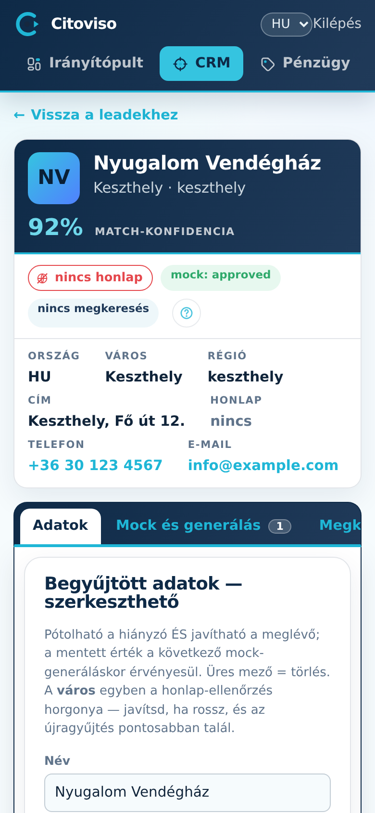

A lead-lap a napi munka szíve: itt fut végig egy szereplő a teljes láncon —
adat-ellenőrzés → mock-generálás → kurátori döntés → megkeresés → konverzió.

## A fejléc — mielőtt bármit csinálsz

A név melletti badge a honlap-kvalifikáció; a tény-sávban ország, város, régió, cím, a talált
honlap (kattintható), a **„Match-konfidencia”** (mennyire biztos, hogy a begyűjtött adatok tényleg
erről az üzletről szólnak — alacsony értéknél ELŐBB ellenőrizz, csak utána generálj), és a
legutóbbi mock állapota.

## Begyűjtött adatok

A **„Begyűjtött adatok — szerkeszthető”** panelben pótolhatod és javíthatod, amit a scrape hozott;
a mentett érték a következő mock-generáláskor már érvényes. A provenance-táblázat mutatja, melyik
mező honnan jött (forrás + konfidencia) — a források kattinthatók. Ha az adat hiányos vagy
gyanús, az **„Adatok újragyűjtése”** gomb friss webes keresést futtat erre az egy leadre.

## Mock-generálás

A generáló panelben a **„Kinézet-típus”** kártyákon kiválasztod az elrendezést (a kurátor dönt),
majd a gombbal indítod. A „generálás folyamatban…” jelzés alatt az oldal magától frissül
(~1–2 perc). Az elkészült mock az „előnézet ▸” linken nyílik.

## Kuráció — ember dönt

Minden mockon két gomb: **„Jóváhagyás”** és **„Elutasítás”**. Kiküldeni CSAK jóváhagyott mockot
lehet — ez kőbe vésett szabály, a rendszer nem enged vak auto-sendet. Elutasításnál a mock a lap
alján az „Elutasított mockok” csoportba kerül, és bármikor generálhatsz újat.

## Megkeresés

A **„Megkeresés — követett link”** panel prospect-linket készít a jóváhagyott mockhoz. Az
**„E-mail / SMS megnyitása — küldés ▸”** gomb az Outreach-piszkozat KÉPERNYŐRE visz — ott fut le
a §C-jogszerűségi kapu, ott választasz csatornát, és onnan küldi ki a levelet maga a rendszer
(részletes útmutató: a Súgóban az „Outreach-piszkozat" téma). Ha kézzel, a saját leveleződből
küldtél, a **„Kiküldve — mérés indul”** gombbal jelzed — innentől méri a rendszer a megnyitást
és az aktivitást (Tevékenység-gomb).

## Konverzió

Ha a tulaj megrendelt, a jóváhagyott mock alatti űrlapon a **„Konvertálás privát előnézetbe ▸”**
gomb indítja az élesítést — a modulok a tulaj konfigurátor-választásából jönnek, nem kézből.

## Diszkvalifikálás

Ha a szereplő biztosan nem célpont, a lap alján a **„Diszkvalifikálás”** panelben indokkal
kivezetheted — megmarad, az újra-scrape sem hozza vissza, és bármikor visszavonható.
