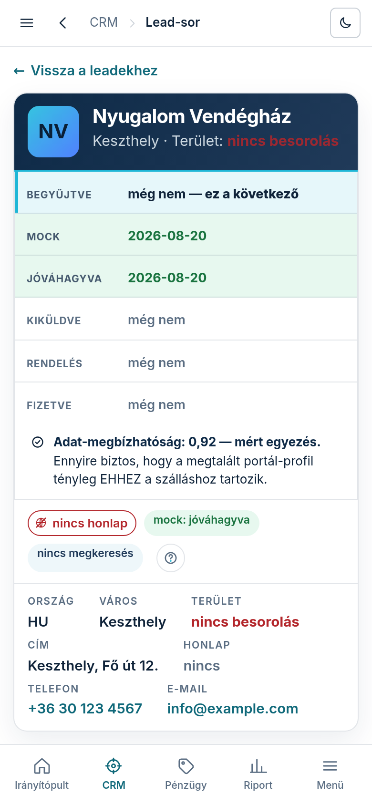
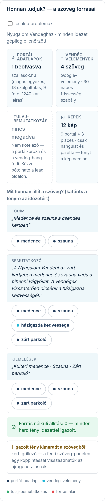

A lead-lap a napi munka szíve: itt fut végig egy szereplő a teljes láncon —
adat-ellenőrzés → mock-generálás → kurátori döntés → megkeresés → konverzió.

## A fejléc — mielőtt bármit csinálsz

A név melletti badge a honlap-kvalifikáció; a tény-sávban ország, város, **„Régió”**, cím, a talált
honlap (kattintható), és a legutóbbi mock állapota.

### A munkamenet-sáv — hol tart ez a lead?

2026-09-14 óta a fejléc alatt egy **hat állomásos sáv** áll: **„Begyűjtve”**, **„Mock”**,
**„Jóváhagyva”**, **„Kiküldve”**, **„Rendelés”**, **„Fizetve”**. Ez a lap első kérdésére felel:
hol tart ez a lead, és mi a következő lépés.

- Minden állomás vagy **dátumot** mond, vagy azt, hogy **„még nem”** — üres gondolatjel sehol.
- A soron következő állomás kiírja magáról, hogy **„ez a következő”**, hogy ne kelljen keresned.
- ⭐ Újragenerálás közben a **Mock** állomás vált futás-állapotra (eltelt idővel), a
  **Jóváhagyva** állomás viszont **a helyén marad a dátumával** — a megkeresés ugyanis attól
  mehet ki, és ez a tény nem tűnhet el csak azért, mert épp készül egy újabb mock.

A sáv alatt egy sor mondja meg az **adat-megbízhatóságot**, és mindig kimondja, mi következik
belőle: ha nincs mért egyezés, akkor azt, hogy kiküldés előtt nézd át az Adatok fület.
⚠️ A **0,85** a képlet **alapértéke**, nem mért egyezés — a lead-listánál leírt szabály itt is áll.

⚠️ **A „Régió” itt a GYŰJTÉS doboza, nem a szállás földrajza.** Az az azonosító, amivel a
felderítés felvette a szereplőt — nyers alakban (például `balaton-north`). Ne olvasd
partoldalnak vagy tájegységnek: egy „balaton-north" dobozba déli parti és parttól távoli
település is kerülhet, mert a doboz a keresési terület, nem a fekvés. A lead-lista
**„Terület”** oszlopa ugyanezt az értéket mutatja, ott emberi néven — a listánál leírt
szabály itt is áll.

⚠️ A mock-jelölés **két külön dolgot** mond, mert a kettő szétválhat. Az egyik a **legutóbbi**
generálás állapota (a „mock:” előtag után **„legenerálva”**, **„jóváhagyva”**, vagy futás közben
**„mock: generálás fut”**). A másik a **„van jóváhagyott mock”** jelölés — és a megkeresés
ATTÓL mehet ki, nem a legutóbbi állapottól. Ha egy új generálás születik egy már jóváhagyott
mock mellé, a sáv „mock: legenerálva”-t ír, de a **„van jóváhagyott mock”** ott áll mellette:
a levél kiküldhető.

A jelvény pontosan annyit mond, amennyi TÖRTÉNT, és megnevezi, MIT számol:
„2 követett link · még egyik sem ment ki”, „2 követett link · ebből 1 ment ki (bármely
csatornán)”, vagy — és csak ekkor zölden — „2 követett link · mind kiküldve (valamelyik
csatornán)”. ⚠️ A szám **követett linkeket** számol, nem megkereséseket: egy leadhez több link
is készülhet (pl. új mock), hideg levél viszont **címenként egyszer** megy ki.

## Mi ment ki ezen a linken — és honnan a forgalom?

A Megkeresés fülön minden követett link sora a SAJÁT csatorna-bélyegéből beszél:
**„E-mail elküldve”**, **„Mobil (MMS+SMS) elküldve”** (mindkettő a dátummal), a félbemaradt párosra
**„Mobil: FÉLBEMARADT páros”**, és ha semmi nem ment ki: **„még egyik csatornán sem ment ki”**.
Ez azért fontos, mert a mobil-páros és a levél KÜLÖN csatorna — az egyik kiküldése nem jelenti,
hogy a másik is elment.

⚠️ Ha egy soron az áll, hogy még nem ment ki, DE mégis látsz rajta megnyitásokat és eseményeket,
a felület ezt külön kiírja: **„Ez a link még egyik csatornán sem ment ki, tehát ez a forgalom NEM
a megkeresés címzettjétől van”**. Ilyenkor a szám a te (vagy egy kolléga) saját megnyitásaidból,
előnézetből vagy tesztből származik — nem lead-érdeklődés, és nem is szabad annak olvasni.

## Begyűjtött adatok

A **„Begyűjtött adatok — szerkeszthető”** panelben pótolhatod és javíthatod, amit a scrape hozott;
a mentett érték a következő mock-generáláskor már érvényes. Azt, hogy melyik mező honnan jött
(forrás + konfidencia, kattintható forrás-linkkel), az **Audit** fülön a **„Honnan jött az adat”**
lenyíló táblázat mutatja. Ha az adat hiányos vagy gyanús, az **„Adatok újragyűjtése”** gomb
friss webes keresést futtat erre az egy leadre.

⚠️ **A mentés mindent vagy semmit.** A szállás címe minden mockon és honlapon megjelenik, ezért a
rendszer nem enged bele vevő-számlázási adatot. Az űrlapon a böngésző automatikus kitöltése ki
van kapcsolva (az a saját számlázási adatainkat írná ide); a biztos védelem mégis ez a szabály:

- a **cím** mezőben nem állhat érvényes magyar adószám, sem 10–12 jegyű, telefonszám-formájú szám
  (a szóközzel vagy kötőjellel tagolt számot is egyben vizsgálja);
- az **ország** mezőbe kétbetűs kód kell (például HU); a „Magyarország” és a „Hungary” alakot a
  rendszer magától HU-ra alakítja;
- az **e-mail-címek** mindegyike érvényes cím legyen, és ugyanaz a postafiók csak egyszer
  szerepelhet (a kis- és nagybetű, valamint a `+` utáni címke nem számít).

Ha bármelyik mező hibás, **semmi nem mentődik** — a többi mezőbe írt változtatás sem (például a
tulaj-bemutatkozás) —, és a lap tetején piros sáv jelenik meg, „Nem mentettem:” kezdettel, utána
a hiba okával. Javítsd a jelzett mezőt, és írd be újra a többi változtatást is.

### Több e-mail-cím

Egy leadnek több e-mail-címe is lehet. Az **„E-mail-címek”** részben minden cím külön sorban áll:

- Új címet a **„További e-mail”** linkkel adsz hozzá; a sor végén lévő **×** törli a címet.
- Több címet egyszerre is beilleszthetsz egy sorba (például `info@szallas.hu; tulaj@gmail.com`) —
  a „;”, a „,” és a szóköz mentén külön sorokra bomlik. Ha egy cím már szerepel a listán, nem
  kerül be még egyszer, és a lista alatt ez áll: **„Kihagyva, mert ugyanaz a postafiók már a
  listán van:”**, mögötte a kihagyott címmel.
- A **„Megkeresés ide”** jelölésű cím az **elsődleges**: ez jelenik meg a mockon és a honlapon.
  Ha egy másik sorban jelölöd be, az a sor a lista elejére kerül. A megkeresés címzettjét a
  **Megkeresés** fülön, a **„Követett link készítése”** gomb melletti mezőben adod meg:
  - ha a leadnek **egy** e-mail-címe van, a mezőben már ott áll — ellenőrizd, és ha kell, írd át;
  - ha **több** címe van, a mező üres: te döntöd el, melyikre menjen a levél (általában az
    elsődlegesre), és azt írd be.
  A többi cím a lead adata: a rendszer **nem küld rá levelet**, és sehol nem jelenik meg
  nyilvánosan.
- A lap tetején az **E-mail** mellett a további címek száma látszik (például „+2”). Gépen, ha
  föléviszed az egeret, megmutatja a címeket; telefonon az **Adatok** fülön látod mindet.
- Ha minden sort kiürítesz és mentesz, a leadnek nem lesz e-mail-címe.

Az **„Adatok újragyűjtése”** a mentett e-mail-címeidet nem írja felül, nem törli, és az általad
törölt címet sem tölti vissza; az újonnan talált címek csak az **Elérhetőségek** fülre kerülnek,
a listádba nem. Ha a gyűjtés olyan címet talált, ami a listádon további címként szerepel, ott
**„további”** jelölést kap. A kézzel beírt, de a gyűjtés által nem talált cím ott nem jelenik meg.

## Mock-generálás

⚠️ **Ha ezen a leaden már van mock, a generáló panel CSUKVA van.** A mock-kártyák állnak elöl,
a generálás pedig egy összecsukott sor mögé került — kattints erre, és kinyílik:

> ▸ **Új mock generálása, forrás és szöveg-újraírás**

(Ha még egy mock sincs, a panel eleve nyitva áll — nincs mit elé tenni.)

A generáló panelben a **„Kinézet-típus”** kártyákon választod ki, milyen elrendezéssel
készüljön a mock, majd a gombbal indítod. Az elkészült mock az „előnézet ▸” linken nyílik —
ez a mock-kártyán, **a pillanatkép jobb alsó sarkában**, egy sötét pirulán ül (a képen, nem
mellette). Ha még nincs kép, ugyanott találod, a magyarázó doboz sarkában.

⚠️ **A választó TÖBBSZÖRÖS, és alapból egy sincs bejelölve.** Amennyi kártyát bejelölsz, annyi
külön mock készül; ha egyet sem jelölsz be, egy alapértelmezett kinézettel készül el. Ezt
érdemes tudni, mert könnyű azt hinni, hogy „nem az készült, amit kértem”, holott választás
nélkül a rendszer maga döntött.

### Honnan tudod, hogy fut, és mikor bukott el

A generálás 1–2 percig tart, ezért **a lap tetején** — közvetlenül a szállás neve alatti sötét
sáv alatt — végig ott van egy világoskék csík: **„Mock generálása fut”**, mellette az **eltelt
idő** (percre-másodpercre ketyeg) és a „~1-2 perc — a lap magától frissül” felirat. Amíg fut:

- a sáv megnevezi, HOL TART — de kétféleképpen, attól függően, hány kinézetet indítottál:
  **egy kinézetnél** a szakaszt írja ki (**„adatok betöltése”** → **„fotók gyűjtése és
  szűrése”** → **„szöveg generálása”** → **„oldal renderelése”**), **több kinézetnél** pedig
  azt, hány van kész a sokból (például „2/5 mock kész”). A kettő kizárja egymást: ha egyszerre
  több kártyát jelöltél be, a szakasz-feliratok helyett a darabszámot látod. Mindkettő valós
  adat — a motor jelenti, nem becsült százalék;
- a fejléc mock-pirulája nem „approved”-ot mond, hanem **„mock: generálás fut”** az eltelt idővel
  — a régi állapot nem állíthatja magáról, hogy ez a friss;
- a **„Mock és generálás”** fülön lüktető pötty jelzi, hogy ott dolgozik valami — akkor is
  látod, ha épp másik fülön állsz;
- a lap magától újratölt, nem kell frissítened.

✅ **A végét is kimondjuk.** Amikor kész, a sáv zöldre vált, kiírja, mennyi ideig tartott, és
ad egy **„Megnézem a mockot”** linket (több mock esetén **„A lead mockjai”**). Így akkor is
látod a végeredményt, ha közben máshol dolgoztál — nem tűnik el abban a pillanatban, ahogy
befejeződött.

⚠️ **Meddig marad ott?** Körülbelül **fél óráig**, utána magától eltűnik (és a szerver
újraindulásakor azonnal — ez a jelzés nem tárolt adat, csak egy emlékeztető). Az **„Elrejtem”**
(×) gombbal magad is bezárhatod, de az csak a képernyőről veszi le: ha a fél órán belül
újratöltöd a lapot, visszajön. Ha a mock kell, ne a sávot keresd, hanem a **„Mock és generálás”**
fület — ott a lista nem évül el.

⛔ **Ha elbukik, azt is a lap tetején mondjuk meg.** Ugyanaz a sáv pirosra vált, és kiírja az
okot (például *„A generálás elbukott: Your credit balance is too low to access the Anthropic
API.”*). A kimenet a gomb fölött is ott marad, hogy ne ugyanazt a gombot nyomogasd egy olyan
hibára, amit előbb máshol kell orvosolni.

### A jobb oldali előnézet ENNEK a leadnek az adata

A kártyák mellett élő keretben látod, hogy néz ki **ennek a szállásnak** a lapja a kijelölt
kinézeten — a legutóbbi mock szövegével és képeivel, új generálás nélkül. Másik kártyát
jelölsz be, a keret azonnal átvált rá.

⚠️ Ha a leadhez **még nincs egyetlen generált mock sem**, nincs mit renderelni: ilyenkor egy
**MÁSIK szállás** mintája látszik ezen a kinézeten, és a kép alatti felirat ezt ki is mondja.
Az első mock után a saját lapja kerül a helyére.

### A „Séta a kapun át” kinézet: összeáll-e a séta ennél a leadnél

Ez a kinézet a szállás fotóiból „sétát” épít: a görgetés közben egymás után jönnek a
különböző tárgyú képek (**A ház kívülről**, **Kert és udvar**, **A kilátás**, **Asztalnál**,
**Odabent**). Ehhez **legalább 3 különböző tárgy** kell, és a nyitó-kollázs képei nem
számítanak bele (a séta nem ismétli őket). Ha kevesebb van, a séta **elmarad** — a lap
ekkor egy egyszerű, egyhasábos oldal lesz, ugyanezen a néven. Ez szándékos, nem hiba.

Hogy ne érjen meglepetés, a konzol előre szól:

- A kinézet-kártyán egy sárga címke áll: **„Séta: nem áll össze”** és mellette, hány tárgy
  van a szükséges háromból (például „1/3”). Ha a fotók tárgyát a rendszer még nem mérte meg,
  szürke címke áll: **„Séta: előre nem tudható”** — ezt a generálás méri meg.
- Ha bejelölöd a kártyát, alatta megnyílik a magyarázat: **„Ennél a leadnél a séta nem áll
  össze”**, és felsorolja az öt tárgyat — zölddel, amire van fotó, áthúzva, ami csak a
  nyitó-kollázsban van, halványan, amire nincs.
- A jobb oldali előnézet alatt is ott a figyelmeztetés: ennél a leadnél a lap **séta nélkül**
  áll össze.
- A kész mock kártyáján a **„Séta”** sor mondja meg az eredményt: **„elmaradt”** (sárga, a
  tárgyak számával), vagy zölden, hány lépésből áll a séta.

A kártya ilyenkor is választható — ha épp az egyszerű lapot szeretnéd ezen a kinézeten,
nyugodtan generáld; csak tudd, mit kapsz. Ha sétát szeretnél, válassz olyan leadet, ahol
több fotó van, vagy gyűjts friss képeket.

## A nyitókép felülbírálása

A rendszer maga választ nyitóképet — **a legjobbat, nem a legnagyobbat** —, és minden képnél
kiírja, mit lát rajta. Ha nem értesz egyet vele, felülbírálhatod.

**Két helyen tudsz jelölni, és másképp néznek ki:**

- A **Fotók panelen** minden képnél ott a pontszám és az indoklás, a kép alatt pedig a
  **„Legyen ez a nyitókép”** gomb; az aktuálison **„ez a nyitókép”** áll. Kockázatos
  választásnál megerősítést kér.
- **„A mock szövege”** panelen egy sáv mutatja a nagy aktuális nyitóképet — rajta a
  **„NYITÓKÉP”** címke —, mellette a többi kép alkalmasság szerint. Itt a bélyegre magára
  kattintasz: „Kattints, ha mást akarsz a lap tetejére — a mock azonnal újrarenderelődik.”

- A jelölés **a leadhez tapad**, és a mock **azonnal újrarenderelődik** vele — a sáv ki is írja:
  „Kézi nyitókép — … választotta. A mock már ezzel van renderelve.”
- ⛔ **Kiküldött mockot NEM cserél ki alattad.** Ha a mock már ki lett ajánlva a leadnek, a
  csere elmarad, és a lap tetején piros sávban megjelenik az indok: *„Ez a mock már ki lett
  ajánlva a leadnek — a nyitóképét nem cseréljük ki alatta. A választást elmentettük: a
  következő generálás már ezzel készül.”* Amit a szállásadó egyszer megkapott, azt utólag nem
  írjuk át — a jelölésed viszont nem vész el.
- A **„Vissza a gépi választásra”** gombbal visszavonod a jelölést. Ez **nem a korábbi állapotot
  állítja vissza**, hanem újra lefuttatja a szabályt — az eredmény lehet más kép is, mint ami
  a jelölés előtt volt.
- Ha egy képről nincs ítéletünk, a sáv ezt kimondja („Erről a képről nincs ítéletünk — a mock
  kurátor-sorban marad”), nem találgat.

**⚠️ „nem ítélt” és „nem tölthető be” — KÉT KÜLÖNBÖZŐ dolog.** Könnyű összekeverni, pedig
egészen mást jelentenek:

- **„nem ítélt”** = nincs róla gépi véleményünk (nem néztük meg, vagy nem fért bele a
  pontozott képek körébe). A kép attól még tökéletes lehet.
- **piros sor a csempe alatt** = a képet MAGÁT nem sikerült betölteni, és ott áll az ok is —
  például *„Ez a kép már nincs meg a forrásnál — 404-et ad (hovamenjek.hu).”* Ilyenkor a
  csempén egy piros háromszög és a **„nincs kép”** felirat látszik, nem a böngésző
  törött-kép ikonja.

⛔ **Ha van ilyen kép, a választó alatt piros összegző sor jelenik meg:** *„N kép forrása nem
érhető el — ezek a képek a LEADNEK kiküldött lapon is törötten jelennek meg.”* Ez nem
szépséghiba: **ugyanezek a képek hiányoznak a szállásadónak megmutatott lapról is.** Ilyenkor a
Fotók fülön a **„Portál-fotók újragyűjtése”** a következő lépés, és utána új mock.

### ⛔ Törött képpel a rendszer NEM ENGEDI ki a mockot

Ez nem figyelmeztetés, hanem kapu. Amíg a mocknak törött képe van, **négy művelet meg van
tagadva**, és mindegyik megmondja az okát:

- a **jóváhagyás**,
- a **követett link** készítése,
- a megkeresés **e-mailben**,
- a megkeresés **SMS-ben**.

A lap képenként felsorolja, melyik kép miért nem érhető el — így látod, mit kell pótolni.

**A kiút attól függ, mit mond a kapu-doboz:**

1. **A rendes út** — friss képeket kell szerezni. A kapu-doboz maga az **„Adatok újragyűjtése”**
   gombra irányít (Adatok fül); ugyanezt a Fotók fülön a **„Portál-fotók újragyűjtése”** teszi.
   Utána új mock, és a lead ép lapot kap.
2. **A kivételes út** — a **„Tudomásul veszem — törött képekkel hagyom jóvá”** gombbal
   átléphetsz a kapun. ⚠️ Csak akkor válaszd, ha tudod, mit vállalsz: a szállásadó **tényleg
   törött képeket fog látni** azon a lapon, amit róla készítettünk.

⚠️ **Ez a második gomb nem mindig van ott.** Csak akkor jelenik meg, ha a rendszer BIZTOSAN
tudja, hogy a kép törött. Van egy másik eset is: amikor a mockhoz **nincs renderelt lap**, amit
megnézhetnénk — ilyenkor nem a képekkel van baj, hanem nincs mit megvizsgálni. A doboz ezt ki is
mondja: *„Ehhez a mockhoz nincs megnézhető renderelt lap — generáld újra, a tudomásulvétel itt
nem segít.”* A teendő tehát **új mock generálása**, nem a fotók újragyűjtése.

**A reklámbannerek nem választhatók.** Ha egy képről kiderült, hogy egy MÁSIK cég hirdetése, a
csempéje halványan ott marad — a felirata **„kizárva”**, és megnevezi, mit lát rajta
(**„nem kerül a lapra”**) —, de nem lehet rákattintani: a generált oldalra sem kerül ki.

⚠️ **A „nem találtunk fotót” a LEADRŐL szól, nem rólunk.** Ha nálunk akad el valami (például
elfogy a kép-forrás napi kerete), azt a panel külön mondja meg — olyankor a lead ártatlan, és
érdemes később újrapróbálni.

## A Fotók fül — portál-képek és Google Places-képek

A Fotók fül **két sávban** mutatja a lead képeit: balra a **„Portál-adatlap”** képeit (amit a
foglaló-portálon a szállásadó maga tett ki), jobbra a **„Google Places”** képeit (ezek többnyire
vendégek fotói). Asztali gépen a két sáv egymás mellett áll, telefonon egymás alatt — így a
kettőt közvetlenül össze tudod vetni.

**A Google Places-kép pénzbe kerül, ezért a rendszer magától nem kéri le.** A lap megnyitása
és frissítése soha nem fizet: a Places-sáv csak azt mutatja, ami már el van tárolva. Két eset
van, amikor mégis lekérjük:

- **Neked kell döntened:** ha a portál-képeket gyengének látod, a Places-sávban a
  **„Places-fotók lekérése”** gombbal kérhetsz Google-fotót. A gombon ott a **„fizetős”**
  címke: ez egy fizetős Google-lekérés (1 hely-lekérdezés + legfeljebb 6 fotó), de
  **leadenként csak egyszer** — az eredményt eltároljuk, és újra nem fizetünk érte.
- **Ha a leadnek egyáltalán nincs portál-fotója**, a generálás egyszer magától lekéri a
  Places-fotókat (különben üres lenne a mock). A sáv ezt ki is írja: *„Ennek a leadnek nincs
  portál-fotója, ezért a rendszer egyszer, automatikusan lekérte a Google Places-fotókat”*.

A Places-sáv fejlécén egy címke mondja meg, hol tart a Places-rész:

- **„Places: nincs lekérve”** — ez a kiinduló állapot: még senki nem fizetett érte. Itt áll a
  **„Places-fotók lekérése”** gomb.
- **„Places: lekérés…”** — a lekérés folyamatban van. Ne frissítsd a lapot, a képek ugyanide
  érkeznek; ilyenkor nincs gomb, így kétszer sem kérheted.
- **„Places: lekérve · tárolva”** — megvannak a képek; újra csak akkor kérjük le, ha a lead
  neve vagy helye megváltozik, vagy a tárolt képek elérhetetlenné válnak.
- **„Places: auto-lekérve · tárolva”** — ugyanez, csak a képeket a generálás kérte le magától,
  mert a leadnek nem volt portál-fotója.
- **„Places: nincs fotó · tárolva”** — a Google nem talált fotót (vagy talált egy helyet, de
  nem biztos, hogy ez a szállás, ezért a képeit nem használjuk). Ez is eredmény, el van
  tárolva — ugyanezért nem fizetünk újra.
- **„Places: elavult”** — a tárolt eredmény egy korábbi névre vagy helyre szól, vagy a képei
  elérhetetlenné váltak. A **„Places-fotók újrakérése”** gombbal kérheted újra (ez is fizetős).
- **„Places: nincs hely-adat”** — a leadnek nincs helykoordinátája, ezért a Google Places nem
  kérdezhető, és gomb sincs.
- **„Places nem elérhető”** — a Google-tól nem kaptunk választ: elfogyott a napi kvótánk, a
  Google elutasította a kulcsunkat, hálózati hiba volt, vagy ezen a gépen nincs beállítva
  API-kulcs. A doboz megnevezi, melyik történt. Ez a mi korlátunk, nem a lead hibája;
  **ezért a lekérésért nem fizettünk**, és semmi nem tárolódott. Az **„Újrapróbálom”** gombbal
  később újra megpróbálhatod — ez ugyanúgy **fizetős** lekérés, mint az első.
- **„Places: frissítsd a lapot”** — a mi kérésünk szakadt meg útközben (például elment a
  hálózat), ezért nem tudjuk, lefutott-e a lekérés. Frissítsd a lapot: ha lefutott, az
  eredmény már tárolva van, és nem fizetünk érte újra; ha nem, a sáv újra a gombot mutatja.

Ha egy sávban több kép van, mint amennyi elfér, a sáv a dobozon belül görgethető: alatta a
*„még N kép lent — görgess a rácsban”* sor jelzi, hogy van még kép.

## „A mock szövege” — a szöveg-panel

Az **„A mock szövege”** panelen látod, amit a szállásadó olvasni fog — és itt kérhetsz rajta
változtatást. Két chip-csoport van, és **csak az alsó kattintható**:

- **„Ezeket a hirdetésből eladja”** — amit a szöveg már említ. Ezek csak tájékoztatnak,
  nem lehet rájuk koppintani.
- **„Ezeket nem említi — koppintson, hogy bekerüljön”** — a kimaradt tények. **Ezek a
  kattinthatók.**

⚠️ A koppintás **nem cseréli le a szöveget**, hanem beírja a tételt az alatta lévő utasítás-mezőbe
(**„Mit csináljon másképp? (elhagyható — vagy koppintson a fenti pontokra)”**) — ugyanoda,
ahova te is írhatsz saját kérést. A panel ezt maga is kimondja. A tényleges átírást a
**„Szöveg újragenerálása”** gomb indítja.

A forrás-panel „igazolt tény kimaradt” sora is ide mutat vissza, és **pontosan ugyanazt a
listát** mutatja, mint a fenti chipek — ugyanannyi tételt, ugyanazokkal a nevekkel. Ha a kettő
eltérne, az hiba: jelezd, ne találgass, melyik az igaz. (Korábban a lenti sor a nyers listát
írta ki, a fenti pedig a megszűrtet, így ugyanaz a lap két különböző számot mondott.)

⛔ **Meddig írható át?** Nem a jóváhagyás a határ — az után is újragenerálhatod. A szöveg
abban a pillanatban fagy be, amikor a Megkeresés fülön megnyomod a
**„Követett link készítése”** gombot: onnantól a mock ki van ajánlva a leadnek, és nem
írjuk át a címzett alatt. ⚠️ **Ez a küldés ELŐTT történik** — hiába nem ment még ki levél,
a link elkészítése után már elutasítást kapsz. Ilyenkor a kiút: **generálj új mockot**, ha
másik ajánlatot akarsz adni.

## „Honnan tudjuk?” — a szöveg forrásai

A **„Mock és generálás”** fülön, a szöveg-panel alatt a **„Honnan tudjuk? — a szöveg forrásai”**
panel mutatja, MIBŐL dolgozott a generátor ennél a mocknál (a generáláskori pillanatképből — ha
azóta újragyűjtöttél, az itt nem látszik, csak a következő mockban). A panel csak azokon a
mockokon jelenik meg, amelyek **a forrás-panel élesítése ÓTA** készültek: a korábbiakhoz nincs
pillanatkép, ezért panel sincs — generálj újat, és megjelenik.

1. Fent négy forrás-kártya: portál-adatlapok, vendég-vélemények, tulaj-bemutatkozás, képek —
   számokkal. A szaggatott szegélyű kártya hiányzó forrást jelent (pl. „nincs megadva”
   tulaj-bemutatkozás): ez nem hiba, de ha pótolható, pótold — a tulaj-bemutatkozást az
   **„Adatok”** fülön, a **„Begyűjtött adatok — szerkeszthető”** blokk **„Tulaj-bemutatkozás”**
   mezőjében írhatod be; a hiányzó portál-adatra pedig ugyanott indíthatsz újragyűjtést.
2. Alatta a mock szöveg-elemei tény-chipekkel — főcím, bemutatkozó, kiemelések és így tovább.
   ⚠️ Itt **csak az az elem jelenik meg, amelyikhez tartozik chip**: ha egy elemre (tipikusan
   az alcímre) egyetlen tény sem illeszkedik, az a sor némán kimarad a panelről. Ne lepődj meg,
   ha nem látod mindegyiket — a képen sincs rajta mind.
   A chip színpöttye a forrás: cián = vendég-vélemény, zöld = tulaj-bemutatkozás,
   piros = forrástalan, **sötétkék = minden más** (jellemzően a portál-adatlap, de ide esik a
   szállás saját leírásából kinyert és a be nem azonosított forrású tény is).
   **A chipre kattintva megnyílik a forrás-doboz**, négyféle tartalommal:
   ① szó szerinti, gépileg ellenőrzött idézet a forrás nevével;
   ② **„A szolgáltatás-listájában szerepel (nincs külön szöveg-idézet).”**;
   ③ **„A leírás-elemző nyerte ki a szövegből (ehhez nem készül szó szerinti idézet).”**;
   ④ a PIROS chipnél **„FORRÁSTALAN”** — **„Ezt az állítást egyik forrás sem támasztja alá —
   a tényhűség-őr jelölte. Újragenerálás vagy kézi javítás javasolt.”**
   A ② és ③ nem hiba (ott nincs mit idézni), a ④ viszont **cselekvést kér** — ez az egyetlen,
   amivel dolgod van. Újabb kattintás csukja.
3. A zöld sáv azt igazolja, hogy nincs forrás nélküli állítás; ha lenne, piros sávot látsz a
   tételekkel. Alatta az „igazolt tény kimaradt” sor: ezek benne vannak a forrásokban, de a
   szövegből kimaradtak — a fenti szöveg-panelen egy koppintással visszaadhatod őket az
   újragenerálásnak.
4. A „csak a problémák” pipával a panel elrejti az egészséges részeket, és csak a piros
   chipes elemeket meg a figyelmeztetéseket hagyja fent — gyors ellenőrzéshez.

## A mock-kártya pillanatképe

Minden mock a saját **kártyáján** ül, és a kártya tetején egy pillanatkép mutatja, hogyan néz
ki a mock nyitóképernyője — ugyanaz a kép, ami a megkeresésbe is megy. Így nem kell megnyitni
mindegyiket ahhoz, hogy lásd, melyik lett jó.

A kép **nem készül el magától**, mert a legyártása jó néhány másodpercig tart. A kártya
megmondja, hol tart:

- **„Még nem készült pillanatkép”** → a **„Kép kérése”** gombbal indítod.
- **„Pillanatkép készül…”** → fut; frissítsd a lapot kicsit később.
- **„Nincs pillanatkép”** → hibázott, és a kártya megnevezi az okát. Ilyenkor a gomb felirata
  **„Újra”**.

ℹ️ Ha nincs kép, a kártyán **nem jelenik meg törött képikon** — helyette ez a magyarázó doboz
áll. Ez szándékos: egy néma törött ikonból nem derülne ki, hogy kérni kell.

### A „Kapuk” jelvénysor

A kártyán rövid nevekkel látod a mock legenerálásakor futott gépi ellenőrzések verdiktjét:

| Jelvény | Mire felel |
|---|---|
| **Tényhűség** | minden kemény tény (szám, ár, férőhely) forrásból származik-e — nincs-e kitalálva; és nem rakott-e össze a szöveg két külön forrásolt tényből egy harmadikat (lásd lent: összevont hely) |
| **Piac** | a szöveg megnevezi-e azt, amiért egy vendég valóban választ (a rendszer másutt **„Marketing-őr”**, a küldés-felugróban **„Piac-kapu”** néven mutatja ugyanezt). ⚠️ Ennek semmi köze a **Beállítások → „Piacok — jogi csomag”** panelhez |
| **Dizájn** | a generált oldal viseli-e a kötelező szerkezeti szabályokat (ikonok, tokenek, modul-horgonyok) |
| **Nyitókép** | a lap tetejére került fotó elérte-e a minőségi küszöböt (a pontszám és a téma külön is ott áll a kártyán) |

**Mit talált a Tényhűség?** Ha a jelvény sárga, a **leletek számát** is mutatja (például
„6 forrás nélküli”, a végén egy ▾ nyíllal). Koppints rá: a kártyán kinyílik a lista, amire az őr nem
talált forrást, alatta a teendő. Újra koppintva becsukódik. Régebbi mockon, ahol a lista nem
volt eltárolva, a jelvényen továbbra is csak **„megjelölve”** áll.

A lap **MINTA-jelölt** szakaszait (minta-szobák, minta-szolgáltatások, minta-programok) a
Tényhűség nem ellenőrzi: azok nem állítanak tényt, ezért nem lehetnek forrás nélküli leletek —
így ugyanaz az adat minden kinézeten ugyanazt az ítéletet kapja. A jelvény ítéletét a talált
tételek listája adja: ha az őr megjelölné a mockot, de egyetlen forrás nélküli tényt sem nevez
meg, a jelvényen `error` áll (nincs ítélet), nem sárga.

**Összevont hely.** Két forrásban álló szó egymás mellett még nem bizonyítja a viszonyukat. Ha a
forrás külön mondja, hogy van kert és hogy van reggeli, a szöveg nem írhatja, hogy „reggeli a
kertben”; ha egy szolgáltatás-listán „Uszoda” áll, nem írhatja, hogy „uszoda a villában”. Ezt a
Tényhűség gépiesen is megjelöli (a jelvény ilyenkor sárga, AI nélkül is), a vendég-kritikus pedig
megállító kifogásnak veszi. A „kerttel”, „kertes”, „teraszos” alak nem számít helyviszonynak. A
javítás: a helyhatározó elhagyása, vagy a két tény külön mondatban.

**A jelvény színe:** zöld = rendben · **sárga = lelet van**. Ha egy kapu lefutott, de nem tudott
ítélni, a jelvényen a nyers `error` szó áll — zöld alapon; ez **nem** azt jelenti, hogy rendben
van, hanem hogy nincs ítélet. Ha egy kapu egyáltalán nem futott, a jelvénye meg sem jelenik.

⛔ **A jelvény nem az utolsó szó — a küldésnél derül ki, mi állít meg.** Ne a jelvények
színéből próbáld kitalálni, kimehet-e a megkeresés: nyomd meg a küldést, és ha a rendszer
akadályt lát, **felugró áll meg elé**, ami MEGNEVEZI a kaput és leírja, mit talált. Ott
döntesz: **„Mégsem”**, vagy **„Kiküldöm mégis”**. A felugró mezője (**„Megjegyzés a naplóba
(nem kötelező)”**) elhagyható — a napló üresen is rögzíti, hogy te vállaltad.

A felugró **többet tud, mint a négy jelvény**:
- a **Nyitókép** jelvény önmagában sosem állít meg — sárgán is kimegy a levél. A másik három
  (Tényhűség · Piac · Dizájn) viszont igen;
- van egy megállító kapu, aminek **nincs jelvénye a kártyán**: a **„Demó-keretezés”** (rajta
  van-e a kiküldendő lapon az „előzetes terv” keretezés, és nem állítja-e a lap magáról, hogy
  már élő, hivatalos oldal). A felugró ezen a néven nevezi meg;
- ugyanígy jelvény nélkül állít meg a **„Vendég-kritikus”**: egy szállóvendég szemével olvassa
  a generált szöveget (tükörfordítás, tegezés, vendég-véleményből lett ígéret, például
  „bérelhető kerékpár” abból, hogy a házigazda egyszer kölcsönadta a biciklijét). Mindig
  megállító kifogás az is, ha a szöveg a forrásban nem álló hely- vagy minőség-részletet tesz
  hozzá egy valódi tényhez — például „grillezés a fedett teraszon”, amikor a forrás csak grillt
  említ, vagy „saját”, „fűtött”, „őrzött” jelzőt, amit semmi nem igazol. Ugyanígy megállít a
  forrásban nem álló kültéri TÁRGY akkor is, ha nem egy tényhez toldották (például terasz, kerti
  bútor, kerti pihenő, grill, bogrács, kemence, jakuzzi, szauna, játszótér, függőágy, stég). Forrásnak
  az adatlap, a leírás vagy a vendég-vélemény számít, a fotó NEM: egy fotón jól látszó teraszt is
  meg kell neveznie valamelyik szöveges forrásnak. A kertre, erkélyre, medencére ez a tárgy-szabály
  nem vonatkozik — de a velük összevont hely-állításra igen: ha a forrás külön mondja a kertet és a
  reggelit, a „reggeli a kertben” megállító kifogás (a felugróban „tulzas_a_forrashoz” jelöléssel),
  mert a forrás a kettő viszonyát nem mondja ki (lásd fent: Összevont hely). Amit talál,
  azt generáláskor az író már kijavítja. A felugró két esetben nevezi meg: ha két javító kör után
  is maradt blokkoló kifogás (ilyenkor felsorolja a kifogásolt szövegrészeket), vagy ha a
  vendég-kritikus nem tudott ítélni (például nem válaszolt az AI) — ekkor azt írja, hogy az őr nem
  tudta ellenőrizni a mockot, és a küldés ugyanúgy megáll. Generáld újra a mockot, hogy az őr
  lefusson. A vendég-kritikus csak magyar nyelvű lapon fut; idegen nyelvű lapon nem állít meg;
- a kártyán a vendég-kritikus indoklása a nem blokkoló, csak **javítandó** kifogásokat is
  felsorolja („… javítandó maradt (nem blokkol, nézd át)”). Ezek nem állítják meg a küldést;
  olvasd el őket, és ha valamelyik zavar, írasd újra a szöveget az **Új mock generálása, forrás
  és szöveg-újraírás** panelen; ha nem zavar, a mock így is kimehet;
- a **Piac** kapu a vendég-kritikus javítása **után**, a ténylegesen kiküldendő szövegen ítél.
  Ha ott nem tud ítélni, az indoklása az, hogy a kiszállított szöveg nem ítélhető, és a felugró
  a **Piac-kapu** néven állítja meg a küldést. Ilyenkor is a mock újragenerálása a teendő;
- a **képek állapotát** sem a jelvények mutatják. Ha a kiszállított lapon törött kép van vagy
  egyetlen szállás-fotó sincs, azt is a felugró mondja meg — **„A kiszállított lap képeivel baj
  van — kiküldöd mégis?”** címmel akkor, ha közben az őrök nem találtak semmit; ha van őr-lelet
  is, a cím az **„Az őr megjelölte ezt a mockot — kiküldöd mégis?”**, és a kép-baj a felsorolásban
  áll. Fotó nélküli mocknál a kártya maga is kiírja: *„Ez a mock használható fotó NÉLKÜL
  készült… Kiküldés előtt gyűjts friss adatot, és generálj újat.”* — ilyenkor a jó válasz az új
  gyűjtés, nem a vállalás. (Ha mégis fotó nélkül küldenél, azt a kártyán, a **„Mégis kiküldöm
  fotó nélkül…”** lenyíló alatt kell vállalni, és ott az indoklás **kötelező**.)

⚠️ **Két esetben NINCS „Kiküldöm mégis”** — ott a küldés nem vállalható, újat kell generálni:
ha a mockhoz **nincs renderelt lap**, vagy ha **egy újabb generálás felülírta a lap fájlját**
(ilyenkor a link már más tartalmat vinne, mint amit jóváhagytál).

A felugró részletes leírása a Súgóban a **„Megkeresés-piszkozat”** témánál, a *„Kiküldöd
mégis?”* szakaszban.

## Kuráció — ember dönt

Minden mockon két gomb: **„Jóváhagyás”** és **„Elutasítás”**. Kiküldeni CSAK jóváhagyott mockot
lehet — ez kőbe vésett szabály, a rendszer nem enged vak auto-sendet. Elutasításnál a mock a
kártya-rácsban **marad**, csak halványan és hátrasorolva, és bármikor generálhatsz újat. A
**„Mock-artefaktumok”** fejléc zárójelben ki is írja, hány aktív és hány elutasított van.

⚠️ **Egy leaden EGY jóváhagyott mock van.** Ha jóváhagysz egy másikat, a korábbi automatikusan
visszakerül „legenerálva” állapotba, és a lap tetején zöld sávban ezt ki is írjuk. Így a fejléc,
a nyitókép-panel és a megkeresés mind ugyanarra a mockra mutat. (Kivétel: amit **már kiküldtünk**
a leadnek, azt nem minősítjük vissza — az az ajánlat áll.) Visszaminősíteni nem baj: a mock
megmarad, bármikor újra jóváhagyhatod.

## Megkeresés

A **„Megkeresés — követett link”** panel prospect-linket készít a jóváhagyott mockhoz. Az
**„E-mail / SMS megnyitása — küldés ▸”** gomb a Megkeresés-piszkozat KÉPERNYŐRE visz — ott fut le
a jogszerűségi kapu, ott választasz csatornát, és onnan küldi ki a levelet maga a rendszer
(részletes útmutató: a Súgóban a „Megkeresés-piszkozat" téma). Ha kézzel, a saját leveleződből
küldtél, a **„Megjelölöm kiküldöttként”** gombbal jelzed. ⚠️ A mérés NEM ekkor indul: az a link létrehozása óta fut — a megjelölés azt rögzíti, hogy innentől a forgalom a címzetté
és az aktivitást (Tevékenység-gomb).

## Ha a soron „leiratkozott” áll

A leiratkozott prospect sorában piros címke jelzi a leiratkozást a dátumával, és a küldés-gomb
eltűnik. Alatta egy dobozban látod a leiratkozás-naplót: mikor, ki, és — visszavonásnál — mire
hivatkozva.

⚠️ **Egy leiratkozás több sort is némává tehet.** A tiltás nem a linkhez tartozik, hanem a
SZEMÉLYHEZ: ha ugyanaz az e-mail-cím vagy telefonszám bárhol máshol leiratkozott, a rendszer
oda sem küld. Az e-mail-címnél a `+` utáni címke nem számít: a `nev+valami@domain` és a
`nev@domain` ugyanaz a személy, a tiltás és a visszavonás mindkettőre érvényes. Ezért fordulhat elő, hogy egyetlen kattintás után több leadnél is elakad a küldés
— ilyenkor azt a sort kell megkeresni, ahol a piros címke áll.

### A leiratkozás visszavonása

A doboz **„Leiratkozás visszavonása ▸”** sorára koppintva nyílik ki az űrlap. Írd be az
indoklást, majd **„Visszavonás”**. Az indoklás kötelező — üresen vagy pár betűvel a rendszer
nem engedi el.

⛔ **Ezt csak akkor teheted meg, ha a címzett MAGA kérte** (telefonon, e-mailben, személyesen).
A leiratkozás jogilag a címzetté, nem a miénk. Amit beírsz, a naplóba kerül a felhasználóneveddel
együtt, és ott is marad — ez a bizonyíték arra, hogy volt jogalapod. Ha nincs ilyen kérés,
hagyd a leiratkozást érvényben.

Visszavonás után a piros címke eltűnik, a küldés-gomb visszajön, a napló pedig megmarad a soron.

⭐ **A visszavonás annyira ér el, amennyire a tiltás.** Mivel a tiltás a SZEMÉLYHEZ tartozik, a
visszavonás egyszerre oldja fel az ÖSSZES olyan követett linket, amelyik ugyanarra az e-mail-címre
mutat — a visszajelzés meg is mondja, hányat („Leiratkozás visszavonva 2 követett linken”).
⚠️ Ha a személyt a TELEFONSZÁMA miatt még egy másik lead sora is tiltja, a rendszer ezt KIMONDJA,
és nem ígér küldhetőséget: „a megkeresés MÉG NEM küldhető: …”. Ilyenkor azt a sort is meg kell
keresni. (A cím kis- és nagybetűs alakja ugyanaz a személy: `Info@…` és `info@…` egy postafiók.)

## Konverzió

Ha a tulaj megrendelt, a **„Konvertálás privát előnézetbe ▸”** gomb indítja az élesítést — a
modulok a tulaj konfigurátor-választásából jönnek, nem kézből.

⚠️ **Ez a gomb el van rejtve, amíg ki nem nyitod.** A jóváhagyott mock kártyáján kattints a
**„Részletek ▾”** gombra — a konvertáló űrlap (és a mock törlése, az AI-költség, a recept)
ott nyílik ki. Visszazárni a **„Bezárom ▴”** felirattal lehet, ugyanazon a gombon.

**Időzóna.** A konvertált ügyfél blokkjában (ugyanitt, a **„Részletek ▾”** alatt) az **„Időzóna”** sor
mutatja, melyik zóna órája szerint él a szállás (pl. „Budapest (Europe/Budapest)”, mellette „most
HH:MM”). A **„Módosítás”** ugyanazt a választót nyitja, amit a tulaj a saját **„Fiók”** fülén lát:
keresés, lista, a „Most itt: …” előnézet, figyelmeztetés, ha eltér az ország alapértékétől, és a
**„Vissza az ország alapértékére”** gomb. Az **„Időzóna mentése”** csak valódi időzónát ment; a
mentés után a lap tetején „Időzóna mentve: …” áll. Az új szállás a gyűjtés országának alapzónájával
jön létre; ezen csak akkor kell állítani, ha a szállás máshol van (pl. Kanári-szigetek).

## Ha a számla nem készült el

Ha a vevő fizetett, de a számlázó (Számlázz.hu) nem állította ki a számlát, a lead lapján a
**„Csomag és fizetés”** fülön, a fizetés sora alatt egy piros *számla: sikertelen* jelölés
áll — utána zárójelben, hányszor próbáltuk (pl. 1×) —, mellette a számlázó saját hibaszövege, és
egy **„Számla újra ▸”** gomb. Erről levelet is kapsz (lásd a Beállítások súgójában az üzemi
riasztásokat).

1. **Olvasd el a hibaszöveget.** Ha a Számlázz.hu fiók beállításáról szól (például „össze
   kell kötnöd fiókodat a NAV Online Számla rendszerével”), azt a Számlázz.hu felületén kell
   rendbe tenni — a gomb addig ugyanazzal a hibával bukik.
2. Ha a hiba nem a fiók beállításáról szól, vagy azt már rendbe tetted, koppints a
   **„Számla újra ▸”** gombra. Siker esetén a lap a „Csomag és fizetés” fülre tér vissza, és a
   fizetés sorában a gomb helyén „· számla: …” áll, a kiállított számla számával. A vevő a
   számlát a szokásos számla-levélben kapja meg. Ha most sem sikerült, a lap TETEJÉN, a fülek
   fölött piros sáv mondja meg, miért (és hányadik kísérlet volt).
3. Ha nem nyúlsz hozzá, a rendszer naponta egyszer (a reggeli számlázási futásban) magától is
   újrapróbálja. Az első bukás után **összesen legfeljebb három újrapróba** jár — és ebbe a
   sikertelen gombnyomásaid is beleszámítanak (két sikertelen kattintás után egy automatikus
   próba marad). Amikor a keret elfogy, egy „újrapróbák elfogytak” levél jön; onnantól csak a
   gomb adja ki.

**Nem lesz belőle két számla.** Ha közben már elkészült a számla (például a reggeli futás
kiadta), a gomb nem ad ki újat: a lap a „Csomag és fizetés” fülre tér vissza, és a fizetés
sorában a meglévő számla száma áll. Ha egy korábbi próbánál a
számlázó kiállította a számlát, de a válasza nem ért vissza hozzánk, az újrapróba ugyanazt a
számlát kapja vissza, nem egy másodikat.

**Ha a hiba „Nincs számlázási nyilatkozat az orderen”** — ez egy régi rendelés, amihez a vevő
nem adott meg számlázási adatot. Ilyenkor újrapróba nem segít, és a rendszer magától nem is
próbálkozik: a számlát kézzel kell kiállítani a Számlázz.hu felületén.

## Diszkvalifikálás

Ha a szereplő biztosan nem célpont, a lap alján a **„Diszkvalifikálás”** panelben indokkal
kivezetheted — megmarad, az újra-scrape sem hozza vissza, és bármikor visszavonható.
