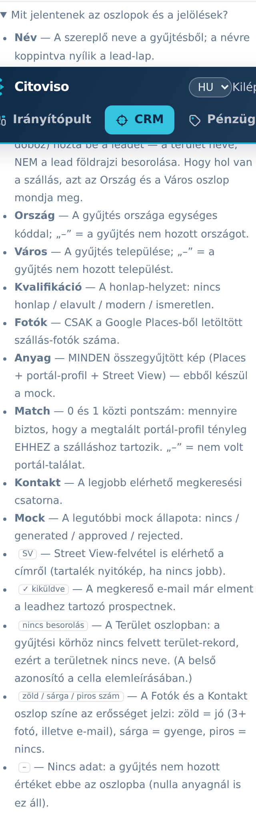
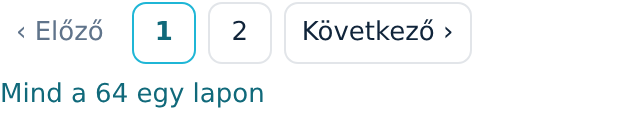

A lead-lista két nézetből áll: az **„Aktív leadek”** a munka-lista, a
**„Diszkvalifikált leadek”** pedig az elutasítottaké. Mindig látszik a képernyő tetején, melyikben
vagy — a cím mondja ki, nem egy apró vissza-link.

## Melyik szám mit számol?

A cím alatti sor minden számot megnevez, mert önmagában egyik sem mond semmit:

- „1–50 / 260 sor megjelenítve” — amennyi ezen a lapon látszik.
- „260 felel meg a szűrőnek” — a jelenlegi szűrés teljes találati halmaza (ennyin lapozol végig).
  Ez a tétel **csak akkor jelenik meg, ha tényleg fut szűrő** — szűrés nélkül nincs mihez
  „megfelelni”.
- „593 aktív lead (szűrő nélkül)” — minden nem diszkvalifikált szereplő.
- „2 diszkvalifikált” — akiket kizártál.
- „595 felmért szereplő összesen” — a teljes gyűjtött állomány, a két nézet együtt.

Az irányítópult **„kvalifikált lead”** jelzője ugyanezt a szűrést számolja, mint amit a rákattintva
kapott lista mutat — a két szám nem térhet el.

## Az alapértelmezett szűrés

Üres `/leads` megnyitásakor a lista nem a teljes állományt mutatja, hanem a ma
megszólíthatókat. A szűrő-sor kiírja tételesen, **melyik oszlopra** milyen feltétel él,
például: „Alapértelmezett szűrő — Kvalifikáció: nincs honlap vagy elavult · Anyag: legalább 1”.

⚠️ A feltétel az **„Anyag”** oszlopon ül, nem a **„Fotók”**-on — ezért látsz a listában 0 fotós
sorokat is. Ez szándékos: egy szállásnak lehet 13 képe portál-profilból úgy, hogy a Places
egyet sem adott; a mock az összes összegyűjtött képből készül.

## Szűrés és rendezés a fejlécből

A táblázat fejléce nem csak felirat — szűrő **és** rendező is. A kettő egymás mellett van, ezért
érdemes tudni, melyik mit csinál:

- **Szűrés:** az oszlopnév melletti kis, felirat nélküli **vonalkás ikonra** koppintva nyílik le a
  szűrő. A kategorikus oszlopoknál (Régió, Ország, Város, Kvalifikáció, Kontakt, Mock) pipálható
  lista jön élő darabszámmal — hosszú listánál (Régió, Város) egy **„keresés…”** mező is, amivel
  szűkíthetsz. A szám-oszlopoknál (Fotók, Anyag, Match) egy **„legalább”** mező van. Amint pipálsz
  vagy beírsz egy számot, a lista **azonnal újratöltődik** — nincs külön „Alkalmaz” gomb. Ha a
  szűrő aktív, az ikon kigyullad: a pipálós szűrőnél a kijelölt értékek darabszáma, a szám-szűrőnél
  maga a küszöb látszik rajta (pl. `3+`).
- **Match-szűrés:** a Match 0 és 1 közti pontszám, ezért itt tizedes értéket adsz meg (0,05-ös
  lépésekkel, pl. `0.9`). ⚠️ A küszöb beállításával a **portál-találat nélküli („–”) sorok
  kiesnek** — helyesen, mert egy találat nélküli lead nem éri el a küszöböt. Ha azokat is látni
  akarod, vedd ki a Match-szűrőt.
- **Név-keresés:** a Név oszlop **nagyító ikonja** alatt gépelhetsz, és a lista a meglévő nevekből
  ajánl.
- **Rendezés:** **bármelyik oszlop nevére** koppintva rendezel. Amelyik oszlopnév mellett halvány
  **↕** áll, az rendezhető — vagyis mind. Koppintás után a nyíl a valódi irányt mutatja (↑ növekvő,
  ↓ csökkenő), az oszlopnév kiemelt színű lesz, újabb koppintás megfordítja; a lista visszaugrik az
  első lapra. Ha csak szűrni akartál, ügyelj rá, hogy az ikont találd el, ne a nevet.
  A szöveges oszlopok a **magyar ábécé** szerint rendeződnek, tehát az Á, É, Ó, Ö, Ü kezdetű nevek
  a helyükön vannak, nem a lista végén. Ahol nincs adat („–”), azok a sorok növekvő rendezésnél
  elöl, csökkenőnél hátul csoportosulnak.
- **Mindig látod, mi szerint olvasod a listát:** a szűrő-sor végén ott a sorrend
  („Sorrend: legutóbb felmért elöl”, rendezés után pl. „Sorrend: Város (növekvő)”).

A szűrésed akkor is megmarad, ha közben **kiürítesz** egy fejléc-szűrőt: a
**„Szűrők törlése”**-vel kapott teljes listáról nem esel vissza az alapértelmezettre.
- Ha elveszett a fonál: **„Szűrők törlése”** — minden szűrőt egyszerre enged el, és ezzel a teljes
  aktív állományt (a „593 aktív lead” sort) kapod meg.

A szűrésed **átmegy a nézetváltáson**: ha a **„diszkvalifikáltak ▸”**-ra, majd az
**„◂ aktív leadek”**-re kattintasz, ugyanazt a szűrt listát kapod vissza, amiből elindultál.

⚠️ **Telefonon** a táblázat vízszintesen görgethető, és álló képernyőn csak a Név, Régió, Ország
és Város fér ki. A Kvalifikációtól jobbra minden oszlop — és a hozzájuk tartozó szűrő-ikon —
csak oldalra húzva érhető el; ezért van a jelmagyarázat a táblázat ALATT, nem tooltipekben.

## Mit jelentenek az oszlopok és a jelölések?

A táblázat alatt nyitható ugyanez a lista a felületen is:
**„Mit jelentenek az oszlopok és a jelölések?”** — minden oszlop és minden cellán belüli jelölés
szerepel benne.

- **„Kvalifikáció”** — a honlap-helyzet badge-e: **„nincs honlap”** (fő célcsoport),
  **„elavult”**, **„modern”**, **„ismeretlen”**. Diszkvalifikált leadnél itt áll az áthúzott
  **„diszkvalifikálva”** jelölés.
- **„Fotók”** — CSAK a Google Places-ből letöltött szállás-fotók száma.
- **„Anyag”** — MINDEN összegyűjtött kép (Places + portál-profil + Street View). A mock ebből
  készül, ezért az alapszűrés is ezt méri.
- **„Match”** — 0 és 1 közti pontszám: mennyire biztos, hogy a megtalált portál-profil tényleg
  ehhez a szálláshoz tartozik. A „–” azt jelenti, nem volt portál-találat. Szűrhető („legalább”
  küszöbbel) és rendezhető is.

Minden oszlop szűrhető és rendezhető is, egyetlen kivétellel: a **„Név”** oszlopban keresel
(nem pipálsz), de rendezni azt is lehet.
- **„Kontakt”** — a legjobb csatorna a megkereséshez (e-mail / SMS / telefon / nincs).
- **„Mock”** — a legutóbbi mock állapota: nincs / generated / approved / rejected.
- **„Régió”** — a gyűjtési terület emberi neve („Balaton északi part”).
- **„Ország”** / **„Város”** — a gyűjtésből; ha az nem hozott értéket, „–” áll ott.

Cellán belüli jelölések:

- **SV** a Fotók mellett — Street View-felvétel is elérhető a címről (tartalék nyitókép).
- **„✓ kiküldve”** a Mock oszlopban — a megkereső e-mail már elment ehhez a leadhez.
- **?** a Régió mellett — ehhez a gyűjtési területhez már nincs felvett terület-rekord, ezért a
  nyers azonosító látszik, nem helynév.
- **Szín** a Fotók és a Kontakt oszlopban — zöld = jó (3+ fotó, illetve e-mail), sárga = gyenge,
  piros = nincs.
- **–** bármelyik szám-oszlopban — nincs adat; az Anyag oszlopban a nulla is így jelenik meg.

## Lapozás

Alapból 50 sor jön egy lapon; alul a **„‹ Előző”** / **„Következő ›”** visz tovább.
A „Mind a 260 egy lapon” linkkel egyszerre is végignézheted a teljes találati halmazt — onnan a
**„Lapozva”** link vált vissza lapozott nézetre.

## A lead-lapra

A lead nevére koppintva nyílik a lead-lap — ott zajlik az érdemi munka (adat-ellenőrzés,
mock-generálás, kuráció, megkeresés, konverzió). Erről külön útmutató szól: a Súgóban keresd a
„Lead-lap” témát.

## Diszkvalifikáltak

A szűrő-sáv jobb szélén a **„diszkvalifikáltak ▸”** link az elutasított szereplőket mutatja
(őket az újra-scrape sem hozza vissza); az **„◂ aktív leadek”** visszavált. A diszkvalifikálás
indokkal együtt a lead-lapon történik, és visszavonható.
