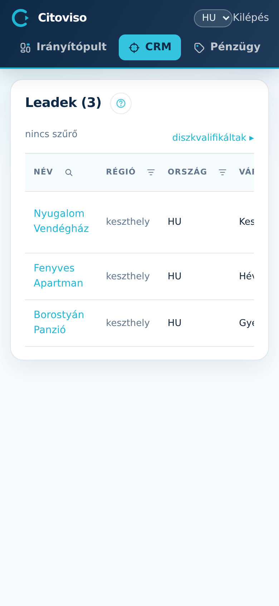

A **„Leadek”** képernyő a teljes felmért állomány: minden sor egy szereplő, a fejléc-szűrőkkel
pedig percek alatt leszűkíted arra a körre, akivel ma dolgozni akarsz.

## Szűrés a fejlécből

A táblázat fejléce nem csak felirat — szűrő is. A kategorikus oszlopok (régió, ország, város,
kvalifikáció, elérhetőség, mock-állapot) többes kijelölést tudnak élő darabszámmal: kipipálod,
amit látni akarsz, és a lista azonnal alkalmazza. A név-mezőbe gépelve a lista a meglévő nevekből
ajánl (autocomplete). A szám-oszlopoknál „legalább N” feltételt adhatsz (pl. legalább 3 fotó —
mock-generáláshoz hasznos). Ha elveszett a fonál: **„Szűrők törlése”** — minden szűrőt egyszerre enged el.

## Mit jelentenek a kulcs-oszlopok?

- **kvalifikáció** — a honlap-helyzet badge-e: **„nincs honlap”** (fő célcsoport),
  **„elavult”**, **„modern”**, **„ismeretlen”**.
- **„Fotók”** / **„Anyag”** — hány valós kép áll rendelkezésre; kevés anyagból gyenge mock lesz.
- **„Kontakt”** — a legjobb csatorna a megkereséshez (email / sms / voice / nincs).
- **mock** — a legutóbbi mock állapota (generated / approved / rejected).

## A lead-lapra

A lead nevére koppintva nyílik a lead-lap — ott zajlik az érdemi munka (adat-ellenőrzés,
mock-generálás, kuráció, megkeresés, konverzió). Erről külön útmutató szól: a Súgóban keresd a
„Lead-lap” témát.

## Diszkvalifikáltak

A lista alján a **„diszkvalifikáltak ▸”** link az elutasított szereplőket mutatja (őket az
újra-scrape sem hozza vissza); az **„◂ aktív leadek”** visszavált. A diszkvalifikálás indokkal
együtt a lead-lapon történik, és visszavonható.
