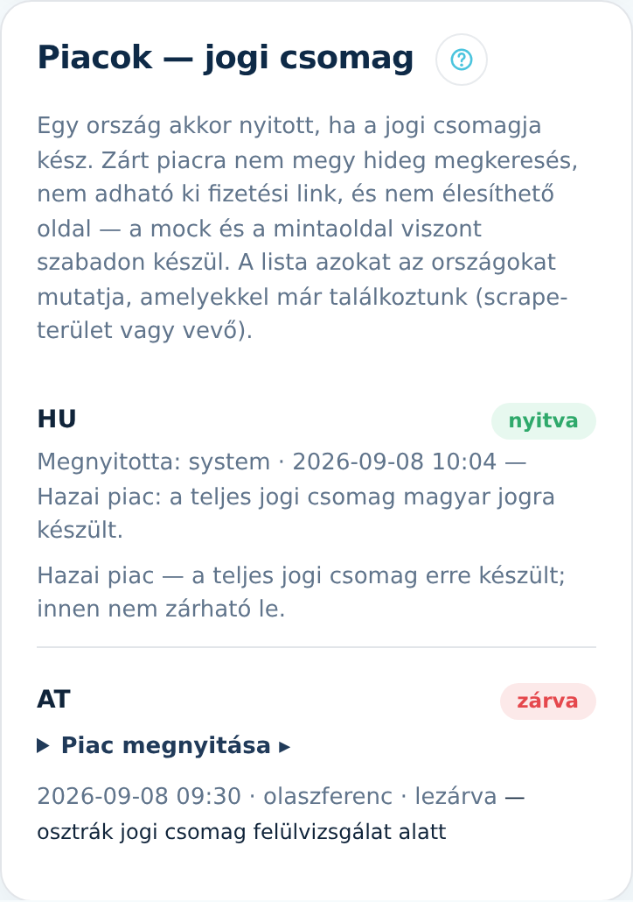

A **Beállítások** lap **„Piacok — jogi csomag”** paneljén dől el, mely országokban működhet
a rendszer. Ez nem műszaki kapcsoló, hanem felelősségvállalás: egy piac attól nyílik meg, hogy
valaki kimondja, az adott ország jogi csomagja kész.

## Mit jelent, ha egy piac zárva van?

Zárt országnál a rendszer három ponton áll meg magától:

1. **Hideg megkeresés** — a levél és az SMS `PIAC:` jelöléssel elbukik a küldés előtti
   ellenőrzésen, tehát ki sem megy.
2. **Fizetési link** — nem adható ki, így a vevő nem tud fizetni olyan szolgáltatásért,
   amit nem tudunk jogszerűen kiszolgálni.
3. **Élesítés** — a megrendelt oldal nem kapcsol élesre; előnézetben marad.

Ami **szabadon mehet**: a lead begyűjtése, a mock legyártása és a mintaoldal megmutatása.
Ezek nem üzleti ajánlatok és nem publikálnak jogi dokumentumot.

⚠️ Két dolog, ami zárt piacon is működik, szándékosan: a **már futó előfizetések
megújulása** (egy piac lezárása nem teheti fizetésképtelenné a meglévő ügyfelet), és a
**már élő oldalak** kiszolgálása.

## Miért ORSZÁG és nem nyelv?

Mert a jogi csomag jogrendszerhez tartozik. Ausztria és Németország ugyanazt a nyelvet
beszéli, de más az e-kereskedelmi és a fogyasztóvédelmi szabályozásuk — ha nyelv szerint
nyitnánk, egy osztrák piac megnyitása Németországot is kinyitná.

## Mikor szabad megnyitni egy piacot?

Akkor, ha az adott országra **elkészült és felülvizsgált** a teljes jogi csomag:

- ÁSZF az adott ország szerződési és fogyasztóvédelmi joga szerint;
- elállási tájékoztató (a magyar 45/2014. Korm. rendelet megfelelője);
- adatkezelési tájékoztató és adatfeldolgozási feltételek;
- a hideg megkeresés szabályai (több országban **opt-in** kell, nem elég a jogos érdek);
- az impresszum kötelező adatai az adott ország szabálya szerint.

⛔ **Ezeket nem fordítjuk le.** A jogi szöveg országonkénti csomag, nem a magyar szöveg
más nyelven — ezért van a rendszerben külön döntés arról, hogy egy ország nyitva van-e.

## Hogyan nyitok meg egy piacot?

1. A panelen keresse meg az országot. A lista azokat mutatja, **amelyekkel már
   találkoztunk** — vagyis van hozzá scrape-terület vagy vevő.
2. Nyissa le a **„Piac megnyitása ▸”** sort. Szándékosan lecsukva indul: ez nem
   félrekattintható művelet.
3. Az indoklás mezőbe írja be, **mire hivatkozva** nyitja meg (például melyik jogi csomag
   melyik verziója, ki és mikor vizsgálta felül). Az indoklás **kötelező**: nélküle nem
   történik semmi, és naplósor sem keletkezik.
4. Koppintson a **„Megnyitás”** gombra. A döntés a sor alatt megjelenik: ki, mikor, mire
   hivatkozva.

## Lezárás

A **„Piac lezárása ▸”** ugyanígy működik, szintén kötelező indoklással. A lezárás **a jövőre
hat**: új megkeresés, új rendelés és élesítés nem indul, a már futó előfizetéseket viszont
nem érinti.

A **hazai piac (HU)** innen nem zárható le: a termék teljes jogi csomagja erre készült.

## Mit lát a napló?

Minden döntés megmarad a sor alatt: időpont, a bejelentkezett operátor neve, a művelet és
az indoklás. Erre azért van szükség, hogy a „miért van a lengyel piac nyitva?” kérdés
megválaszolható legyen — hónapokkal később is, adatbázis nélkül.
