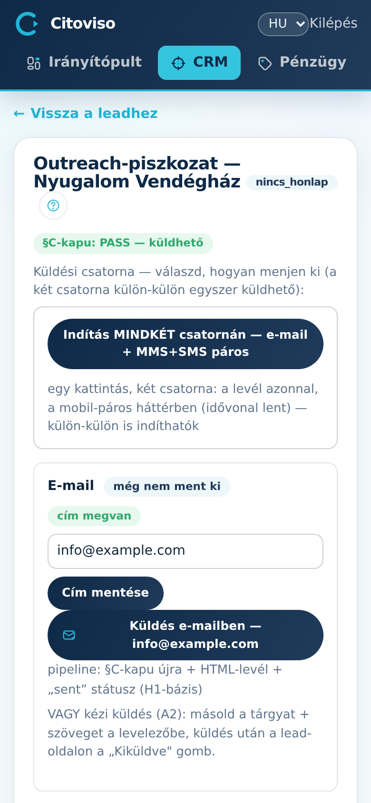

Az **„Outreach-piszkozat”** képernyőn dől el, hogy egy megkeresés kimehet-e, és innen megy is ki —
ez a hideg megkeresés jogi kapuja és küldő-felülete egyben. A lead-lap Megkeresés-paneljéből
érkezel ide; ugyanez az útmutató szolgálja a Tevékenység-képernyőt is (lent).

## A §C-kapu — először mindig ezt nézd

A lap tetején a verdikt-pill: **„§C-kapu: PASS — küldhető”** vagy
**„§C-kapu: FLAG — NEM küldhető”**. FLAG esetén a piros lista megmondja az okokat — amíg ezek
nem rendeződnek, a levél SEMMILYEN csatornán nem küldhető ki (03-INVARIANTS §C: hideg megkeresés
csak jogszerűen — leiratkozási link, elérhető feladó, valós személyre szabás).

## A levél tartalma

A **„Tárgy”** mező alatt két nézet: **„Így néz ki a levél a címzett postafiókjában (HTML-előnézet)”**
— ezt látod, amit ő látni fog —, és **„Levél szövege (text-változat — kézi küldéshez másolható)”**
a **„szöveg másolása”** gombbal.

## Küldés — csatornát választasz

A **„Küldési csatorna — válaszd, hogyan menjen ki (a két csatorna külön-külön egyszer küldhető):”**
blokk két kártyája:

1. **E-mail** — ha nincs címzett-cím, előbb írd be és **„Cím mentése”**. Utána a
   **„Küldés e-mailben —”** gomb (a címmel a feliratában) megerősítés után a RENDSZERBŐL küldi ki
   a HTML-levelet — nem a saját leveleződ nyílik meg. A kapu-ellenőrzések küldéskor a szerveren
   újra lefutnak. Kézi út is van: a text-változatot bemásolod a leveleződbe, és küldés után a
   lead-lapon a **„Kiküldve — mérés indul”** gombbal jelzed.
2. **„Mobil-megkeresés”** — a telefonszámos leadeknek: egy MMS (kép) + SMS (link) páros. A
   **„Páros indítása”** gomb (a számmal a feliratában) megerősítés után VALÓDI küldést indít —
   nem vonható vissza —, és a kártya élő idővonalon mutatja, hol tart. Ugyanaz a §C-kapu
   vonatkozik rá; a felület előre kiírja, ha a szám a hideg-küldési szabályok miatt nem
   küldhető, vagy a páros már elfogyott.

Ha MINDKÉT csatorna küldhető állapotban van (van cím ÉS szám, és még egyik sem ment ki),
a kártyák felett megjelenik az **„Indítás MINDKÉT csatornán — e-mail + MMS+SMS páros”** gomb —
egy kattintással kimegy a levél és a mobil-páros együtt. Ha bármelyik feltétel hiányzik, ez a
gomb nem látszik: ilyenkor a kártyákról külön-külön küldesz.

Mindkét csatorna EGYSZER küldhető — a rendszer véd az ismételt zaklatás ellen.

## Tevékenység — mit mért a link

A kiküldött, követett link méréseit a Tevékenység-képernyő mutatja (a Megkeresés-panel
gombjáról nyílik): látogatásonként az események, görgetés és olvasási idő; felül a státusz-pill
és a **„vissza a leadhez”** / **„a látott oldal ▸”** linkek. Amíg nincs megnyitás:
**„Még nem nyitotta meg a linket — nincs mérési adat.”** — ez nem hiba, csak még nem történt semmi.
