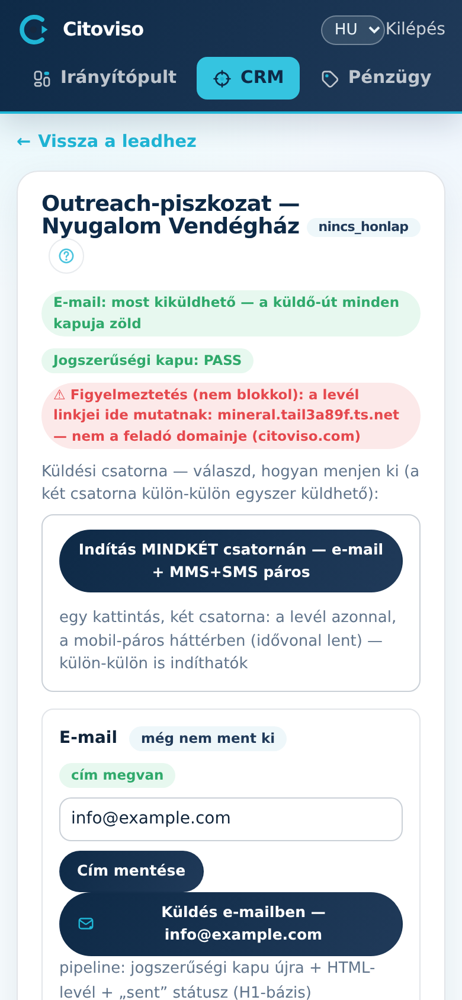

A **„Megkeresés-piszkozat”** képernyőn dől el, hogy egy megkeresés kimehet-e, és innen megy is ki —
ez a hideg megkeresés jogi kapuja és küldő-felülete egyben. A lead-lap Megkeresés-paneljéből
érkezel ide; ugyanez az útmutató szolgálja a Tevékenység-képernyőt is (lent).

## „Mehet ki most?” — a legfelső sor válaszol rá

A lap legfelső sora **azt** mondja meg, amit tudni akarsz. **Három** válasza lehet:

1. **„E-mail: most kiküldhető — a küldő-út minden kapuja zöld”** (zöld) — nyomd meg a
   küldés gombot, és megy.
2. **„E-mail: kiküldhető — a küldés gomb előbb megmutatja az őr leletét, és a
   megerősítéssel kimegy”** (sárga) — a gépi őr talált valamit a mockon (vagy a lap
   képeivel van baj). **Ez nem tiltás.** A sor ALATT ott a lelet a saját szavaival, és a
   küldés gomb megnyomására egy ablak megkérdezi, kiküldöd-e mégis. Ha igen, kimegy.
3. **„E-mail: most NEM küldhető”** (piros) — itt tényleg nem megy, és a sor
   megmondja, miért: például ennek a címre már kiküldtük a hideg megkeresést, a címzett
   leiratkozott, a mock még kurátori jóváhagyásra vár, nincs renderelt lapja, vagy a
   jogszerűségi kapu FLAG-et adott.
   Akkor is megáll, ha a cím (vagy SMS-nél a telefonszám) egy **másik szálláshoz is
   tartozik** — ilyenkor könnyen lehet, hogy a szomszédé, és a mock a konkurenshez menne.
   A sor megnevezi a másik szállást. Ha a kettőnek tényleg ugyanaz a tulajdonosa, jelöld
   így a **Duplikátumok** lapon, és a küldés feloldódik; ha nem, javítsd a lead
   elérhetőségét. Ha a cím sok szálláson szerepel, az egy közvetítő vagy iroda címe —
   azt a lead saját elérhetőségére kell cserélni.

Ez a sor ugyanazt futtatja le, amit a küldés-gomb — tehát amit itt olvasol, azt fogja a
gomb is tenni.

## „Kiküldöd mégis?” — a megerősítő ablak

Ha a gépi őr megjelölte a mockot, vagy a kiszállított lap képeivel van baj, a küldés gomb
**nem küld azonnal**, hanem előbb megmutatja, mit talált:

- a címe **„Az őr megjelölte ezt a mockot — kiküldöd mégis?”**, kép-hiba esetén
  **„A kiszállított lap képeivel baj van — kiküldöd mégis?”**;
- felsorolja a leletet (melyik őr, mit talált; képeknél a nem elérhető kép-címeket);
- van egy **„Megjegyzés a naplóba (nem kötelező)”** mező — ide írhatod, miért vállalod;
- **„Kiküldöm mégis”** → a levél kimegy. **„Mégsem”** → visszalépsz a piszkozathoz.

⚠️ **A döntés a tiéd, és a rendszer nem bírálja felül.** A napló rögzíti, ki, mikor és
melyik leletet vállalta. A vállalás csak **arra** a leletre szól, amit láttál: ha a mockot
újragenerálod, vagy a jóváhagyás óta újabb kép esik ki, az ablak megint megkérdezi.

⛔ **Két eset, ahol a gomb tényleg nem küld** — mert nem lelet, hanem hiányzó termék:
a mockhoz **nincs renderelt lap** (a lead üres oldalra érkezne), vagy a lapját egy újabb
generálás **felülírta** (a link más mock tartalmát vinné). Ezeket újra kell generálni.

## A jogszerűségi kapu — a jogi ítélet

Alatta a verdikt-pill: **„Jogszerűségi kapu: PASS”** vagy
**„Jogszerűségi kapu: FLAG — ez tiltja a küldést”**. ⚠️ A PASS azt jelenti, hogy a levél
JOGILAG rendben van — **nem** azt, hogy ki is mehet: a küldésnek több feltétele van (elhasznált
csatorna, jóváhagyatlan mock, leiratkozás). Ezért van fent külön a „mehet ki most?” sor.

FLAG esetén a piros lista megmondja az okokat — amíg ezek
nem rendeződnek, a levél SEMMILYEN csatornán nem küldhető ki, és ezen a megerősítő ablak
sem segít: ez nem gépi vélemény, hanem jogi követelmény (hideg megkeresés
csak jogszerűen mehet — leiratkozási link, elérhető feladó, a hirdető cégazonosítása, valós személyre
szabás).

Ha a feladó azonosítása a hibás, külön piros doboz sorolja fel **mezőnként**, mit kell
javítani („A feladó azonosítása nem szállítható”): melyik beállítás, mi az értéke most, és mi
a baj vele. Ezek az értékek a levél aljára nyomtatódnak, ezért a levél addig nem mehet ki.

⚠️ A **„⚠ Figyelmeztetés (nem blokkol)”** kezdetű sor NEM állítja meg a küldést — ahogy a
felirata mondja. Tájékoztat (például arról, hogy a levél linkjei nem a saját domainünkre
mutatnak), de a döntést a felső sor hozza.

Minden ok-sor NAGYBETŰS előtaggal kezdődik, ami megmondja, MIRŐL szól (LEIRATKOZÁS, FELADÓ, HIRDETŐ, SZEMÉLYRE SZABÁS, ÁR-HIRDETÉS, JOGALAP, ADATKEZELÉS, LINK, PIAC, FÉLREVEZETÉS, KERETEZÉS) — így a piros listát végig lehet futni anélkül, hogy minden mondatot elolvasnál.

A leggyakoribb FLAG-okok és mit kell tenni:

| Amit kiír | Mi a teendő |
|---|---|
| „LEIRATKOZÁS: a link a címzett számára elérhetetlen" | a `PUBLIC_BASE_URL` beállítás nem nyilvános HTTPS-cím — rendszergazdai javítás |
| „FELADÓ: az identitás kitöltetlen" | `OUTREACH_SENDER_*` beállítások hiányoznak |
| „HIRDETŐ: hiányzik / kitöltetlen a cégazonosítás" | a `LEGAL_ENTITY_*` beállítások (cégnév, székhely, nyilvántartási és adószám) — ugyanaz, amiből az impresszum is dolgozik. Ezt kitalálni TILOS: hideg levél a hirdető megnevezése nélkül nem mehet ki |
| „SZEMÉLYRE SZABÁS: a levél nem hivatkozik a lead nevére" | a lead neve hiányzik vagy hibás — a lead-lapon javítsd |
| „ÁR-HIRDETÉS: a levél árat hirdet, de az árazás még nincs véglegesítve" | Konzol ▸ Árazás, és pipáld be az **„Az árak véglegesek, élesíthetők”** kapcsolót |

## A levél tartalma

A **„Tárgy”** mező alatt két nézet: **„Így néz ki a levél a címzett postafiókjában (HTML-előnézet)”**
— ezt látod, amit ő látni fog —, és **„Levél szövege (text-változat — kézi küldéshez másolható)”**
a **„szöveg másolása”** gombbal.

⚠️ **Ha a levél MÁR KIMENT**, ugyanez a doboz átvált: **„Ez a levél már kiment — a másolás a
MÁSODIK példányt jelentené a címzettnek”**, a felirata **„A KIKÜLDÖTT levél szövege”** lesz, a
gomb pedig rákérdez, mielőtt másol. A szöveg szándékosan OLVASHATÓ marad — jogod van látni, mi
ment ki —, csak a felület nem tesz úgy, mintha a kézi küldés még hátra lenne.

⚠️ **MINDKÉT nézet a TELJES levelet mutatja, görgetés nélkül** — az aláírással, az apróbetűvel,
a leiratkozás-linkkel és a jogalap-lábazattal együtt. A text-változat sem doboz többé, amiben
görgetni kellene: a szöveg a maga teljes hosszában ott áll a lapon. Ezt olvasd végig: a levél
alja az, amitől a hideg megkeresés jogszerű, és a küldés nem vonható vissza. (Ha a levél mégis
külön lapon kell: **„előnézet külön lapon ▸”**.)

**Hová mutatnak a levél linkjei?** A verdikt-pill alatt ott áll: „A levél linkjei ide mutatnak:
…". Ha ez PIROS, akkor a levél nem a saját domainünkre linkel — a címzett szemében ez
phishing-alak, és a leiratkozás is idegen gépre visz. Fejlesztő-gépen ez normális; ÉLESBEN
küldés előtt szólj, mert a `PUBLIC_BASE_URL` beállítás rossz.

## Küldés — a lap alján, a levél után

⚠️ **A küldés-gombok NEM a csatorna-kártyákon vannak.** A lap alján egy sáv ül, ami görgetés
közben is a képernyő alján marad — abban van minden gomb, ami tényleg kiküld valamit. Ez
szándékos: korábban a visszafordíthatatlan gomb a levél FÖLÖTT állt, és így meg lehetett
nyomni azelőtt, hogy elolvastad volna, mit küldesz ki egy idegennek.

A **„Küldési csatorna — állapot és címzett (a két csatorna külön-külön egyszer küldhető);
a KÜLDÉS a lap alján, a levél alatt:”** blokk két kártyája már csak az ÁLLAPOTOT mutatja:

1. **E-mail** — ha nincs címzett-cím, előbb írd be és **„Cím mentése”**. A kártya megmondja,
   hogy a küldés gombja lent van. Kézi út is van: a text-változatot bemásolod a leveleződbe,
   és küldés után a lead-lapon a **„Megjelölöm kiküldöttként”** gombbal jelzed.
   ⚠️ **Miután a levél kiment, a cím-mező eltűnik**, és a kártya csak kiírja, hova ment: a cím
   utólagos átírása ezen már nem változtatna, ezen a csatornán pedig nincs újraküldés.
2. **„Mobil-megkeresés”** — a telefonszámos leadeknek: egy MMS (kép) + SMS (link) páros.
   A kártya kiírja, ha a szám a hideg-küldési szabályok miatt nem küldhető, vagy a páros már
   elfogyott; a **„Páros indítása”** gomb maga a lenti sávban van.
   ⚠️ **Ha nincs telefonszám**, a gomb halvány és nem nyomható („Páros indítása (nincs szám)”),
   a kártya pedig megmondja a kiutat is: a számot a lead adatlapján, a **„Begyűjtött adatok —
   szerkeszthető”** panelen tudod megadni, és van odavivő link is. Ugyanígy halvány a gomb
   akkor is, ha a kimenő MMS képe nem áll elő („nincs kép”).

   **Hogyan megy ki az MMS (2026-09-30 óta):** a kép nem a szerverről indul, hanem **sorba
   kerül**, és a dev gép modemje küldi el (relay). Ezért a „Páros indítása” után a lap TETEJÉN, a
   jogszerűségi verdikt alatti zöld pirulában ez áll: „az MMS sorba került — a dev gép relay-e
   küldi (~1–3 perc), utána megy a kísérő SMS”; a Mobil-megkeresés kártya közben azt írja, hogy
   **„Küldés folyamatban — az idővonal lent mutatja, hol tart. A lap magától frissül.”**, az
   idővonal első lépése pedig futó (kék) marad, amíg a relay nem nyugtázza. A kísérő SMS az MMS
   nyugtájakor indul magától. Ha újra megnyomnád, amíg a sor tart, a felső pirula pirosan, „Nem
   küldhető — ” előtaggal írja: „ennél a prospectnél már sorban áll az MMS — a dev gép relay-e
   küldi”. Az MMS csak **8:00 és 19:30 között** (magyar idő szerint) megy ki (a kísérő SMS esti
   ablaka miatt); ami később kerül sorba, reggel 8 után megy.
   Két piros eset az idővonalon:
   - „MMS-hiba (relay): … — semmi nem ment ki, a pár újraindítható” — a modem vagy a
     hálózat háromszor elhasalt; nézd meg a hibaszöveget, és indítsd újra a párost.
   - „az MMS kimenete ISMERETLEN (a relay nem nyugtázta) — automatikusan nem küldjük újra; a
     ház riasztást kapott” — a küldés közben szakadt meg a relay; nem tudjuk, kiment-e.
     Szándékosan nem küldjük újra (a lead kétszer kapná, kétszer fizetnénk). Újraindításkor a
     felső piros pirula ezt írja: „az előző MMS kimenete ismeretlen (a relay nem nyugtázta) —
     előbb nézd meg a relay naplóját”: a dev gépen a relay naplója (`journalctl -u citoviso-mms-relay`)
     mondja meg, elment-e; utána a lead-lapon kézzel dől el a folytatás.

### Az alsó sáv — ez küld

A sávban az szerepel, ami éppen indítható: a **„Küldés e-mailben —”** gomb (a címmel a
feliratában), a **„Páros indítása”**, és ha MINDKÉT csatorna küldhető állapotban van (van cím
ÉS szám, és még egyik sem ment ki), az **„Indítás MINDKÉT csatornán — e-mail + MMS+SMS páros”**.
Mindegyik megerősítést kér, és a RENDSZERBŐL küld — nem a saját leveleződ nyílik meg. A
kapu-ellenőrzések küldéskor a szerveren újra lefutnak.

⚠️ **A sáv ZÁRVA indul**, és ezt ki is írja: **„Zárva: a levél végét (leiratkozás + jogalap)
még nem láttad — görgess végig a levélen.”** Amint a levél végére érsz, a gombok felélednek, és
a sáv átvált arra, hogy **„A levél végét láttad — a küldés nyitva. Nem vonható vissza, és ezen
a csatornán csak egyszer megy ki.”** Ez nem bürokrácia: a levél alja hordozza a leiratkozást és
a jogalapot, vagyis azt, amitől a hideg megkeresés jogszerű.

Mindkét csatorna EGYSZER küldhető — a rendszer véd az ismételt zaklatás ellen.

⚠️ **Az „egyszer" a CÍMRE szól, nem a linkre.** Ha ugyanahhoz a leadhez két követett link
készül (pl. új mock miatt), a második NEM küld újabb levelet ugyanarra az e-mail címre:
a rendszer azt írja ki, hogy erre a címre már ment hideg megkeresés. Ez szándékos — a
címzett akkor is egy ember, ha nálunk két sorban szerepel.

Ugyanez a címke-változatra is áll: a `nev+valami@domain` és a `nev@domain` címet a rendszer
EGY címzettnek veszi, ezért ha az egyikre már ment hideg megkeresés, a másikra sem megy ki.
A tárolt cím nem változik, csak az összevetés hagyja figyelmen kívül a `+` utáni részt.

## Mit lát a lead, amikor megnyitja a linket

A lap **legtetején** mindig áll egy diszkrét sáv — de **három különböző**, attól függően, ki
nyitja meg. Egy látogató mindig **pontosan egyet** lát a három közül, mert a három mást állít.

**① Aki először kattint a hideg levélből** (2026-09-14 óta — korábban felső sávot csak az
kapott, aki már leiratkozott):

> **Ez egy honlap-terv az Ön szállásáról.** Készítette: *(a hirdető neve a beállításokból)* —
> ingyen, az Ön nyilvánosan elérhető adataiból. Ez még nem élő oldal.
> ▸ **Miért kaptam?**

ℹ️ **Telefonon (2026-09-26 óta) a sáv rövidebb:** „Készítette: *(a hirdető neve)*. Ez még nem élő
oldal.” — az „ingyen, az Ön nyilvánosan elérhető adataiból” tagmondat a **„Miért kaptam?”**
részleteiben olvasható, és a süti-kérdés csak az első görgetésnél vagy érintésnél jelenik meg
(addig semmi nem követ). Így a lead az első pillantással a tervet látja, nem a sávokat.

A **„Miért kaptam?”** egy kattintásra, **helyben** nyitja ki a jogalapot (jogos érdekű
megkeresés — Grt. 6. § / GDPR 6. cikk (1) f)), a mérésről szóló tájékoztatót, valamint az
**Adatkezelési tájékoztató** és a **Leiratkozás** linkjét. Alapból csukva van, és JavaScript
nélkül is nyílik.

A **lap alján** változatlanul ott a teljes jogi lábazat a leiratkozó linkkel — az a kiút
végpontja, a felső sáv nem váltja ki. ⚠️ **A leiratkozó link megnyitása önmagában nem iratkoztat
le** (2026-09-26 óta): egy rövid megerősítő lap nyílik egyetlen **„Leiratkozom”** gombbal, és csak
a gomb megnyomása hat. Így a levelezőprogramok és vírusirtók link-ellenőrzése (amely a levél
minden linkjét „megnyitja”) nem némít el egy megkeresést a címzett tudta nélkül. A levelezők saját
egykattintásos leiratkozó gombja (List-Unsubscribe) továbbra is azonnal hat.

ℹ️ **A kiküldött előnézeten nincs nyitó-animáció.** Két sablon egyébként egy teljes
képernyős bevezetővel indul (a szállás neve úszik be, több másodpercig). A követett
linken ez ki van kapcsolva, hogy a lead **azonnal** a lapot és a fenti sávot lássa.
A megrendelt, éles oldalon a bevezető marad.

**② Aki korábban leiratkozott**, más sávot lát: „Leiratkozott, ezért nem keressük többé —
ezt az oldalt Ön nyitotta meg. Megnézheti és meg is rendelheti; nem mérjük és nem küldünk
emlékeztetőt.”

**③ Aki MÁR MEGVETTE a honlapját** (2026-09-20 óta), megint mást lát — és ezen a
lapon **nem lehet újra megrendelni**. Ez a sáv **három dolgot mondhat**, attól függően, hol
tart a megrendelés:

> ✓ **Ez az oldal már az Öné.** Az oldala él: *(a saját címe)*
> **[Belépés a kezelőfelületre]**
> ▸ **Miért ezt látom?**

…ha az oldal már nyilvános. Ha elkészült, de még **nem** nyilvános, a nyitó mondat ugyanaz
(**„Ez az oldal már az Öné.”**), de utána nem a cím jön, hanem az, hogy elkészült, és a
nyilvános megjelenés még folyamatban van — cím nélkül, mert még nincs mit megmutatni.

⚠️ Ha a fizetés beérkezett, de az élesítés **elakadt** (pl. kurátori rendezésre vár), a sáv
mással kezd: **„Ezt már megrendelte.”**, és azzal folytatja, hogy a fizetés beérkezett, az
oldala még készül, és e-mailben jelezzük, amint elkészül. Ilyenkor **nincs belépés-gomb**,
mert még nincs hova belépni. Ez az a vevő, aki a leginkább hajlamos újra rákattintani a
levélre — ha ilyet lát, nála **a mi oldalunkon akadt el valami**, nem nála.

Miért kellett ez: a link e-mailben él tovább, és aki már fizetett, bármikor rákattinthat.
Korábban ilyenkor a lap **újra felkínálta a fizetést**, és a kártyát tényleg meg lehetett
terhelni — úgy, hogy a vevő cserébe semmit nem kapott volna (az előfizetése sem
hosszabbodott volna meg). Ma a fizetés a **szerver oldalán** is le van tiltva, nem csak a
gomb tűnt el: egy régen nyitva hagyott fülről beküldött rendelést is elutasít.

Ezen az ágon **nem mérünk** (nincs megnyitás-rögzítés, nincs eszkalációs ajánlat), és a sáv
**nem lépteti be** a látogatót — csak elvezeti a belépéshez. A link továbbküldhető egy
levélben, ezért hozzáférést nem adhat.

Három állapot, három sáv: egy látogató **mindig pontosan egyet** lát.

## Tevékenység — mit mért a link

A kiküldött, követett link méréseit a Tevékenység-képernyő mutatja (a Megkeresés-panel
gombjáról nyílik): látogatásonként az események, görgetés és olvasási idő; felül a státusz-pill
és a **„vissza a leadhez”** / **„a látott oldal ▸”** linkek. Amíg nincs megnyitás:
**„Még nem nyitotta meg a linket — nincs mérési adat.”** — ez nem hiba, csak még nem történt semmi.

A felső összefoglaló két dolgot KÜLÖN mond ki, mert két külön tény:

- **„nem mértünk”** — a linket meg sem nyitotta, tehát nincs mit mérni (a *Legmélyebb
  görgetés* és a *Leghosszabb olvasás* sorban).
- **„0%” / „0 másodperc”** — megnyitotta, de nem görgetett, illetve nem időzött. Ez MÉRÉS,
  és mást jelent, mint az előző.
- **„nem választott”** — a *Választott csomag* és a *Fizetési ciklus* sorban: nem mérés
  hiányzik, hanem döntés nem született.

A *Megnyitások* sor a megnyitások számát, a *Rögzített események* sor az események számát
mutatja — két külön sorban, mert két külön mennyiség.

**Mi számít megnyitásnak?** Az, amikor a látogató a lapon görget, koppint, kattint vagy
billentyűt üt, vagy amikor a lap összesen 5 másodpercig látható a képernyőn. A puszta letöltés nem
számít: a levelezőprogramok link-ellenőrzője és a link-előnézet a linket ember nélkül is megnyitja,
és 2026. október 1. óta ezek többsége nem számít megnyitásnak. ⚠️ Teljesen nem zárható ki: egy
olyan gépi ellenőrző, amely valódi böngészőben, látható lapon 5 másodpercig futtatja az oldalt,
továbbra is megnyitásnak számíthat. Az eszkalációs ajánlat („hányadik megnyitásnál kapja”) is
ebből a számból dolgozik — alapbeállításban a megnyitások NAPJAIT számolja (egy napon belül akárhány
megnyitás egynek számít; az Árazás lapon a „Csak a különböző napokon történt megnyitások számítanak”
jelölőnégyzettel állítható) —, és egy régebben kiküldött linknél a 2026. október 1. előtt rögzített
megnyitások (köztük a gépiek) is beleszámítanak.

**A saját megnyitásod nem számít** (2026. október 5. óta). Ha a linket a konzolból nyitod meg (a
lead lapján a link maga vagy a Tevékenység lap „a látott oldal ▸” linkje), a levél-előnézetből, vagy
a pilot-másolatból (a „[Másolat → …]” kezdetű e-mail vagy SMS), a link végén `?sajat=1` áll: ugyanazt
a lapot látod, amit a lead, de semmit nem mérünk — nem nő a számláló, nem lesz „megnyitva” az állapot,
és eszkalációs ajánlat sem keletkezik. A „link másolása” gomb a jelöletlen címet másolja, mert azt a
leadnek szánod. ⚠️ Ha a lead levelét a saját telefonodra továbbítod, vagy a jelöletlen linket
magadnak küldöd el, az a megnyitás a leadé lesz.
