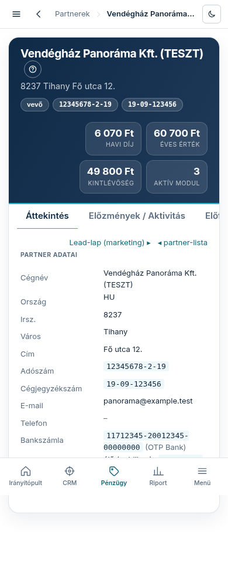

A partner nevére kattintva (a **„Partnerek”** listából) nyílik a partner-lap: egy vevő vagy
szállító minden pénzügyi és CRM-adata egy helyen. Ez a lap a partner PÉNZÜGYI arca — a vevő
marketing-oldala (mock, megkeresés, kuráció) a lead-lapon marad, és a kettő hivatkozik egymásra:
a fejlécből a **„Lead-lap (marketing) ▸”** link visz át.

## A fejléc

A jogi név alatt a cím, mellette jelvényként az adószám, a közösségi adószám és a
cégjegyzékszám (amelyik ki van töltve). A vevő/szállító jelölés mutatja a partner szerepét —
egy partner lehet mindkettő egyszerre.

## A KPI-csempék — vevőnél és szállítónál mások

- **Vevőnél:** „havi díj” és „éves érték” (a bekapcsolt modulokból számolt előfizetési érték),
  „kintlévőség” (kiegyenlítetlen számláink felé), „aktív modul” (hány modul él az oldalán).
- **Szállítónál:** „éves költség (365 nap)” (mennyit költöttünk nála az elmúlt évben) és
  „nyitott tartozásunk” (kiegyenlítetlen bejövő számlák).

Kettős szerepű partnernél mindkét sor megjelenik. Az összegek devizánként külön állnak —
forintot és eurót nem adunk össze.

## Az **„Előzmények / Aktivitás”** fül — a partner teljes története

Egyetlen, időrendi idővonal a partner MINDEN eseményéből, a legfrissebb elöl: mikor és honnan
találtuk a leadet, mikor készült és kapott jóváhagyást a mock, mikor ment ki a megkeresés, mit
csinált a címzett a mockon (megnyitotta, görgetett, modult kapcsolt, megrendelést indított,
fizetéshez ment — ez a „kvázi CRM” arany), a megrendelések, a fizetési kísérletek (a sikertelen
is), a számlák kiállítása és kiegyenlítése, az oldal élesítése, a modul-bekapcsolások, és hogy
belépett-e valaha az admin felületére. A színes jelvény mutatja az esemény forrását; ahol van
mélyebb nézet (lead-lap, tevékenység-lap), a sor címe link. Tiszta szállítónál az idővonal a
bizonylat-eseményeket mutatja.

## Az **„Előfizetés”** fül — csak vevőnél

A vevő platform-előfizetésének összefoglalója: havi díj és éves érték (az aktív modulokból
számítva), a ténylegesen fizetett ciklus (havi/éves — az utolsó sikeres fizetésből), a domain,
az élő oldal linkje (vagy a privát előnézet, amíg nincs élesítve), az élesítés dátuma és az
aktív modulok listája. Innen is átléphet a lead-lapra, ahol a marketing-oldal (mock,
megkeresés, konverzió) él. Szállítónál ez a fül nem jelenik meg — szállítónak nincs
előfizetése.

## A **„Kontaktok”** fül

A partner kapcsolattartói szerep szerint csoportosítva: Számlázás, Műszaki, Általános, Jogi.
A „Számlázás” csoport elsődleges címére megy a számla, a többi billing-cím másolatot kap —
ezeket a címeket a vevő a megrendeléskor adja meg, és fizetéskor automatikusan ide kerülnek.

## A **„Bizonylatok”** fül

A partner minden számlája/bizonylata egy listában, a sztornó negatív összeggel ugyanabban a
sorban. Két szűrősor: **„Vevői”** / **„Szállítói”** irány és **„Fizetve”** / **„Nem fizetve”**
állapot — kombinálhatók. Fölötte KPI-sor (összes bruttó, fizetve, nyitott, fizetési szokás:
átlagosan hány nappal a határidő előtt/után fizet és hány százalék időben — ezt a rendszer a
fizetés és a határidő dátumából számolja). A **„Korosítás (nyitott)”** tábla a kiegyenlítetlen
tételeket bontja lejárat szerint: Nem lejárt · 1–30 · 31–60 · 61–90 · 90+ nap. A sor végi
**„Számlakép ▸”** link a tárolt bizonylat-képet nyitja meg (ha van); az
**„Excel-export (CSV) ▾”** a szűrt listát tölti le Excelben megnyitható fájlként.

## Az **„Áttekintés”** fül

A partner törzsadatai: cégnév, cím, adószámok, cégjegyzékszám, elérhetőség, bankszámlák (több
is lehet; ha több van, az alapértelmezett jelölést kap — utaláskor azt használjuk), vevőnél az
élő oldal címe és állapota, és hogy mióta partnerünk.
